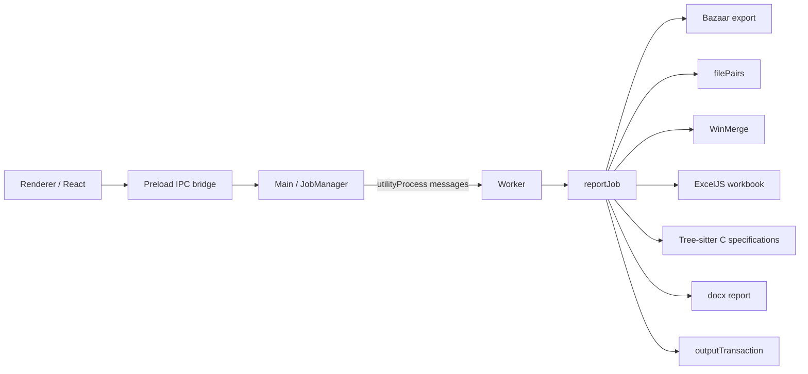

# 詳細設計書

## 1. 文書情報

| 項目 | 内容 |
| --- | --- |
| システム名 | DiffRepo Report Builder |
| 対象バージョン | 0.1.0 |
| 更新日 | 2026-06-19 |
| 対象 | Electron/React/TypeScript実装 |

## 2. アーキテクチャ

### 2.1 全体構成



### 2.2 モジュール責務

| 層 | 主なファイル | 責務 |
| --- | --- | --- |
| Renderer | `src/renderer/src/App.tsx` | 入力、設定ダイアログ、実行/中止、状態表示 |
| Preload | `src/preload/index.ts` | `window.diffRepo` API |
| Main | `src/main/index.ts` | Electron起動、ダイアログ、設定、IPC登録 |
| Main | `src/main/jobManager.ts` | 単一ジョブ、Worker所有、メッセージ、強制停止、異常終了復旧 |
| Main | `src/main/windowClose.ts` | 実行中の終了保留と終了時中止 |
| Worker | `src/worker/index.ts` | Workerプロトコル、AbortController、進捗/結果転送 |
| Core | `src/core/reportJob.ts` | レポート生成オーケストレーション |
| Core | `src/core/outputTransaction.ts` | Excel/Wordの一括確定、ロールバック、復旧 |
| Core | `src/core/excelExporter.ts` | ExcelJSストリーミング出力 |
| Core | `src/core/reportRowSelection.ts` | Excel書き込み前の行選別 |
| Core | `src/core/cProject*.ts` | Cソース収集、Tree-sitter解析、索引 |
| Core | `src/core/cSpecification*.ts` | 新規C仕様の差分と文書モデル |
| Core | `src/core/cTypeLayout.ts` | MSVC 32bit型レイアウト |
| Shared | `src/shared/*.ts` | 設定、IPC要求、Workerメッセージ型 |

## 3. ジョブ実行

### 3.1 起動

1. Rendererが`StartJobRequest`を`job:start`へ送る。
2. `JobManager`が同時実行中ジョブの有無を確認する。
3. UUIDをジョブIDとし、OS一時フォルダ配下に`diffrepo-report-<jobId>`を割り当てる。
4. `utilityProcess.fork()`で`out/worker/index.js`を起動する。
5. Workerの`ready`受信前に、MainがExcel/Wordの既存有無を記録する。
6. Mainが`start`メッセージを送り、Workerが`generateDiffWorkbook()`を実行する。

Workerプロセスには`serviceName: "DiffRepo Report Worker"`を設定する。

### 3.2 Workerメッセージ

MainからWorker:

```ts
type MainToWorkerMessage =
  | { type: "start"; jobId: string; request: WorkerJobRequest }
  | { type: "cancel"; jobId: string };
```

WorkerからMain:

```ts
type WorkerToMainMessage =
  | { type: "ready" }
  | { type: "progress"; jobId: string; progress: ReportProgress }
  | { type: "completed"; jobId: string; summary: GenerateDiffWorkbookSummary }
  | { type: "cancelled"; jobId: string }
  | { type: "failed"; jobId: string; error: SerializedError };
```

MainはジョブIDとRendererのsender IDを照合し、古いジョブや別Rendererの中止要求を無視する。

### 3.3 処理フェーズ

| フェーズ | 内容 |
| --- | --- |
| `exporting` | Bazaar変更前/変更後リビジョンのexport |
| `scanning` | 全変更ファイルの収集 |
| `reporting` | テキストファイル単位のWinMerge HTML生成 |
| `workbook` | HTMLのExcelJS変換 |
| `analyzing-c` | 変更前後の全`.c`/`.h`収集とTree-sitter解析 |
| `resolving-types` | 型サイズと限定的な呼び出し元の解決 |
| `writing-document` | Wordレポート生成 |
| `cancelling` | 中止処理 |
| `done` | 出力確定完了 |

## 4. 中止・終了

### 4.1 中止要求

1. Rendererが状態を`cancelling`へ変更し、`job:cancel`を送る。
2. `JobManager`が所有者を確認し、Workerへ`cancel`を送る。
3. Workerが進捗`cancelling`を通知し、対象ジョブの`AbortController.abort()`を呼ぶ。
4. ジョブ内の`throwIfAborted()`または外部プロセスのabort listenerが`AbortError`を発生させる。
5. Workerが`cancelled`を返す。
6. Mainが出力トランザクションと作業ディレクトリを復旧/削除し、Rendererへ中止結果を返す。

Workerが5秒以内に終了しない場合、Mainはutility processを`kill()`し、同じ復旧処理を行う。

### 4.2 外部プロセス

`src/core/processRunner.ts`は`spawn(..., { windowsHide: true })`でWinMergeとBazaar/Breezyを起動する。

Windowsの中止では次を実行する。

1. `taskkill.exe /PID <pid> /T`
2. 終了しない場合は`taskkill.exe /PID <pid> /T /F`

対象は当該ジョブが起動したプロセスツリーだけである。

### 4.3 ウィンドウ/アプリ終了

`createCloseCoordinator()`は実行中ジョブがある最初の`close`または`before-quit`を`preventDefault()`する。`JobManager.cancel()`の完了後だけ`BrowserWindow.destroy()`または`app.quit()`を実行する。

## 5. 設定

### 5.1 型

```ts
interface RowOutputPolicy {
  contextRows: number;
  hideRetainedRows: boolean;
}

interface AppSettings {
  winMergePath: string;
  bazaarPath: string;
  lastOutputDirectory: string;
  rowOutput: {
    cFiles: RowOutputPolicy;
    otherTextFiles: RowOutputPolicy;
  };
}
```

### 5.2 既定値

| 設定 | 値 |
| --- | --- |
| `rowOutput.cFiles` | `{ contextRows: 100, hideRetainedRows: true }` |
| `rowOutput.otherTextFiles` | `{ contextRows: 100, hideRetainedRows: true }` |
| `bazaarPath` | `brz` |
| `winMergePath` | 既知のProgram Files配下を順に検出し、未検出時は空 |
| `lastOutputDirectory` | 空 |

WinMerge候補は64bit側、32bit側の順に確認する。

### 5.3 保存と検証

- 保存先は`app.getPath("userData")/settings.json`。
- 読み込み時は不足したネスト項目を既定値で補う。
- `contextRows`は0以上の`Number.isSafeInteger()`だけを許可する。
- 保存時は設定全体を検証し、不正値なら書き込まない。
- 実行中/中止中は設定ダイアログを開けず、入力も変更できない。
- WinMergeが空の場合は実行不可。BazaarモードではBazaar/Breezyも必須。

## 6. 差分ファイルとWinMerge

### 6.1 差分収集

`collectChangedFiles(leftRoot, rightRoot, signal)`はバイナリを含む変更ファイルを返す。

| 判定 | 実装 |
| --- | --- |
| 追加/削除 | 左右の存在差 |
| 変更 | サイズまたはSHA-256の差 |
| テキスト | 先頭8192バイトのNUL/制御文字判定 |
| パス | `/`区切りの相対パス |

Excel/WinMerge対象は`isText=true`だけ、Word変更ファイル一覧は全件を対象とする。

### 6.2 WinMerge

```text
/noninteractive /minimize /u <left> <right> /or <report.html>
```

追加/削除時は、存在しない側へ作業ディレクトリの`empty-counterpart.txt`を渡す。HTML名は連番と相対パスSHA-1短縮値で一意化する。

## 7. HTML解析

`src/core/htmlReport.ts`はWinMerge HTMLを`HtmlReport`へ変換する。

- WinMergeタイトルを持つHTMLは全DOM構築を避ける高速パーサを使う。
- その他HTMLはCheerioフォールバックを使う。
- `tr`、`td/th`、`colspan`、セル背景/文字色、太字、斜体、下線、水平配置、span単位のrich textを保持する。
- 対応CSSはタグ、`.class`、`#id`、`tag.class`、インラインstyleである。
- `AbortSignal`を解析処理へ渡す。

## 8. Excel出力

### 8.1 ファイル単位ストリーミング

`exportReportsWorkbookFromHtmlFiles()`は`ExcelJS.stream.xlsx.WorkbookWriter`を使用する。

1. `HtmlReportFile.htmlPath`からHTMLを1件だけ読み込む。
2. `parseHtmlReport()`で解析する。
3. `selectReportRows()`で書き込む行を選ぶ。
4. 列幅を選別後の行から算出する。
5. Excel行を作り、必要な保持行だけ`hidden`にする。
6. 各行とワークシートをcommitする。
7. 全シート後にブックをcommitする。

HTML本文をレポート配列へ格納せず、Excel COM経路も使用しない。

### 8.2 ポリシー選択

- `.c`と`.h`: `rowOutput.cFiles`
- その他テキスト: `rowOutput.otherTextFiles`

### 8.3 行分類

`SelectedReportRow.visibility`は次の3値である。

| 値 | 処理 |
| --- | --- |
| `structure` | ヘッダ等。常に書き込む |
| `visible` | レビュー表示対象。書き込み、非表示にしない |
| `retained` | 手動修正用。書き込み、設定時だけ非表示 |

いずれにも分類されないソース行は`selectReportRows()`の戻り値から除外されるため、Excelへ書き込まれない。

### 8.4 表示範囲

`contextRows=N`とする。

#### `.c`

- 変更後側を優先した行テキストから関数範囲を推定する。
- 差分を含む関数は宣言先頭から閉じ波括弧まで`visible`にする。
- 差分を含まない関数は通常の`visible`対象にしない。
- 関数外差分は、前後の未変更空行までと空行外側`N`行を`visible`にする。
- 関数範囲は関数外コンテキスト探索の境界とする。

#### `.h`とその他テキスト

- 各差分行について前後の未変更空行を探す。
- 空行があればその空行の外側`N`行まで、なければ区間端までを`visible`にする。
- 重なる区間は統合する。

#### 保持行

全ファイル種別で、`visible`集合を前後`N`行へ拡張した追加分を`retained`にする。この拡張は関数境界で停止しない。

### 8.5 Excel表現

- A/C列: 行番号
- B/D列: 変更前/変更後ソース
- E1: `■OK □NG`
- フォント: `MS Gothic`
- 先頭行固定
- HTMLの背景/文字色、太字、斜体、下線、rich textを反映
- パスを`【変更前】$`/`【変更後】$`へ置換
- 追加/削除の空側を「ファイルなし」へ置換
- 追加時はB列幅をD列へ、削除時はD列幅をB列へ合わせる

## 9. C解析

### 9.1 Tree-sitter資産

`src/core/treeSitterRuntime.ts`は`web-tree-sitter` runtime WASMと`tree-sitter-c.wasm`を解決する。`electron.vite.config.ts`の`treeSitterAssetsPlugin()`が次を`out/main/tree-sitter-assets`へコピーする。

- `tree-sitter.wasm`
- `tree-sitter-c.wasm`

開発時は依存パッケージ内資産も候補とし、見つからない場合は確認した候補パスを含むエラーにする。

### 9.2 プロジェクト収集

`collectCSourceInputs()`は変更前/変更後ルートを再帰走査し、すべての`.c`/`.h`を相対パス順に読み込む。各ファイルは`$/...`へ正規化する。

`buildProjectCSpecifications()`は変更前と変更後をTree-sitterで解析し、変更後モデルを仕様作成の基準にする。解析対象は変更ファイルだけではなく、両ルートの全C系ファイルである。

### 9.3 構文モデル

`cProjectParser.ts`は次を抽出する。

- 関数定義、宣言、戻り値、引数、storage class
- 関数本体内の識別子による直接呼び出しと、関数内`static`/`const`関数ポインタテーブル初期化子の関数参照
- ローカル変数名
- グローバル変数
- struct/unionとメンバー
- typedef、enum
- 整数マクロ
- `#pragma pack`
- コメントと構文診断

変更ファイル一覧の関数差分も`cFunctionChanges.ts`でTree-sitter Cを使い、左右の関数本体を比較する。

## 10. C仕様差分

### 10.1 新規関数

- 対象は変更後`.c`の関数。
- 識別子は`相対パス + 関数名`。
- 変更前に同一識別子がなければ新規とする。
- 移動で相対パスが変わった関数は移動先で新規扱いになる。

### 10.2 新規グローバル変数

- 対象は変更後`.h`のグローバル変数。
- 識別子は`相対パス + 変数名`。
- 変更前に同一識別子がなければ新規とする。

### 10.3 struct/union

- 名前付き型は`種別 + 型名`で対応付ける。
- 匿名型は相対パス、親宣言、宣言位置で対応付ける。
- 新規型は変更後の全メンバーを仕様対象にする。
- 既存型は変更前に同名メンバーがないメンバーだけを仕様対象にする。
- 既存メンバーの型やコメントだけの変更は新規メンバーにしない。

## 11. 呼び出し元

`buildCProjectIndex()`は変更後側の全C系ファイルから得た関数定義を索引化する。

- 関数本体内の直接`call_expression`で、呼び出し先がidentifierの場合だけ直接呼び出しの証跡にする。
- 関数本体内の`static`または`const`な配列初期化子に現れる関数参照を、関数ポインタテーブル登録の証跡として収集する。
- テーブル登録では`target`と`&target`の両形式を認識する。
- `.field`や`[index]`のdesignator部分自体は関数参照として扱わず、値側の関数参照だけを対象にする。
- ローカル変数または引数と同名の呼び出しは除外する。
- 同一ファイルの一意な`static`関数を優先する。
- 一意な非`static`関数へ解決する。
- 同名候補が複数なら対象関数へ割り当てず「呼び出し先特定不可」を出す。
- 直接呼び出しとテーブル登録の関数参照は同じ名前解決規則を使い、重複する呼び出し元は1件に統合する。
- 呼び出し元は`$/path/file.c : function`形式でパス、関数名、ID順に整列する。

通常の関数ポインタ変数呼び出し、関数外の式、マクロ呼び出し、型情報が必要な動的ディスパッチは呼び出し元に含めない。

## 12. MSVC 32bit型レイアウト

`createCTypeLayoutResolver()`は変更後プロジェクト全体の型、定数、pack指示を使う。

### 12.1 基本規則

- ポインタ: 4 bytes / alignment 4
- enum: 4 bytes / alignment 4
- `char`: 1、`short`: 2、`int`/`long`/`float`: 4
- `long long`/`double`/`long double`: 8
- `int8_t`から`uint64_t`、`intmax_t`/`uintmax_t`、`size_t`、`ptrdiff_t`、`intptr_t`/`uintptr_t`はMSVC 32bitの既知型として解決
- 配列: 定数式で各次元を評価し、要素数とサイズを乗算
- struct: 各メンバーを有効alignmentへ切り上げ、末尾を型alignmentへ切り上げる
- union: 最大メンバーサイズを型alignmentへ切り上げる

### 12.2 `#pragma pack`

既定packは8とし、ファイル内の宣言位置より前にある指示を順に適用する。

- `#pragma pack(push, n)`
- `#pragma pack(pop)`
- `#pragma pack(n)`
- `#pragma pack()`

有効値は1、2、4、8、16である。マクロ等の整数式も評価対象にする。

### 12.3 算出不可

次の場合はサイズ、alignment、要素数等を文字列`算出不可`にする。

- 未解決または曖昧な外部型/typedef/定数
- 値としての再帰型
- 可変長配列、フレキシブル配列
- ビットフィールド
- 未対応式または不正なpack値

自己参照ポインタはポインタサイズで解決する。

ヘッダガード等のプリプロセッサ分岐内にある翻訳単位レベルの関数、変数、typedef、enum、struct、unionも解析する。関数本体内のローカルstruct/unionは新規変数仕様書の対象にしない。

呼び出し元索引と仕様モデル構築は一定件数ごとにイベントループへ制御を戻し、`AbortSignal`を再確認する。

## 13. Wordレポート

`exportChangeListDocument()`は`docx`で次の3章を生成する。

### 13.1 変更ファイル一覧

- 全変更ファイルを相対パス順の入力どおり出力
- 追加/削除プレフィックス
- `.c`の変更/新規/削除関数を字下げ

### 13.2 新規関数仕様書

関数ごとに基本表、引数表、`@retval`表、呼び出し元表を出力する。Doxygenの不足項目は`記載なし`、空表は`該当なし`とする。

### 13.3 新規変数仕様書

次を出力する。

1. 新規グローバル変数
2. 新規構造体・共用体
3. 既存構造体・共用体の新規メンバー

新規struct/unionのメンバー表には全メンバー、既存struct/unionのメンバー表には追加メンバーだけを渡す。サイズ値が数値なら`<n> bytes`、解決不能なら`算出不可`とする。

## 14. 出力トランザクション

`createOutputTransaction()`は各最終出力について次を作る。

```text
<stem>.diffrepo-<jobId>.tmp<ext>
<stem>.diffrepo-<jobId>.bak<ext>
```

### 14.1 commit

1. Excel/Word両方のstage存在を確認する。
2. 同ジョブIDの古いbackupを除去する。
3. 既存finalをbackupへrenameする。
4. stageをfinalへrenameする。
5. 両方成功後にbackupを除去する。

途中失敗時は、昇格したfinalを除去し、backupを逆順に復元する。復元にも失敗した場合は`AggregateError`とし、backupをcleanupで消さない。

### 14.2 中断復旧

Mainはジョブ開始前のfinal存在状態を保持する。Workerの中止、異常終了、強制終了時に`recoverInterruptedOutputTransaction()`を呼び、backupがあれば復元し、開始前に存在しなかったfinalは除去し、stageを削除する。

## 15. エラー処理

| 箇所 | 処理 |
| --- | --- |
| Worker起動/異常終了 | エラーをRendererへ返し、出力と作業ディレクトリを復旧 |
| 外部コマンド非0終了 | stderr/stdoutを含む例外。UTF-8不正時はShift_JIS decodeを試行 |
| Tree-sitter WASM欠落 | 候補パスを含むジョブ失敗 |
| 設定読込失敗 | 既定値へ正規化 |
| 設定保存不正 | 保存せず例外 |
| Excel/Word生成失敗 | stageを削除し、finalを更新しない |
| commit失敗 | 既存出力へロールバック |
| 中止 | `cancelled`として終了し、中断復旧を実施 |

## 16. 実装上の制約

- Excel生成にMicrosoft Excel、Excel COM、PowerShellを使用しない。
- C解析はTree-sitter C構文木を基礎とするが、完全なプリプロセッサ/リンカ解決ではない。
- 行表示用の`.c`関数範囲推定はWinMerge行テキストに対する専用ロジックであり、Word仕様用Tree-sitterモデルとは別である。
- 出力先が作業ディレクトリ配下の場合は、生成物保護のため作業ディレクトリを自動削除しない。
