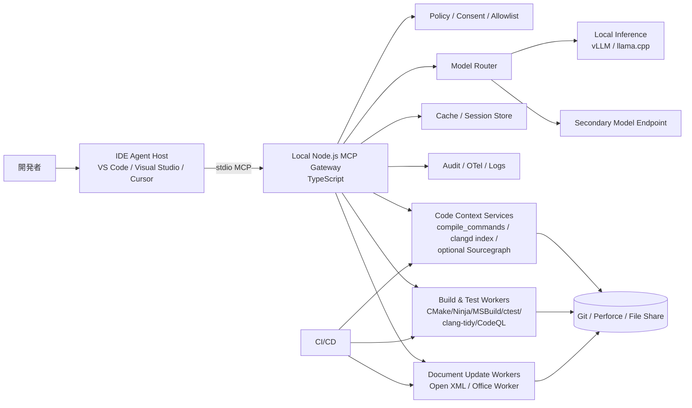
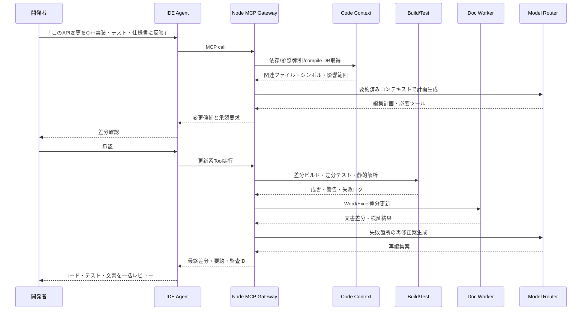

# IDE統合生成AIとローカルNode.js MCPによる大規模C/C++・Office文書保守の実装提案

## エグゼクティブサマリ

本報告では、ユーザーのいう「MCPサーバー」を、主要公式文書が定義する **Model Context Protocol** に基づくものとして扱う。GitHub と MCP 公式文書はいずれも、MCP を LLM と外部ツール・データソースを接続するためのオープン標準と定義しており、IDE、CLI、クラウドエージェント、外部サービス統合の共通インターフェースとして位置づけている。したがって、実用案の中心は、**IDE のエージェント機能を MCP で拡張し、ローカル Node.js/TypeScript 製の MCP ゲートウェイが、コード理解・ビルド・テスト・文書更新・監査を仲介する構成**になる。citeturn28view0turn20search11turn29view1

結論から言うと、数百MB級の C/C++ コードベースと多数の Word/Excel 文書を同時に扱う場合、単に長いコンテキストをモデルに渡すだけでは安定運用にならない。`compile_commands.json` に基づく静的/リモート索引、依存解析、コンパイルキャッシュ、差分限定テスト、文書のアンカー更新、監査可能なツール実行という **周辺基盤** が必須である。clangd は巨大コードベース向けに静的 index と remote index を用意しており、大規模プロジェクトでの CPU/RAM 負荷や索引構築待ちを回避するための設計が既に整備されている。研究面でも、RepoCoder などの repository-level code completion は、単純な in-file completion よりも、検索付きの反復生成が有効であることを示している。citeturn28view2turn4search1turn9search0

推奨する実装方針は、**IDE 側は VS Code または Visual Studio の Agent Mode、ローカル側は stdio 接続の Node.js MCP Gateway、コード理解は clangd/clang-tidy/CodeQL/Sourcegraph 補助、文書更新は Open XML ベースの高忠実度パッチ適用、モデル実行はローカル vLLM または llama.cpp を一次系、より難しい多段推論だけを二次系モデルにフェイルオーバー**、という多層構成である。VS Code と Visual Studio はいずれもエージェントモードと MCP 統合の公式導線があり、Visual Studio は日本語ドキュメントが充実しているため、Windows 比率が高い C++ 組織では特に採用しやすい。citeturn29view0turn29view1turn29view2turn29view3turn30view5turn30view6

また、Word/Excel 更新は「全文再生成」ではなく、**コンテンツコントロール、ブックマーク、名前付き範囲、表などの安定アンカーを使った差分更新** に寄せるべきである。OOXML 文書は ZIP パッケージ内に XML/バイナリのパーツを持ち、Word のマクロは `vbaProject` パーツ、Excel マクロは `.xlsm` 形式で扱われる。これを踏まえると、通常更新ではマクロパーツを不変として保持し、必要時のみ専用ワーカーで扱うのが安全である。Excel の自動化ではプログラム経由で開いたブックのマクロが既定で有効になるため、Office COM/Automation を使う場合は明示的なセキュリティ制御が必要である。citeturn30view1turn28view3turn28view4turn30view2turn6search3

## 前提条件と採用方針

まず、対象環境には未指定事項が多い。OS、IDE、VCS、ビルドシステム、文書保管場所、閉域要件、クラウド使用可否は明示されていないため、本報告では **未指定は未指定として明記しつつ、実装可能性が高い基準構成** を置く。MCP の主要ホストとしては、公式に IDE 連携、レジストリ、ローカル/リモート MCP、企業ポリシーを備える GitHub Copilot 系と、MCP を前面に出した Cursor、自己ホスト/エアギャップに強い Tabnine、巨大コードベース文脈補助に強い Sourcegraph を比較対象にするのが妥当である。citeturn28view0turn14search4turn28view7turn28view6

| 項目 | 現時点の扱い | 実務上の推奨 |
|---|---|---|
| OS | 未指定 | Windows と Linux の混在を許容する前提で設計。Visual Studio を使う場合は Windows 優先、VS Code/Cursor/Tabnine はクロスプラットフォーム前提。citeturn29view0turn29view2turn14search0 |
| IDE | 未指定 | 基準案は **VS Code + GitHub Copilot Agent**。Windows ネイティブ C++ 中心なら **Visual Studio + Copilot Agent** を第一候補にする。MCP は Agent Mode で使う。citeturn29view0turn29view2turn29view3 |
| VCS | 未指定 | Git を基準とし、Perforce などを使う場合は Tabnine の remote codebase awareness や Sourcegraph 補助を検討する。citeturn31view1turn28view6 |
| ビルドシステム | 未指定 | CMake/Ninja/MSBuild/Bazel のいずれでも、最終的に `compile_commands.json` を生成または補完できることを必須条件にする。citeturn3search1turn3search4turn4search2 |
| 文書基盤 | 未指定 | Word/Excel は OOXML を前提にし、テンプレート化可能な文書にはコンテンツコントロールや名前付き範囲を導入する。citeturn28view3turn28view4turn30view1 |
| セキュリティ境界 | 未指定 | まずはローカル stdio 接続を基本とし、外部通信は allowlist 化された HTTP MCP のみに限定する。citeturn20search0turn32view0turn28view5 |

基準構成として最も現実的なのは、**開発者の内側ループは VS Code/Visual Studio の Agent Mode、外側ループは GitHub・Jenkins・Azure DevOps など既存 CI/CD、両者の間を Node.js MCP Gateway がつなぐ** 方式である。理由は三つある。第一に、VS Code と Visual Studio はいずれもエージェントがファイル編集、ターミナル実行、自己修正ループを行える。第二に、MCP による外部ツール拡張が公式サポートされている。第三に、企業ポリシーで MCP 利用可否やレジストリ管理を統制できる。citeturn29view1turn29view2turn29view3turn7search9turn7search12

一方で、**完全閉域・自己ホスト最優先** なら Tabnine Enterprise の private installation / fully air-gapped 構成が強い。逆に、**巨大な多リポジトリ横断検索とコードナビゲーションが最重要** なら、Sourcegraph の precise code navigation や大規模コードベース対応を補助レイヤとして重ねる意味が大きい。したがって、本件の最適解は「単一製品への全面依存」ではなく、**IDE エージェント + Node.js MCP + コードインテリジェンス + 文書更新ワーカー** の合成アーキテクチャである。citeturn28view7turn31view0turn31view1turn28view6turn23search1

## MCPサーバーの役割と全体アーキテクチャ

MCP サーバーの役割を厳密に整理すると、**Tools** は外部システムを実行・変更するための操作面、**Resources** はファイルやスキーマや索引などの参照面、**Prompts** は構造化された作業指示やテンプレート面である。これをコード開発に当てはめると、`build.compileChanged` のような実行系は Tool、`repo://compile-db/current` や `docs://manifest/spec.docx` は Resource、`refactor-cpp-api` や `update-release-note` は Prompt になる。MCP TypeScript SDK は Node.js 上でこれらをフル実装でき、標準 transport として stdio と Streamable HTTP を使える。citeturn29view5turn29view6turn29view7turn32view0turn32view1

本件では、**IDE とローカル Gateway の間は stdio**、**Gateway と共有サービス間は Streamable HTTP** を採るのがよい。stdio はローカル配置の基本 transport で、Node 実装も容易であり、余計なネットワーク公開を避けられる。共有索引サーバーやモデルルーター、承認済みの社内文書サービスを別プロセス・別ノードで運用したい場合だけ Streamable HTTP を使う。citeturn20search12turn20search0turn25search14turn32view0

以下は、本報告で推奨する全体像である。

この構成で Node.js Gateway が担うべき役割は、単なる「モデル呼び出し」ではない。実際には、**コンテキスト収集の正規化、ツール許可判定、キャッシュ制御、監査 ID 付与、モデル選択、出力差分の整形** が中核になる。特に大規模 C/C++ では、AI 本体よりも「どの情報を、どの粒度で、どの順番に渡すか」が品質を決めやすく、repository-level completion の研究も、反復 retrieval を伴う設計が有効であることを示している。citeturn9search0turn31view0turn23search3

MCP サーバーのツール体系は、**読み取り系・検証系・更新系** に明確分離すべきである。ローカル IDE では開発者承認付きの更新系を使いやすいが、クラウドエージェントでは一度構成すると自律的にツールを使うため、GitHub 公式も read-only tool の allowlist を強く勧めている。さらに、GitHub の repository-level MCP は cloud agent / code review では **Tools のみ** をサポートし、Resources と Prompts を使えず、OAuth を使う remote MCP も現時点では制約がある。よって、**豊富な Resource/Prompt を使う高度な開発支援はローカル IDE 側、CI/CD や cloud agent 側は限定的な read-only Tools** に分割するのが安全である。citeturn29view4turn25search4

## IDE統合ワークフロー

VS Code の agent は、自然言語タスクから relevant context の決定、複数ファイル編集、コマンド実行、自己修正までを同じ編集体験の中で回せる。Visual Studio でも Ask / Plan agent / Agent mode が整理されており、MCP 機能を使うには Agent mode を選ぶ必要がある。したがって、C/C++ のような「解析→編集→ビルド→再修正」が多い仕事では、**チャット補助より agent loop 前提で設計したほうが整合的** である。citeturn29view0turn29view2turn29view3

以下は、推奨ワークフローの実装イメージである。

### コード補完と横断参照

単純な行補完は IDE 付属の inline completion に任せてよいが、大規模 C/C++ で効くのは **関数単位・変更単位の repository-aware completion** である。これを実現するには、現在ファイルだけでなく、参照先シンボル、include 先、型定義、呼出し階層、テスト例を Resource として段階的に引く必要がある。clangd は compile command を前提に正しい include path や言語モードを解釈し、静的 index / remote index で大規模索引を外だしできるため、この層を MCP Resource に変換するのが最も費用対効果が高い。citeturn4search2turn28view2turn4search0

### リファクタと依存影響解析

リファクタは、LLM に直接「rename して」と言うより、**影響範囲探索→変更計画→差分適用→ビルド/テスト→再修正** に分けるべきである。VS Code/Copilot agent は複数ファイルの refactor、テスト実行、ドキュメント生成に対応し、Visual Studio は Plan agent でレビュー可能な実装計画を先に出せる。C/C++ では依存が濃く、テンプレートやマクロやビルドフラグ差があるため、LLM の一次案を `clang-tidy`、CTU 解析、CodeQL で機械的に減衰させる工程が重要になる。citeturn29view0turn29view3turn18search2turn18search9turn18search3

### テスト生成と回帰防止

テスト生成は「単に新規テストを書く」より、**変更差分に紐づくテスト骨格を作り、既存テストパターンと関連付ける** 方がよい。GitHub 公式は Copilot の unit test 生成を前面に出しており、エージェントは terminal/test output を監視しながら自己修正を繰り返せる。ここで Node Gateway は、変更ファイルから近傍テスト、同型 API の既存テスト、失敗ログをまとめてモデルへ渡すと安定する。citeturn17search16turn29view3

### ドキュメント更新

ドキュメント更新は、コード変更後に別作業で手編集する運用をやめ、**同じ agent session で Word/Excel 更新まで完了させる** のが実用的である。GitHub は legacy code の説明・記録に Copilot を使う方法を案内しており、agent は documentation 生成も担える。ただし Word/Excel はコードと違って binary/OOXML の忠実度問題があるため、生成文章そのものはモデルに作らせても、**適用は文書専用 Tool** に限定すべきである。citeturn24search2turn24search13turn24search9

## ローカルNode.js実装設計

Node.js 実装は、MCP Gateway を **TypeScript 製の明示的な制御面** として置くのがよい。公式 TypeScript SDK は Node.js 上で MCP server/client の両方を実装でき、tools/resources/prompts、stdio、Streamable HTTP、認証 helper を含む。よって、IDE から見れば一つのローカル MCP サーバーだが、内部では複数の下位サービスを呼び分ける「集約ゲートウェイ」として実装するのが自然である。citeturn32view0turn32view1

### API設計

API 面では、MCP の 3 要素をそのままドメイン化する。

| 区分 | 推奨エンドポイント例 | 用途 |
|---|---|---|
| Tools | `code.searchSymbols`, `code.findReferences`, `build.compileChanged`, `test.runChanged`, `doc.word.patchAnchors`, `doc.excel.patchRanges`, `repo.createPrDraft` | 実行・変更操作。更新系は承認必須、CI 向けは read-only 優先。citeturn29view6turn29view4 |
| Resources | `repo://compile-db/current`, `repo://index/<target>`, `docs://manifest/<file>`, `policies://coding-guidelines` | モデルに渡す構造化コンテキスト。URI 単位でキャッシュしやすい。citeturn29view5 |
| Prompts | `refactor-cpp-api`, `generate-regression-tests`, `update-release-spec` | 人間が明示選択するテンプレート化手順。Prompt は user-controlled が原則。citeturn29view7 |

### 認証と承認

ローカル stdio 接続そのものにはネットワーク認証は不要だが、**下流の共有サービス** には認証が必要になる。HTTP 系 MCP では認可サーバーが OAuth 2.1 を実装し、MCP client/server は Protected Resource Metadata を用いて discovery することが仕様で定められている。実運用では、IDE → ローカル Gateway は開発者ローカル権限、Gateway → 社内索引/ドキュメント/チケット/コードホストは **短寿命トークン** という二層がよい。citeturn28view5turn10search1

承認モデルは、ローカル IDE と cloud agent で分けるべきである。VS Code agent mode は tool invocation の透明表示、terminal approval、undo を持つが、GitHub の repository-level MCP は cloud agent では approval なしで自律実行されうる。したがって、**ローカル IDE は write-enabled、クラウドは read-only allowlist** という原則が安全である。citeturn29view3turn29view4

### モデル管理

モデル管理は、**用途別ルーティング** にすべきである。vLLM は OpenAI API 互換サーバーとして起動でき、既存クライアントの drop-in replacement になりうる。llama.cpp の server も OpenAI compatible routes、parallel decoding、continuous batching、monitoring endpoints を備える。したがって Gateway から見ると両者は「ほぼ同型の推論バックエンド」として扱える。citeturn30view5turn30view6

実用上は、次のようなルールが堅い。**補完・要約・軽いテスト草案・文書差分説明** はローカルモデル、**広範囲リファクタ・複数ツール連鎖・あいまい仕様からの計画立案** は上位モデルへフェイルオーバーする。ローカルモデル中心の IDE ツールも、tool calling と reasoning の限界が agent mode を難しくすると明記しているため、完全ローカル一本化は避けたほうがよい。citeturn31view4turn30view5turn30view6

### キャッシュ

キャッシュは 3 層が適切である。**L1 は in-process メモリキャッシュ、L2 は Redis、L3 は SQLite WAL** である。Redis は TTL と eviction を前提にしたキャッシュ運用に向き、cache-aside パターンでは stampede 対策が重要である。SQLite の WAL は reader/writer の並行性が高く、軽量な永続メタデータストアとして扱いやすい。citeturn13search0turn13search12turn13search18turn30view7

キャッシュ対象は、`compile_commands.json` のハッシュ、索引バージョン、シンボル解決、文書 manifest、モデルプロンプト正規化結果、テスト失敗要約でよい。大きなソース本文そのものを長く保持するより、**再構成可能な中間表現** を持つほうが漏洩面積も減る。これは MCP Resource の URI 設計とも相性がよい。citeturn29view5turn13search12

### ログと監査

stdio ベースの MCP サーバーは **stdout に JSON-RPC 以外を書いてはいけない**。公式 quickstart は、STDIO ベースでは `console.log()` を使わず `console.error()` あるいはファイル/ログ基盤に書くよう明示している。したがって、Node Gateway では protocol stdout と運用ログを分離し、アプリログは stderr + OpenTelemetry export に寄せるべきである。citeturn32view2turn25search0turn25search2

OpenTelemetry は Node.js で traces と metrics を採れる。よって、各エージェント実行に `trace_id`, `request_id`, `developer_id`, `repo_rev`, `doc_rev`, `model_route`, `tool_chain` を付与し、**「誰が、何を、どの文脈で、どのツールを通して変更したか」** を再現できるようにする。監査ログは SQLite/OLTP に要約を残し、長期保存は既存 SIEM に送るのがよい。citeturn32view5turn7search3

### フェイルオーバーと実行分離

CPU 集約処理には `worker_threads`、プロセス分離が必要なワーカーには `cluster` または `child_process` を用いる。Node 公式は、CPU-intensive には worker_threads、ポート共有と複数プロセスには cluster を推奨している。したがって、**XML 差分正規化・埋め込み生成・大規模 diff 要約** は worker_threads、**Office 自動化・ネイティブツール呼び出し・外部プロセス破損隔離** は別プロセスに切るべきである。citeturn32view3turn32view4turn11search10

## 大規模C/C++コードベースとWord/Excel更新の技術課題

### C/C++コードベース特有の課題

C/C++ でまず必要なのは、**正しいビルドコンテキストの再現** である。clang 系ツールは `compile_commands.json` を標準的な入口としており、ここに include path、言語方言、マクロ定義、target 情報が入る。これが曖昧だと、AI が正しい編集案を出しても、索引層が誤解析し、誤った依存関係を返す。したがって、AI 導入前の最優先作業は「コード生成」ではなく **コンパイルデータベースの整備** である。citeturn3search1turn3search4turn4search2

大規模プロジェクトでは background index を全開にすると待ち時間とメモリが重くなりやすい。clangd は、static index により background indexing を待たずに全体索引を使え、remote index により巨大索引を別マシンに逃がせる。LLVM 公式は、Chrome 級のプロジェクトでは global index 構築に非常に長い時間と数GB級メモリがかかりうると説明しているため、本件のような数百MB級コードベースでも **共有 remote index** は実務的な投資対象である。citeturn28view2turn4search1

ビルド時間については、**ccache / sccache / 差分ビルド / 差分解析** を組み合わせる。ccache は再コンパイル高速化の定番であり、sccache は local disk と remote storage の多段キャッシュを張れる。PR 上の静的解析は、CodeQL の compiled language 設定に加えて incremental analysis を使えば速くでき、C/C++ の build-free scanning も現在は GA である。したがって、「毎回フルビルド・フル解析」の運用を AI 導入と同時にやめるべきである。citeturn32view6turn32view7turn18search1turn18search12turn18search3

依存解析の深さも重要である。`clang-tidy` は compile database 前提で広く自動化でき、CodeChecker を使えば CTU 解析も組み込める。これにより、単一翻訳単位だけでは検出しにくい呼出し境界の問題や interface misuse を夜間バッチで拾える。AI のリファクタ結果を人間が全部読まなくても、**機械検証で先に削る** という発想である。citeturn18search2turn18search9

以下に、大規模 C/C++ 向けの主要課題と対策を整理する。

| 課題 | 症状 | 推奨対策 |
|---|---|---|
| ビルド時間 | agent の試行回数に比例して待ちが増える | 差分ビルド、ccache、sccache、多段キャッシュ、PR 上の incremental CodeQL。citeturn32view6turn32view7turn18search1turn18search12 |
| 依存解析 | include/macro/target 差で誤提案が出る | `compile_commands.json` を必須化し、clangd/clang-tidy/CodeQL の前提を揃える。citeturn3search1turn4search2turn18search2 |
| スケーリング | 全文脈投入で遅延・幻覚が増える | remote/static index、必要範囲だけ Retrieval、Sourcegraph 等の補助検索を併用。citeturn4search1turn28view2turn28view6turn23search1 |
| メモリ | ローカル開発機で索引と IDE が競合する | 索引を共有サービス化し、ローカルは on-demand 取得に寄せる。citeturn4search1turn28view2 |
| 横断変更の安全性 | rename/refactor 後に壊れる | Plan agent → 差分適用 → build/test → auto-remediate のループを標準化。citeturn29view0turn29view3 |

### Word/Excel文書自動更新の課題

Word/Excel は、コードファイルのように行 diff をそのまま使えない。OOXML は ZIP パッケージ内に複数のパーツを持ち、Word の本文、スタイル、テーマ、画像、関係定義、マクロが分離されている。したがって、**文書更新は「最終ファイルの再生成」ではなく、特定パーツ・特定アンカーへの最小更新」** として扱うべきである。citeturn30view1turn27search0

Word では、テンプレート側に **コンテンツコントロール** を入れ、必要なら custom XML parts とバインドする方法が堅い。Excel では、**名前付き範囲** を業務意味のアンカーにするのがよい。Microsoft Learn はどちらもプログラムから扱う方法を示しており、将来の差分適用点を人間が設計できるという点で、RAG よりもはるかに再現性が高い。citeturn28view3turn28view4

Node.js 側のライブラリ選定は、用途別に分けたほうがよい。Excel の既存書式保持を重視するなら xlsx-populate 系は「XML を直接操作するため styles and other content を preserve しやすい」と説明している。Word/Excel テンプレート生成では Docxtemplater が JavaScript から docx/xlsx をテンプレート埋め込みでき、表・条件分岐・HTML・サブテンプレートまで扱える。ただし、**高忠実度の「更新」** と **テンプレートからの「生成」** は別問題なので、既存文書保守では Open XML の安定アンカー更新を主、Docxtemplater 等は新規定型帳票生成を主にするのが適切である。citeturn26search0turn26search4turn30view4

マクロ対応は慎重に切り分けるべきである。Word の `.docm` は `vbaProject` パーツを持ち、Excel の `.xlsm` はマクロ有効ブックである。Excel をプログラムで開くときは既定でマクロが有効になる。したがって、通常の Node/Open XML 更新では **マクロパーツ非改変・非実行** を原則とし、マクロ編集が必要な場合だけ、隔離された Windows ワーカーか、Aspose.Cells のように VBA 変更 API を持つ商用ライブラリに委譲するのが安全である。citeturn30view1turn30view2turn6search3turn30view0

以下は、実務的な更新方式の比較である。

| 対象 | 推奨方式 | 長所 | 注意点 |
|---|---|---|---|
| `.docx` 保守更新 | コンテンツコントロール / ブックマーク / 表セルアンカーに対する Open XML パッチ | 書式保持しやすく、差分点が安定する。citeturn28view3turn27search1 | 先にテンプレート設計が必要。 |
| `.xlsx` 保守更新 | 名前付き範囲 / テーブル / セル範囲アンカー更新 | 範囲単位で業務意味を持てる。citeturn28view4 | 行列挿入で参照が崩れない設計が必要。 |
| 新規帳票生成 | Docxtemplater / Excel テンプレート埋め込み | JS だけで扱いやすい。citeturn30view4 | 既存複雑文書の忠実更新には向かない。 |
| 既存 Excel 書式保持更新 | xlsx-populate 系 | XML 直接操作で style 保持に強い。citeturn26search0turn26search4 | 複雑機能のカバレッジは限定的。 |
| マクロ編集 | 隔離 Office/Aspose ワーカー | VBA 変更や検証を専用環境に閉じ込められる。citeturn30view0turn30view2 | 実行権限と署名・マクロポリシー管理が必須。 |

差分管理は、元ファイルをそのまま Git 管理するだけでは不十分である。推奨は、**原本 OOXML + 正規化した semantic manifest + AI 提案 diff + 適用後検証結果** の四点セットを残す方式である。OOXML パッケージ構造がパーツ分割されていることを利用し、更新前後の `document.xml`、`sheet*.xml`、rels、defined names、custom XML を正規化比較すれば、レビュー可能な差分を binary 外に持ち出せる。これは標準仕様の上に載せる設計推論だが、実務では最も再現性が高い。citeturn30view1turn27search0turn28view4

## セキュリティ・運用・CI/CD・検証

### セキュリティとコンプライアンス

MCP のセキュリティ原則として重要なのは、**ツールは任意コード実行に近い危険な面を持つ** という扱いである。MCP 仕様と security best practices は、明示的な user consent、適切な access control、privacy 配慮、authorization の整備を要求している。企業側では GitHub Copilot の MCP allowlist policy や private registry を使って、どの MCP サーバーを使わせるかを中央統制できる。citeturn25search4turn7search0turn7search9turn19search10

本件のようにソースコードと設計文書を同時に扱う場合、**DLP・最小権限・監査可能性** を三本柱にすべきである。具体的には、(a) Resource を repo/doc 単位でスコープ化する、(b) モデルへ送る文脈は全文ではなく要約・抽出結果中心にする、(c) 更新系 Tool は開発者承認か CI 専用 BOT 権限に限定する、(d) 機密リポジトリは context filter / scoping で明示的に除外する、という設計が望ましい。Sourcegraph は機密リポジトリの context filter、Tabnine は context scoping と remote codebase awareness を備えており、**「何を見せるか」自体を管理対象にする** 方向が現在の主流である。citeturn23search9turn31view0turn31view1

### 運用設計

運用は、**個人利用のチャット補助** ではなく、**統制された開発基盤** として設計すべきである。Node Gateway にはバージョン固定された Tool contract を持たせ、MCP server card 相当の内部台帳を作り、各ツールの read-only / write / destructive 区分、データ保持方針、監査項目、インシデント連絡先を記録する。GitHub enterprise 側の MCP policy と組み合わせることで、「誰がどのサーバーを使えるか」を開発組織単位で制御しやすい。citeturn28view0turn7search12turn19search10

### CI/CD統合案

CI/CD では、ローカル IDE の豊富な Prompt/Resource 群をそのまま持ち込まないほうがよい。前述のとおり GitHub cloud agent は MCP Tools のみを扱い、Resources/Prompts には未対応で、remote OAuth MCP にも制約がある。そのため、パイプラインでは **読み取り専用の Build/Test/Issue/PR ツール** を中心にし、文書更新や大規模コード変更はローカル agent か自己ホスト worker に寄せるのが堅い。citeturn29view4

| フェーズ | 実行内容 | 推奨ツール群 |
|---|---|---|
| pre-commit | 変更ファイルの format / lint / 単体テスト | `clang-format`, `clang-tidy`, 変更限定テスト。citeturn18search11turn18search2 |
| pull request | 差分ビルド、差分静的解析、文書 manifest 整合性検査 | `ccache/sccache`, incremental CodeQL, doc patch validation。citeturn32view6turn32view7turn18search1 |
| nightly | 全体索引再生成、CTU 解析、回帰テスト、文書 render 検査 | `clangd-indexer`, CodeChecker CTU, full regression。citeturn4search0turn18search9 |
| release | 仕様書・変更履歴・運用手順書の同期更新 | Word/Excel アンカー更新 + 人手レビュー。citeturn28view3turn28view4 |

### 検証ベンチマーク

AI コーディング導入の検証では、SWE-bench Verified のような外部標準を参照しつつ、**自社コードと文書を含む社内ベンチマークを別に作る** 必要がある。SWE-bench Verified は 500 件の human-filtered software engineering task で、モデル比較には有用だが、主として GitHub issue 修正課題であり、Word/Excel 更新や巨大 C++ ビルドの要素は含まれない。RepoCoder 系研究は repository-level context が completion 品質を改善することを示すが、やはり Office 文書までは扱わない。ゆえに、**外部ベンチマークは参考、採用判断は社内業務ベンチマーク** が必須である。citeturn8search8turn8search10turn9search0turn9search11

推奨する評価指標は次のとおりである。

| 指標 | 定義 | 評価意図 |
|---|---|---|
| Time-to-Green | 指示からビルド・テスト緑化までの時間 | 開発速度の改善を測る。 |
| Patch Correctness | 初回提案がテスト・静的解析を通る割合 | AI 提案の即戦力性を測る。 |
| Rework Ratio | 人手による追加修正行数 / AI 提案行数 | レビュー負荷を測る。 |
| Context Precision | 実際に使われた Resource のうち有効だった割合 | コンテキスト選別品質を測る。 |
| Doc Fidelity | 更新後文書の書式崩れ件数、アンカー一致率、マクロ非破壊率 | Office 文書運用品質を測る。 |
| Security Deviation | 禁止ツール宣言、越権アクセス、機密流出疑いの件数 | コンプライアンスを測る。 |

評価手順としては、**対照群ありのパイロット** がよい。具体的には、同等難度のチケット群を「従来運用」と「MCP+Agent 運用」に割り付け、C++ bugfix、API rename、新規 test 追加、仕様書更新、Excel 管理票更新の 5 種を最低 20〜30 件ずつ回す。GitHub 自身の調査では Copilot 利用コードの機能性・可読性・信頼性・保守性が有意に高いと報告しているが、企業導入では **自社の defect density と rework** を測るほうが重要である。citeturn17search10

## コスト要素と推奨スタックおよび既存事例

コスト見積りは、前提未指定のため厳密な金額ではなく **要素分解** が適切である。本件で見積りに入れるべきなのは、(a) IDE/AI ライセンス、(b) モデル実行基盤、(c) 索引・ビルド高速化基盤、(d) Office 文書更新ワーカー、(e) 実装/運用人件費、(f) セキュリティ・監査基盤である。特にローカルモデルを使う場合、推論 GPU は継続費になる一方、クラウド比で DLP とデータ所在地の統制がしやすい。逆に managed AI を使う場合は、トークン費よりも **レビュー・再作業・ガバナンス不足の隠れコスト** が大きくなりやすい。citeturn30view5turn30view6turn17search8

| 費目 | 主な中身 | 備考 |
|---|---|---|
| ハードウェア | 索引サーバー、キャッシュ、ローカル/共有推論ノード | remote index とローカル推論の有無で大きく変動。citeturn4search1turn30view5 |
| ソフトウェア | IDE/AI ライセンス、自己ホスト製品、文書処理商用 SDK | GitHub Copilot、Cursor、Tabnine、Sourcegraph、Aspose/Syncfusion 等。citeturn19search6turn14search29turn28view7turn22search0 |
| 人件費 | Gateway 実装、CI/CD 統合、テンプレート整備、教育 | Office 文書のアンカー設計に初期投資が必要。citeturn28view3turn28view4 |
| 運用費 | モデル監視、監査、ポリシー更新、索引再生成 | OTel/監査連携を前提化。citeturn32view5turn7search3 |
| リスク対応費 | セキュリティレビュー、DLP、法務/監査対応 | MCP allowlist・権限分離の設計が効く。citeturn7search9turn25search4 |

既存事例としては、Cursor が Salesforce、NVIDIA、Dropbox、Coinbase などで速度・PR throughput・開発サイクル短縮の改善を顧客事例として公開している。Sourcegraph は 10M LOC 超や 250,000 repository 級まで対応する code intelligence を打ち出している。Tabnine は self-hosted と fully air-gapped private installation を公式に提供している。GitHub Copilot は legacy code の文書化・近代化・テスト生成の実践記事を継続して公開している。これらは「生成 AI 導入そのもの」よりも、**文脈取得と運用統制が価値源泉** であることを示している。citeturn17search3turn17search6turn17search9turn17search15turn28view6turn28view7turn17search0turn17search7turn17search16

最後に、主要スタックの推奨を整理する。

| レイヤ | 第一推奨 | 代替 | 選定理由 |
|---|---|---|---|
| IDE エージェント | **VS Code + GitHub Copilot Agent** / **Visual Studio + Copilot Agent** | Cursor | 公式 MCP 対応、日本語資料、Agent Mode、企業ポリシー。citeturn29view0turn29view2turn29view3turn28view0 |
| MCP 実装 | **Node.js + TypeScript + MCP SDK** | Go/Rust サブサービス併用 | tools/resources/prompts と stdio/HTTP を同一実装で持てる。citeturn32view0turn32view1 |
| コード索引 | **clangd static/remote index** | Sourcegraph + precise nav 補助 | C/C++ 向けに成熟。巨大コードベースでメモリ外だし可能。citeturn28view2turn4search1turn23search1turn28view6 |
| 解析・品質 | **clang-tidy + CodeQL + CodeChecker CTU** | Sonar/その他 | 変更限定・CTU・incremental で段階的に導入しやすい。citeturn18search2turn18search9turn18search1 |
| ビルド高速化 | **ccache / sccache** | distcc など | 再コンパイル短縮と共有キャッシュが明快。citeturn32view6turn32view7 |
| ローカル推論 | **vLLM** | llama.cpp | どちらも OpenAI 互換で Gateway から扱いやすい。citeturn30view5turn30view6 |
| 文書更新 | **Open XML ベース更新 + 専用 Office/Aspose ワーカー** | Docxtemplater/xlsx-populate を用途別補助 | 高忠実度保守とテンプレート生成を分離できる。citeturn30view1turn28view3turn28view4turn30view0turn30view4turn26search0 |
| 強閉域代替 | **Tabnine Enterprise** | なし | self-hosted / air-gapped が公式選択肢。citeturn28view7turn14search20 |

総合的な推奨案は、**基準導入として GitHub Copilot Agent をホストに据え、Node.js MCP Gateway を自社制御点として実装し、clangd/CodeQL/ccache/sccache を土台に、Word/Excel は Open XML アンカー更新に寄せる** ことである。これにより、IDE 内での補完・リファクタ・テスト生成・ドキュメント更新を一つの監査可能な流れとして束ねられる。もし閉域性が最優先なら Tabnine を、巨大多リポジトリ文脈が最優先なら Sourcegraph を補助層として重ねる構成が最も実用的である。citeturn29view0turn29view2turn32view1turn28view2turn18search1turn30view1turn28view7turn28view6