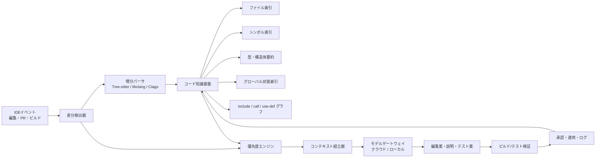
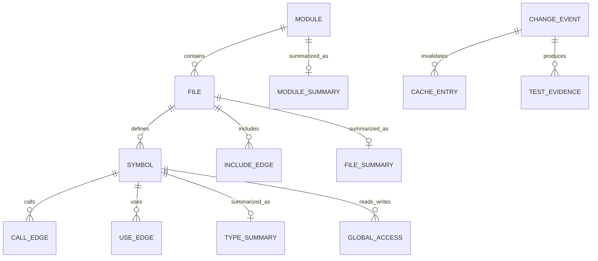

# IDEに統合されたAIエージェントの運用設計に関する調査報告

## エグゼクティブサマリ

本件の前提条件では、AIエージェントの設計目標は「大きなコンテキストを使い切ること」ではなく、「270,000トークンの上限を常に余裕を持って下回りつつ、変更に必要な証拠だけを高密度に詰めること」に置くべきです。理由は三つあります。第一に、300MB・約6,500ファイルのコードベースを文字数ベースで概算すると、全体はおおむね 7,500万〜1億トークン級になり、270,000トークン窓に対して 0.27〜0.36% しか一度に載せられません。第二に、長大コンテキストは使えることと、精度よく使い切れることが同義ではなく、Anthropicの公式文書も「context rot」を明示し、学術研究でも relevant な情報が中間位置にあるほど性能が落ちる傾向が示されています。第三に、近年のIDE統合エージェントは、JetBrains、VS Code、GitHub Copilot いずれも「ファイル全部を常時積む」のではなく、添付・オンデマンド読込・コンパクション・技能ファイル・外部ツール連携で文脈を絞る方向に進化しています。 citeturn25view0turn13view2turn16view2turn13view6turn13view7turn18view2

したがって、推奨運用は **ハイブリッド分割** です。具体的には、ファイル単位・モジュール単位・機能単位・シンボル単位を単独採用せず、まず「差分中心の機能スライス」を起点にし、その上に「シンボル要約」「共有ヘッダ要約」「グローバル状態の所有者・読書き関係要約」を重ね、必要時のみ raw code を局所追加する三層方式を採るべきです。RepoCoder や repository-level prompt generation の研究は、リポジトリ全体を直接投げるより、検索・再ランキング・反復取得で repository context を絞る方が有効であることを示しています。さらに、要約ベースの Meta-RAG は大規模コードベース要約で平均 79.8% の圧縮を報告しており、ASTベース要約研究も構文構造を要約品質に活かせることを示しています。 citeturn15view7turn16view1turn15view8turn15view9

運用面では、編集時・レビュー時・ビルド時で別のエージェント動作に分けるのが現実的です。編集時は 2〜6万トークン級の局所コンテキスト、共有ヘッダ変更やグローバル変数変更では 8〜14万トークン級、PRレビューやビルド障害解析でも 18.9万トークン前後を実運用上限とするのが妥当です。これは 270,000 トークン上限の約70%であり、残りを出力・ツール応答・再試行に残す設計です。VS Code の background agents は context compaction を備え、GitHub Copilot や JetBrains も多段タスク・複数ファイル変更・レビュー前提のワークフローを採っています。 citeturn12calculator3turn14view4turn15view4turn18view1

セキュリティ面では、**機密ディレクトリをクラウドIDEエージェントにそのまま見せる設計は避けるべき** です。JetBrains は `.aiignore` とローカル／サードパーティモデル接続を提供していますが、GitHub Copilot の content exclusion は IDE の Edit / Agent mode や cloud agent ではサポートされないと公式に明記されています。したがって、秘匿コードはローカルモデルまたは社内ゲートウェイ経由、クラウドモデルには要約済み・赤塗り済み・識別子変換済みの文脈だけを渡す二系統設計が安全です。OpenAI API には data residency controls があり、GitHub Copilot には組織ポリシーと予算統制がありますが、それらは「無加工ソースの無制限送信」を正当化するものではありません。 citeturn13view11turn14view0turn26view1turn26view2turn17view2turn13view9turn14view13

## 前提整理と設計原則

ユーザー前提の 300MB リポジトリを、OpenAI と Gemini のおおむね「約4文字/トークン」、Anthropic の「約3.5文字/トークン」という公式の目安に当てはめると、コードベース全体は約 7,500万〜1億トークンに相当します。270,000 トークン窓はその 0.27〜0.36% しか保持できず、全体を一度に読む設計は成立しません。さらに、仮に全文を 270,000 トークン窓で「巡回読込」しても、約 278〜370 ウィンドウが必要になります。 citeturn14view11turn15view1turn11calculator0turn11calculator1turn11calculator2turn30calculator0turn30calculator1turn30calculator2turn12calculator0turn12calculator1turn12calculator2

この前提は、設計思想を明確に制約します。すなわち、**上限 270,000 は「利用可能容量」ではなく「緊急時の天井」** であり、通常運用ではそこまで埋めるべきではありません。Anthropic はコンテキスト増大に伴う recall 低下を context rot と説明し、Lost in the Middle は relevant 情報が長文の中央に入ると性能が落ちることを示しています。加えて、Long-Context LLMs Meet RAG は retrieved passage を増やせば一貫して性能が上がるわけではなく、強い retriever でも hard negative が増えると精度が下がると報告しています。つまり、本件で重要なのは「大きく積むこと」ではなく、「正しい順序と粒度で、必要なものだけを積むこと」です。 citeturn13view2turn16view2turn16view3

あなたのプロジェクトでは、共有ヘッダが広範囲にインターフェースをまたぎ、グローバル変数が 1〜2万種類規模で存在し、しかもファイル外変数が大きなメモリ常駐状態を作っています。この構造では、ファイル単位だけで文脈を切ると、型・ABI・依存関係・状態変化の説明が足りず、逆にモジュール単位だけで切ると raw context が肥大化して窓を破綻させます。したがって、設計原則は **差分中心・シンボル中心・状態中心** の三本柱に置くべきです。これはユーザー前提に基づく運用提案であり、現代IDEエージェントの「複数ファイルをまたぐが、必要文脈はオンデマンドで読む」方向性とも整合します。 citeturn13view7turn18view1turn15view4

平均的なサイズ感も実務判断に有用です。単純平均では 1ファイルあたり約46KB、1モジュールあたり約232ファイルです。文字→トークン換算を当てると、平均的な raw file は約 1.15万〜1.32万トークン、平均的な raw module は約 268万〜306万トークンです。したがって、**raw module をそのままコンテキストに載せる案は最初から除外** してよく、モジュール単位が意味を持つのは「要約パック」「依存境界」「責務説明」として扱う場合だけです。 citeturn20calculator1turn20calculator2turn21calculator0turn21calculator1turn21calculator2turn21calculator3

## 推奨アーキテクチャ

推奨アーキテクチャは、IDE の前面にいるエージェントと、背後の「コードベース理解基盤」を明確に分離する構成です。前者はチャット・補完・レビュー・自動修正を担当し、後者はインデックス・要約・差分解析・依存グラフ・キャッシュ・テスト実行履歴を管理します。VS Code / Copilot 系では MCP がこの境界を作る標準的な方法であり、JetBrains 系では AI Chat のエージェント、添付コンテキスト、ローカルモデル／サードパーティモデル接続がその役割を担えます。GitHub Copilot cloud agent はリポジトリ調査・実装計画・ブランチ上の変更作成を非同期で行えるため、「ローカル実装」と「バックグラウンド大仕事」を分離する設計とも相性が良いです。 citeturn14view2turn14view3turn17view6turn13view6turn18view1turn14view0turn13view8

解析基盤の実装には、**インクリメンタル構文解析 + AST/シンボル抽出 + ビルド証跡収集** の組合せが適しています。Tree-sitter は編集中の増分更新に向くインクリメンタルパーサであり、libclang は AST・ソース位置・インデックス機能を提供し、Universal Ctags は JSON Lines でシンボルを吐けます。VC6 系では最新 Visual Studio が `.dsp` / `.dsw` の直接アップグレードを非推奨にしているため、現行の CMake / compile_commands 前提に依存せず、古いプロジェクト定義やビルドログから独自に include graph・compile option・モジュール境界を再構成する実装が安全です。必要に応じて `/showIncludes` のようなビルド出力を使えばネストした include 関係を回収できます。 citeturn14view6turn14view7turn14view8turn14view9turn14view10



上図の要点は、エージェントが直接ファイルシステム全体を読み回るのではなく、**一度構造化された知識基盤を経由して必要文脈だけを取得する** ことです。これは VS Code の agent mode が「計画し、関連ファイルを読み、編集し、コマンド・テストを実行し、自動修正する」流れを採っていること、JetBrains AI Chat がファイル・フォルダ・シンボルなどを文脈として添付できること、Agent Skills が必要時のみロードする設計であることとも一致します。 citeturn13view7turn18view1turn18view2



この ER は最小構成です。特に本件では `GLOBAL_ACCESS` を独立エンティティとして持つことが重要です。グローバル変数 1〜2万種類をすべて自然言語で持ち込むと、10トークン/件でも 10万〜20万トークン、30トークン/件なら 30万〜60万トークンになり、状態辞書だけで窓を使い切ります。したがって、グローバルは「全文辞書」ではなく、「所有モジュール」「型」「初期化関数」「主な読書き関数」「最近変更」「危険度」の圧縮インデックスとして持つべきです。 citeturn22calculator0turn22calculator1turn22calculator2turn22calculator3

## コンテキスト分割と要約設計

コンテキスト分割は、ファイル・モジュール・機能・シンボルのどれか一つを正解とみなすより、**「問い合わせの種類ごとに粒度を切り替える」設計** が合理的です。研究面でも、RepoCoder は repository-level code completion を similarity-based retriever と iterative retrieval-generation で改善し、Repo-Level Prompt Generation は repository knowledge を example-specific prompt に変換する枠組みを提案しています。要約系では Meta-RAG が大規模コードベースを平均 79.8% 圧縮し、CAST は AST を階層分割してコード要約に使う有効性を示しています。これらはすべて、「全文投入より、構造化抽出 + 選択的投入」が本筋であることを補強しています。 citeturn15view7turn16view1turn15view8turn15view9

以下の推定は、ユーザー前提の 300MB / 6,500 ファイルに対し、平均 file size 約46KB、平均 module size 約232ファイル、文字→トークン換算 3.5〜4 文字/トークンを使った試算です。raw module は予算超過なので、モジュールは summary pack 前提の数字にしています。 citeturn20calculator1turn20calculator2turn21calculator0turn21calculator1turn21calculator2turn21calculator3turn14view11turn15view1

| 分割案 | 利点 | 欠点 | 実運用での推定トークンコスト | 実装難易度 |
|---|---|---|---:|---|
| ファイル単位 | 実装が最も簡単。diff との整合が取りやすい。raw code をそのまま渡しやすい。 | 共有ヘッダやグローバル状態で文脈欠落が起きやすい。横断改修に弱い。 | 6k〜20k / 回 | 低 |
| モジュール単位 | 責務説明や境界理解に強い。レビュー文脈に向く。 | raw では巨大すぎる。summary-only でないと成立しにくい。 | 20k〜80k / 回 | 中 |
| 機能単位 | ユーザー要求や不具合票と自然に結び付き、変更範囲を業務単位で切れる。 | 事前の feature map が必要。レガシーCで境界が曖昧だと抽出が難しい。 | 30k〜100k / 回 | 高 |
| シンボル単位 | shared header、構造体、関数、グローバル変数の関係を最短で持ち込める。 | fan-in / fan-out が大きいと雪だるま式に増える。UI設計が難しい。 | 10k〜50k / 回 | 中〜高 |
| ハイブリッド | 精度とコストのバランスが最も良い。diff 起点で、必要時だけ raw を追加できる。 | 組立器とキャッシュ設計が必要。初期構築がやや重い。 | 25k〜120k / 回 | 高 |

結論として、**標準モードはハイブリッド** にすべきです。基底は「diff で触れたファイル + 共有ヘッダ要約 + 主要シンボル要約 + 関連グローバル状態要約 + 直近ビルド/テスト証跡」で構成し、そこへ raw code を 2〜6 ファイル程度まで追加します。これなら、通常編集は 2〜6万トークン、共有ヘッダ変更や横断修正でも 8〜14万トークン程度に収めやすく、PRレビューでも 18万トークン級に制御できます。Long context を「全部積める余地」ではなく、「必要に応じた局所拡張の余地」として使うことが肝要です。 citeturn16view2turn16view3turn13view2

要約手法は三層で設計すると運用しやすいです。第一層の **構造要約** は AST / ctags / include graph 由来で、`定義ファイル・宣言位置・型・マクロ・参照先` を短く保持します。第二層の **意味要約** は関数責務・副作用・エラー条件・前提条件・更新するグローバル・呼び出し順序を自然言語 5〜12 行で保持します。第三層の **状態要約** は構造体とグローバル変数に対して、`所有者・寿命・初期化・競合しやすい更新点・危険な暗黙依存` を抜き出します。AST を階層的に分けて要約する発想は CAST の方向性と整合し、Tree-sitter / libclang / Ctags を併用すると実装しやすいです。 citeturn15view9turn14view6turn14view7turn14view8

特に本件では、**型・構造体要約** と **グローバル状態要約** を別資産にする価値が大きいです。共有ヘッダにまたがる構造体とインターフェース関数は、多くの修正で再利用される反復文脈であり、OpenAI の Prompt Caching、Anthropic の prompt caching、Gemini の context caching は、こうした繰り返し文脈をコスト・レイテンシの両面で有利に扱えます。要は「毎回 raw header を丸ごと送る」のではなく、「ハッシュ化された summary pack を安定 ID で再利用する」ことが、技術的にも課金上も筋が良いということです。 citeturn13view1turn17view0turn17view1

## 同期・キャッシュ・優先度制御

大規模レガシーCで最もコストを悪化させるのは、**毎回フル再要約・毎回フル再送信** です。これを避けるには、同期戦略を「編集イベント」「Git差分」「ビルド証跡」「夜間メンテナンス」に分ける必要があります。プロンプトキャッシュは OpenAI では自動適用で最大 80% のレイテンシ削減、最大 90% の入力コスト削減をうたい、Anthropic は cache write / hit の明示価格、Gemini は implicit caching を提供しています。したがって、キャッシュはアプリ内だけでなく、**モデル提供者側キャッシュを前提にしたプロンプト安定化** も設計対象にすべきです。 citeturn13view1turn17view0turn17view1

| 戦略 | 仕組み | 長所 | 短所 | 推奨用途 |
|---|---|---|---|---|
| 保存時マイクロ同期 | 保存されたファイルだけを増分解析し、ファイル要約・シンボル要約を更新 | 最も新鮮。編集体験が良い。 | 頻繁な保存でCPU負荷が出る。 | 日常編集の既定 |
| Git差分増分同期 | commit / stash / branch diff に基づき影響集合を再計算 | PRレビューや作業再開に強い。 | 未保存変更は拾えない。 | レビュー前、朝会後、再開時 |
| ビルド証跡同期 | include graph、警告、エラー、リンク失敗、テスト失敗をインデックス化 | レガシーCで真に重要な依存を拾いやすい。 | ビルド実行が必要。 | 共有ヘッダ変更、障害解析 |
| 夜間フル再索引 | 全体整合性を検査し、summary drift を修正 | 品質維持、欠落補正に有効。 | 毎回やると高コスト。 | 夜間・週末バッチ |
| API側プロンプトキャッシュ | 繰返し送る system / tools / summary packs を provider cache に載せる | 課金と遅延を強く削減できる。 | プロンプトの安定性設計が必要。 | 定型ガードレール、ヘッダ要約、共通知識 |

この表から分かる通り、キャッシュは一種類ではなく、**ローカル知識キャッシュ** と **APIプロンプトキャッシュ** を重ねるのが最適です。実装上は、`summary_pack_id = hash(content_normalized + parser_version + prompt_version)` のような安定キーを作り、同じ shared header や構造体パックを何度も使い回します。Anthropic では cacheable prompt の最小長や cache hit 価格が公開されており、OpenAI でも repetitive prompt を安く扱う仕組みがあるので、プロンプト固定部を毎回書き換えないこと自体がコスト最適化になります。 citeturn17view0turn13view1turn15view3

また、セッションは長くなるほど劣化しやすいため、**インクリメンタル同期とコンパクションを同じ設計問題として扱う** べきです。VS Code の background agents は context compaction を備えており、Agent Skills も relevant content のみを必要時に読み込みます。これを自社運用に移植すると、セッションが長くなったときは「会話履歴を保持する」のではなく、「決定事項・未解決論点・影響シンボル・未完了テスト」を handover pack に再圧縮して新セッションへ引き継ぐのがよいです。 citeturn14view4turn18view2

以下は、現場でそのまま使える優先度テンプレートです。これは本報告の提案ルールであり、Git diff、ビルド証跡、シンボル索引、共有ヘッダ、グローバル状態という五種のシグナルを重ねて、**先に何を読むか** を統制します。

| トリガー | 優先シグナル | 最初に読むべき文脈 | 追加ロード条件 | 目安予算 | 中断条件 |
|---|---|---|---|---:|---|
| 単一 `.c` 編集 | 保存ファイル、同関数、同ヘッダ | 編集中関数 raw、所属ファイル要約、直接 include | 呼出先/被呼出元が 5 件超 | 25k〜50k | 修正の実装候補が 2 件以上得られた時点 |
| 共有ヘッダ変更 | 型変更、宣言変更、macro 変更 | 変更ヘッダ raw、参照 `.c` 上位N件、型・構造体要約 | ビルドエラーや warning が出た場合 | 80k〜140k | 影響ファイル集合が安定した時点 |
| グローバル変数変更 | 初期化、型、寿命、排他、更新関数 | 当該 global の状態要約、主書込関数、主読込関数 | 参照が広域ならモジュール要約追加 | 60k〜120k | 主読書き経路が説明できた時点 |
| ビルド失敗 | エラー行、include chain、リンク失敗 | エラー箇所 raw、include chain、直前差分、関連 symbols | 同系統エラーが複数発生 | 50k〜100k | 最初の根因候補が再現された時点 |
| テスト失敗 | failing test、直近差分、stack trace | failing test raw、対象関数、更新 global 要約 | 同一失敗が複数ケース | 40k〜90k | 最小再現条件が得られた時点 |
| PRレビュー | diff hunk、共有ヘッダ、危険 globals | diff、設計要約、関連 interface、テスト evidence | 高リスクファイルや削除がある場合 | 90k〜180k | 重要指摘が尽きた時点 |
| 機密パス | path policy、秘密度ラベル | ローカル要約のみ | クラウド送信禁止なら raw 不送信 | 0〜ローカルのみ | 承認がない限り外部送信しない |

## IDE統合ワークフローと検証

編集時ワークフローでは、エージェントは常駐チャットとして振る舞うより、**エディタイベントに反応するコンテキスト組立サービス** として振る舞う方が安定します。JetBrains AI Chat はファイル・フォルダ・シンボル添付を前提にし、Agents は複数ファイル変更とロールバックを伴う複雑タスク向けです。VS Code agent mode はコードベースを分析し、関連ファイルを読み、編集し、ターミナルコマンドやテストを実行し、コンパイル／lint エラーに反応してループ修正を行います。したがって、IDE 統合では「会話UI」と「自動文脈組立」を分け、通常編集では後者だけが静かに動く構成が適しています。 citeturn18view1turn13view7turn15view4

レビュー時は、差分だけでなく、**差分に影響する shared header・型・グローバル状態・関連テスト** を足す必要があります。GitHub Copilot Agents の responsible-use 文書は、コードレビュー時に code changes と additional relevant context を見てフィードバックすると説明しています。これは本件のようなレガシーCでも有効で、レビュー専用エージェントには raw files ではなく `diff + interface pack + risk pack + test evidence` を渡すのが合理的です。レビューは「正しいコードを生成する」より「危険な変更を見落とさない」ことが重要なので、文脈の優先順位は correctness より risk-driven に寄せるべきです。 citeturn15view5

ビルド時は、VC6系の現実を踏まえて、**ビルドログを第一級のコンテキスト資産** として扱うべきです。古い `.dsp` / `.dsw` を最新ツールにそのまま依存できない以上、build wrapper で include tree、warning、error、link failure を回収する設計が重要になります。`/showIncludes` はネストした include を出力できるため、もし MSVC 互換のビルド再現が可能なら、include chain を高精度に抽出できます。これは shared header の波及範囲推定や、過剰なヘッダ読込の防止に効きます。 citeturn14view9turn14view10

テスト・検証は、LLM に「全部のテストを書かせる」より、**差分解析に基づく限定的テスト生成** の方が成功率とコストの両面で優れます。具体的には、変更シンボルに対して、`直接呼出元`、`変更した global を読む関数`、`構造体の新旧互換を受ける境界` を抽出し、その周辺だけに回帰テスト候補を自動生成します。VS Code / Copilot 系がテスト実行と修正ループをサポートし、GitHub Copilot cloud agent がプラン〜変更〜ブランチ作成を担える現状では、テスト生成は「単独能力」ではなく「差分・ビルド・レビューとつながったパイプライン能力」として位置付けるのが正しいです。 citeturn15view4turn13view8

以下は、推奨するセッション別の入力トークン目標です。棒グラフの値は本報告の運用提案値であり、赤線の 189,000 は 270,000 上限の 70% です。70% を hard ceiling とするのは、長文での性能劣化研究と運用上の出力余白確保の両方を考慮した設計判断です。 citeturn12calculator3turn16view2turn16view3turn13view2

```mermaid
xychart-beta
    title "セッション種別ごとの目標入力トークン"
    x-axis [軽微編集, 関数改修, 共有ヘッダ変更, ビルド障害解析, PRレビュー]
    y-axis "tokens" 0 --> 200000
    bar [25000, 60000, 110000, 140000, 180000]
    line [189000, 189000, 189000, 189000, 189000]
```

## セキュリティ・ガバナンス・実装ロードマップ

セキュリティ設計では、まず **「どのコードをクラウドに出してよいか」ではなく、「どの層の表現なら出してよいか」** を定義すべきです。JetBrains には `.aiignore` があり、特定ファイルやフォルダを AI 処理対象から除外できます。また、JetBrains AI Assistant はローカルモデルやサードパーティモデルに接続できます。これにより、機密パスはローカルモデルで raw code を処理し、クラウドへは要約だけを渡す二層構成が取りやすいです。 citeturn13view11turn14view0turn14view1

一方で、GitHub Copilot では注意が必要です。公式文書には、content exclusion は Edit / Agent mode や Copilot cloud agent ではサポートされず、除外ファイルの意味情報が IDE 経由で間接的に使われ得ること、cloud agent / CLI / Agent mode は content exclusion をサポートしないことが明記されています。したがって、機密コードがあるディレクトリでは、**ポリシー上の除外設定を過信して raw ソースへのアクセスを許すべきではありません**。この領域はローカル専用エージェント、または社内 MCP/社内ゲートウェイが返す redacted summary に限定すべきです。 citeturn26view2turn26view1

ガバナンス面では、少なくとも四つのロールを置くべきです。`IDE利用者`、`AI運用管理者`、`セキュリティ承認者`、`要約品質管理者` です。GitHub Copilot には enterprise / organization policies があり、アクセス可能な機能・モデル・エージェント・CLI・MCP を統制できます。MCP は GitHub Copilot では組織ポリシー上 disabled by default にでき、VS Code 側では `.vscode/mcp.json` を共有できます。つまり、運用統制は単なる規程ではなく、**設定ファイルと管理コンソールに落とし込める** のが実務上の強みです。 citeturn13view9turn14view3turn14view2

コスト統制もガバナンスに含めるべきです。GitHub Copilot は 2026年から usage-based billing に移行し、トークン消費量に応じて AI Credits を使う方式になりました。企業では included credits がプール共有され、一部の heavy user や automated agent session が早期に大量消費し得るため、GitHub は budget controls を推奨しています。OpenAI API 側でも月次予算や project ごとの billing restrictions を設定できます。したがって、運用ルールとしては、**モデル別予算、役割別予算、セッション種別別の token ceiling** を三重で置くのが適切です。 citeturn17view4turn14view13turn14view14turn25view0

コストの具体例を見ると、設計方針の差が分かりやすくなります。たとえば GPT-5.4 の long context 価格を使うと、`35k uncached + 60k cached + 5k output` の「通常タスク」は約 $0.15875、`80k uncached + 120k cached + 12k output` の「広域レビュー」は約 $0.365 です。逆に 270k をほぼ毎回フルに使う設計では 1回約 $0.7425 になり、75M トークン級リポジトリを 270k 窓で総なめするだけでも約 $206 規模になります。つまり、**コンテキスト組立の品質は、そのまま月額コストに直結** します。 citeturn13view0turn27calculator1turn27calculator2turn28calculator0turn29calculator0

Gemini や Anthropic 側でも傾向は同じです。Anthropic の prompt caching 価格表は base input、cache write、cache hit を分けており、Gemini も context caching と storage price を公開しています。低価格階層のモデルは探索・要約・分類に使い、高価格・高性能モデルは最終生成と高リスクレビューに限定するのが理にかなっています。JetBrains がローカルモデルやサードパーティモデルを feature ごとに割り当てられるのも、この設計と相性が良いです。 citeturn17view0turn13view5turn24view1turn24view2turn14view0

実装ロードマップは、以下の四段階を推奨します。第一段階は **観測基盤の整備** で、`.dsp/.dsw` 解析、保存時差分検出、ビルドログ収集、include chain 収集を行います。第二段階は **知識基盤の構築** で、Tree-sitter / libclang / Ctags を使った file-symbol-type-global index を作り、要約パック生成を始めます。第三段階は **IDE 統合** で、VS Code なら MCP + Agent Skills、JetBrains なら AI Chat 添付 + ローカルモデル併用で運用を始めます。第四段階は **統制と最適化** で、予算、承認フロー、ログ、セッション handover、summary drift 監査を追加します。Windsurf は公開文書で 5000-file workspace に約300MBの indexing RAM を例示しており、6500ファイル規模なら単純比例で約390MB程度が一つの目安になります。ローカル索引は十分現実的です。 citeturn14view6turn14view7turn14view8turn14view2turn18view2turn14view0turn14view5turn20calculator0

## リスクと緩和策

最大のリスクは、**巨大コンテキストを使えることを理由に、全文投入型の運用へ流れること** です。これはトークン費用の増大だけでなく、context rot、lost-in-the-middle、hard negatives による判断品質低下を招きます。緩和策は明確で、通常編集では 2〜6万トークン、横断修正では 8〜14万トークン、レビューでも 18.9万トークンを hard ceiling にし、それを超える前に handover compaction を行うことです。VS Code background agents の compaction は、この運用思想が製品実装としても妥当であることを示しています。 citeturn13view2turn16view2turn16view3turn14view4

第二のリスクは、**要約の古さと誤り** です。要約は安くて便利ですが、source of truth ではありません。したがって、エージェントが最終判断に使う文脈には、必ず `summary + raw evidence` の二重化を入れるべきです。具体的には、編集前に触る raw file と shared header だけは必ず再読込みし、要約のみでパッチを当てない。夜間フル再索引で summary drift を検知し、parser_version や prompt_version が変わったときだけ再要約対象を洗い直す運用が必要です。RepoCoder や Meta-RAG も retrieval / summarization を使いますが、要約だけで完結するとは言っていません。むしろ retrieval quality と generation のつなぎが重要です。 citeturn15view7turn15view8turn16view3

第三のリスクは、**機密コードの漏洩と誤統制** です。JetBrains の `.aiignore` やローカルモデル接続は有効ですが、GitHub Copilot の content exclusion は Agent mode / cloud agent ではサポートされないため、「設定したから安全」とは言えません。緩和策は、機密パスの raw code をクラウドエージェントへ送らないこと、社内要約サービスまたはローカルモデル専用経路を持つこと、GitHub 側は policy と MCP allowlist、OpenAI 側は data residency や project-level budgets を併用することです。 citeturn13view11turn14view0turn26view1turn26view2turn17view2turn25view0

第四のリスクは、**コストが「人」ではなく「セッション種別」に紐づいていないこと** です。GitHub Copilot の usage-based billing が示す通り、軽い質問と長時間の自律セッションは同じではありません。緩和策は、`編集`, `レビュー`, `ビルド障害解析`, `大規模横断改修` の四カテゴリごとにモデル・予算・出力上限を変えることです。安価モデルで探索・索引・前処理、高性能モデルで最終レビューと危険変更判定を行う二段階実行にすれば、コストと品質の両立がしやすくなります。 citeturn17view4turn14view13turn14view14turn24view2turn25view0

総合判断として、本件に最も適した運用設計は、**ハイブリッド分割、三層要約、差分起点の増分同期、API側キャッシュ活用、セッションコンパクション、機密コードの二系統経路、ビルド・テスト証跡の第一級データ化** を中核に置く方式です。これなら、270,000 トークンという上限と従量課金を「制約」ではなく「設計変数」として扱えます。特に VC6 / C / shared header / 多数グローバル変数という条件では、ファイル単位でもモジュール単位でもなく、**シンボルと状態を核にした retrieval-first アーキテクチャ** こそが最も実務的です。 citeturn15view7turn15view8turn13view2turn13view1turn17view0turn17view1