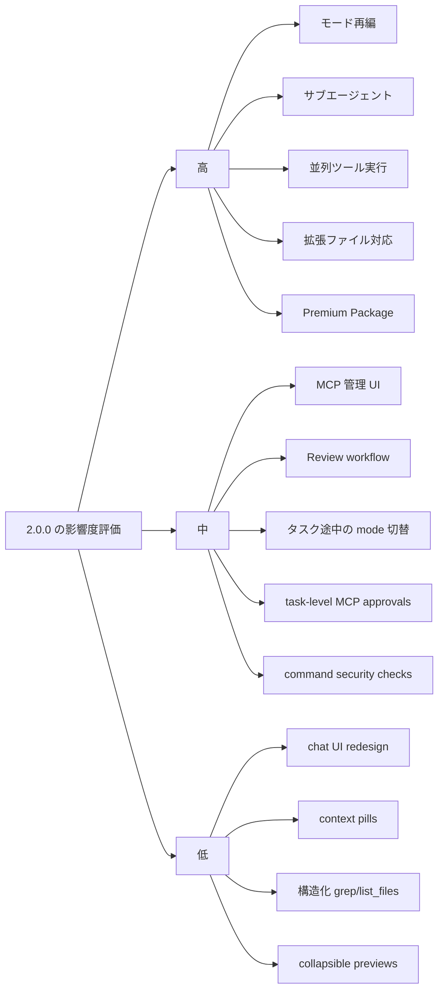

# IBM Bob 2.0.0 の追加機能と改善機能に関する詳細レポート

## エグゼクティブサマリ

IBM Bob 2.0.0 は、単なる機能追加版ではなく、日常的な開発体験を「並列化」「管理容易化」「ガバナンス強化」「モダナイゼーション特化」の四方向で再設計したメジャー更新です。指定された最優先ソースである changelog では、新機能としてサブエージェント、実行中エージェントの方向転換とメッセージキュー、MCP 管理 UI、組み込みレビュー・ワークフロー、ワークスペース単位のモード管理、Skills 管理タブ、そして Premium Package 群が明示されています。改善面では、既定モードの再編、コンテキスト・ウィンドウ拡大、並列ツール実行、承認 UX の再設計、ドキュメント対応拡張、コマンド実行前のセキュリティ検査、認証強化が中核です。citeturn0view0turn8view0

とくに重要なのは、開発フローの単線性が崩れた点です。サブエージェントにより自己完結型の探索や処理を主会話から隔離でき、並列ツール呼び出しと広いコンテキストにより、長い調査・変更・レビューの一連作業をより少ない中断で継続できます。公式発表では、V1 で約 30 秒かかっていた一部タスクが V2 では 10 秒未満で終わることがある、という illustrative な性能改善例も示されています。citeturn1view0turn0view0turn8view0turn36calculator0

運用・統制面では、承認フローの粒度が上がり、コマンド編集、タスク単位の MCP 承認、逐次承認、コラプシブル・プレビュー、コマンド安全性チェックが揃ったことで、「自動化を進めつつ危険操作は抑える」という企業利用向けの制御性が高まりました。一方で、MCP サーバー導入や Premium Package 利用は利便性を上げる反面、権限境界とデータ流出面の検討を必須にします。citeturn24view0turn7search0turn26view0turn16search4

移行そのものは比較的軽く、公式発表では「通常のバージョン更新」で済み、既存の settings、rules files、MCP servers は引き継がれると説明されています。ただし、公開資料間にはいくつか整合性の揺れがあります。たとえば Skills の有効化条件、Subagent 承認の既定挙動、Rollback の内部実装については changelog・機能ページ・発表ブログの間で表現差があり、2.0.0 導入前に実機で確認するのが安全です。citeturn8view0turn0view0turn2view2turn24view0turn17view2

## 調査範囲と読み方

本レポートは、ユーザー指定の最優先ソースである IBM Bob IDE changelog を基点に、IBM Bob 公式ドキュメント、公式ブログ、IBM 公式日本語ページを補助参照して構成しています。機能の存在判定と一次一覧は changelog を優先し、利用方法・前提条件・制限は対応する機能ドキュメントで補完しました。changelog にあるが下位資料に実装詳細が見当たらない項目、または資料間で齟齬がある項目は、本文内で **「未記載」** または **「資料間に不整合あり」** と明記しています。citeturn0view0turn8view0turn19search1turn20search1turn20search3

2.0.0 の一般提供日は公式発表ブログで 2026 年 6 月 24 日とされており、changelog では「June 2026」と表記されています。そのため、本レポートでは「2.0.0 = 2026 年 6 月一般提供」と扱っています。citeturn0view0turn8view0

## 追加された新機能

### 新機能比較表

| 機能 | 目的 | 主要な技術的詳細 | 利用方法 | 想定される利点 | 制限・注意点 | 既存ワークフローへの影響 |
|---|---|---|---|---|---|---|
| サブエージェント | 複雑タスクを自己完結な作業単位へ分割し、主会話の文脈汚染を防ぐ | サブエージェントは独立コンテキストで動作し、結果は要約で親へ戻る。型は `explore` と `general`。必要に応じ `fork_context: true` で親会話履歴を渡せる。各 spawn は承認制。citeturn0view0turn1view0 | 主に複雑調査・大規模探索時に Bob が spawn。モードごとに許可される型が異なる。citeturn1view0turn18view0 | 主タスクのコンテキスト節約、探索の並行化、長期タスクの整理。citeturn1view0turn8view0 | サブエージェントは親と状態・ファイル・ツール結果を自動共有しない。要約しか戻らない。単純な 1〜2 回のツール呼び出しには不向き。citeturn1view0 | 高 |
| 実行中エージェントの方向転換とメッセージキュー | 実行中作業を止めずに新規指示を並行投入する | 実行中の agent を cancel せず redirect 可能。Bob が忙しい間に来たメッセージはキューへ入り、順序変更可能で、webview reload 後も保持される。公式発表では各タスクが独自 thread/context を持つ background task 的に説明。citeturn0view0turn8view0 | Bob が処理中に追加メッセージを送り、必要ならドラッグで順序入れ替え。citeturn0view0 | 待ち時間の隠蔽、タスク切替のしやすさ、複数作業の同時進行。citeturn0view0turn8view0 | 永続化の実装方式、優先度制御、競合時ルールは未記載。citeturn0view0turn8view0 | 高 |
| MCP サーバー管理 UI | 外部ツール連携を JSON 手編集なしで管理可能にする | Settings の MCP タブから global/project の `mcp.json` を編集でき、サーバー単位・ツール単位で有効/無効切替可能。未使用ツールを無効化するとトークン消費も抑制できる。STDIO / Streamable HTTP / SSE transport をサポート。citeturn0view0turn1view1turn26view2 | Settings → MCP。Global は `~/.bob/mcp.json`、Project は `.bob/mcp.json`。ツールごとの toggle も可能。citeturn1view1turn26view4 | 連携導入の容易化、プロジェクト単位共有、トークン節約。citeturn1view1turn26view0 | 外部 MCP は認証・暗号化・アクセス制御・監査が必要。外部サーバーはデータ流出リスクあり。citeturn7search0turn26view0 | 高 |
| Review workflow | IDE 内で AI コードレビューを閉じる | `/review` で起動する専用 panel を持ち、ブランチ差分を解析し Bob Findings に指摘を出す。GitHub issue を任意で紐づけると issue coverage も確認可能。レビュー実行自体は auto-approval で進む。citeturn0view0turn25view0 | `/review` または Review panel から、比較対象ブランチや未コミット変更を選んで開始。除外 glob も設定可能。citeturn25view0turn9search1 | PR 前の品質ゲート、レビュー工数削減、指摘の再利用。citeturn25view0 | issue validation は GitHub 必須。ブランチ比較は GitHub/GitLab で使えるが issue 検証は GitHub のみ。citeturn25view0 | 高 |
| ワークスペース単位のモード管理 | チーム/プロジェクトごとに Bob の人格と権限を調整する | Settings の Modes タブで create / override / manage。保存先は global / project を選べ、YAML は `~/.bob/settings/custom_modes.yaml` か `.bob/custom_modes.yaml`。allowed subagents や tool groups を設定可能。citeturn0view0turn17view1 | Settings → Modes で作成。高度な edit 制限は手動 YAML で fileRegex 指定可能。citeturn17view1 | 権限最小化、再利用可能な開発規約、チーム標準化。citeturn17view1turn23view0 | 一部詳細制約は UI ではなく YAML 追記が必要。citeturn17view1 | 中 |
| Skills settings tab | Skills を中央管理する | changelog では Settings に専用 Skills タブが追加されたと説明。一般 Skills は再利用可能 instruction set と supporting files から成る。citeturn0view0turn2view2 | Settings → Skills で閲覧・管理。具体的な UI 操作詳細は未記載。citeturn0view0 | 再利用フローの可視化、チーム共有の容易化。citeturn2view2 | 一般 Skills 文書は「Advanced mode でのみ利用可」と記す一方、2.0.0 では Advanced 能力を既定 3 モードへ統合とあるため、正確な有効化条件は資料間に不整合あり。citeturn2view2turn0view0turn19search0 | 中 |
| Premium Package の導入枠組み | Bob をドメイン特化機能で拡張する | subscription entitlement を起動時に確認し、未導入なら通知から install できる。各 package は Bob 本体の上に目的別ワークフローを追加する。citeturn0view0turn16search2 | Bob 起動時に entitlement があれば Install 通知。citeturn16search2 | コア Bob を保ちつつ、Java / Z / i 向けに専門能力を追加。citeturn16search2turn8view0 | package ごとに別ライセンス・前提条件が必要。citeturn16search2turn16search3turn16search1turn16search0 | 高 |
| Premium Package for Java Modernization | Java モダナイゼーションを閉ループ化する | Java 8/11 から 17/21/25 への upgrade、WebSphere から Liberty への replatforming、UI modernization、unit test generation の 4 workflows を提供。開始は Start Workflow か `/start-java-mod`。IBM Bob 2.0.0+ と JDK 8 以上が前提。citeturn2view3turn32search0turn17view3turn16search3 | Java project を開き、Start Workflow または `/start-java-mod`。citeturn17view3 | 大規模 Java 更改の再現性、テスト生成、AMA 連携による移行計画活用。citeturn2view3turn32search0 | Liberty workflow は AMA 4.6.0+ bundle、UI workflow は `back/` と `front/` 事前作成が必要。citeturn32search0 | 高 |
| Premium Package for Z | メインフレーム資産の理解・文書化・分割を支援する | COBOL / PL/I 向け data dictionary、documentation、refactor、service generation、explain code を提供。Bob 2.0.0+、Z Open Editor 6.6.0+、Zowe Explorer 3.5.0+ が必要。`/init` による `AGENTS.md` 生成を推奨。citeturn2view4turn16search1turn34view0turn35view0 | Start Workflow または `/data-dictionary-management`、`/refactor`、`/explain` 等。初回は `/init`。citeturn35view0 | レガシー理解、ドキュメント生成、分割サービス化の高速化。citeturn34view0turn35view0 | mainframe source の可視性、copybook/依存物、Z Understand など周辺準備が重要。citeturn16search1turn35view0 | 高 |
| Premium Package for i | IBM i 直結の AI 開発体験を提供する | IBM i 向け modes、skills、workspaces、tools、slash commands、workflows、IBM i docs RAG を追加。Bob 2.0.0+、複数拡張機能の minimum version、IBM i 7.4、SSHD が必要。QSYS / IFS 直接操作、CL / SQL / PASE 実行が可能。citeturn2view5turn16search0turn31search1 | entitlement 導入後、Code for IBM i 接続を有効化し、Start Workflow または IBM i 向け command / workflow を使う。citeturn16search0turn31search1 | IBM i ソースの直接操作、文書検索、RPG modernization や SQL index advisor などの特化処理。citeturn16search0turn31search1 | IBM i 接続と最小権限が必須。SSH 経由での接続・監査・依存拡張の更新維持が必要。citeturn16search0turn16search4 | 高 |

### 新機能の技術的な読み解き

2.0.0 の新機能群は、互いに独立した散発的追加ではなく、**「長いタスクを小さく分けて、止めずに、ガバナンスを保って進める」** という一つの設計意図でつながっています。サブエージェントは文脈分離、メッセージキューは実行継続、MCP 管理 UI は外部機能拡張、Review workflow は品質ゲート、Modes/Skills の settings 化は運用の標準化、Premium Package は業務ドメインへの縦方向拡張を担っています。citeturn0view0turn1view0turn1view1turn25view0turn17view1turn16search2

特に Premium Package は、Bob 2.0.0 の「製品戦略」と「技術構成」の両方に影響します。Bob V2 発表は、Workflows を大規模・多段階・再現性重視の変更の骨格として位置付け、その具体化として Java Modernization、IBM i、IBM Z 向け package を提示しています。つまり 2.0.0 は Bob 本体の機能増強に加え、**ワークフロー実行基盤を業種・プラットフォーム別アセットで埋めていくための受け皿** を整えた版だと解釈できます。citeturn8view0turn16search2turn32search0turn34view0turn31search1

## 既存機能の改善と互換性

### 改善比較表

| 改善項目 | 技術的変更点 | 期待効果 | 互換性・移行上の注意 | 既存ワークフロー影響 |
|---|---|---|---|---|
| 既定モードの簡素化 | 旧 5 モード体系（Code / Ask / Plan / Advanced / Orchestrator）から、2.0.0 では Agent / Plan / Ask の 3 モードへ集約。Advanced と Orchestrator の能力は既定側へ統合。citeturn0view0 | 学習コスト低減、選択ミス減少、役割の明確化。citeturn18view0turn23view0 | 旧モード前提の運用説明書・教育資料は更新が必要。Skills や自動オーケストレーションの説明は旧用語混在あり。citeturn0view0turn2view2turn19search0 | 高 |
| コンテキスト・ウィンドウ拡張 | 200,000 → 270,000 tokens に増加。約 35% 増。citeturn0view0turn36calculator0 | 長タスク、大きいファイル、ツール出力をより長く保持。citeturn0view0turn23view0 | 大規模文脈投入は依然として管理が必要で、Bob 公式は新規 task 分割を推奨。citeturn23view0 | 高 |
| 並列ツール呼び出し | 独立したツールを同時実行。承認は個別。V2 発表では file reads/searches が同時進行し、V1 より大幅短縮の例が示される。citeturn0view0turn8view0 | 調査・検索・読込待ち時間の削減。citeturn0view0turn8view0 | 並列でも承認は個別なので、組織ポリシーによっては体感改善が限定される。citeturn0view0 | 高 |
| エディタ右クリックからの Bob 操作 | Code actions が context menu から直接起動可能。選択コードに対し submenu で Bob action を実行。citeturn0view0turn14search15turn6search11 | コピー・貼り付けを減らし、選択コード起点の作業開始を高速化。citeturn14search15 | 運用上は lightbulb / command palette / context menu の 3 系統が併存。ショートカット教育が必要。citeturn6search11 | 中 |
| タスク途中のモード切替 | Bob が作業途中で mode を切り替え可能。公式 docs では Bob が自律的に Plan → Agent へ移れると説明。citeturn0view0turn18view0 | 計画から実装への切替を会話断絶なしで継続。citeturn18view0turn8view0 | モードごとに tool/subagent 権限が違うため、突然の権限差を理解しておく必要。citeturn18view0 | 高 |
| モード別サブエージェント制御 | モードごとに allowed subagents を制御。Agent は All、Plan/Ask は Explore。citeturn0view0turn18view0 | 不適切な delegation の抑制、least privilege 強化。citeturn18view0 | changelog は「spawn は explicit approval」とし、Auto-approve docs は Subagent 自動許可も示すため、既定挙動は実機確認推奨。citeturn0view0turn24view0 | 中 |
| ネストされた workflow | workflow が他 workflow を呼び出せる。citeturn0view0 | 多段自動化の再利用性向上。citeturn0view0turn31search1turn34view0 | 呼び出し規則・エラー伝播・再試行戦略は未記載。citeturn0view0 | 中 |
| コマンド編集可能化 | 承認前に terminal command を直接編集可能。citeturn0view0turn24view0 | Bob の提案を破棄せず微修正できる。citeturn24view0 | 手動変更により Bob の意図と実行コマンドがずれる可能性。変更後の責任分界に注意。citeturn24view0 | 中 |
| 信頼済みコマンドの自動承認 | trusted command list を定義して反復コマンドを無承認実行。citeturn0view0 | ビルド・テスト等の定型操作を高速化。citeturn0view0turn23view0 | 具体的な設定 UI / file schema は本調査範囲の公式資料では未記載。高リスク command への広範設定は不推奨。citeturn0view0turn24view0turn29search1 | 高 |
| タスク単位 MCP 承認 | global とは別に task ごとに MCP tool group 承認を設定。task-level が UI 先頭に表示。citeturn0view0turn24view0 | 一時的な外部ツール利用に柔軟対応。citeturn24view0 | プロジェクト横断で設定が増えるため、ガバナンス文書で整理が必要。citeturn24view0turn7search0 | 中 |
| 承認の逐次表示 | approval prompt を 1 件ずつ表示。citeturn0view0turn24view0 | 可読性向上、見落とし減少。citeturn24view0 | 並列実行件数が多いタスクでは件数自体は減らない。citeturn0view0 | 中 |
| 承認プレビューの折りたたみ | 大きな diff / command output を preview frame に収める。citeturn0view0turn24view0 | チャットのノイズ削減。citeturn24view0 | 精査時は展開を忘れない運用が必要。citeturn24view0 | 低 |
| チャット UI 再設計 | look and layout を改善。公式発表では intermediate tool calls や dead-end exploration が quieter になったと説明。citeturn0view0turn8view0 | 可読性向上、主作業への集中。citeturn8view0 | 詳細差分は未記載。訓練資料の画面キャプチャ差し替えが必要。citeturn0view0 | 低 |
| Context pills | 貼り付けテキストを input 内の compact pill として表示。citeturn0view0turn6search2 | 文脈追加の把握が容易。citeturn6search2 | 巨大文書の中身可視化にはならない。内容精査は別手段が必要。citeturn6search2 | 低 |
| Unified diff view | 変更を syntax-highlighted unified diff で表示。citeturn0view0 | 変更レビューの比較効率向上。citeturn0view0 | 具体 UI 操作・フィルタは未記載。citeturn0view0 | 中 |
| `read_file` 出力の構文強調 | file content 表示に syntax highlighting を適用。citeturn0view0 | 可読性向上、レビュー負荷低下。citeturn0view0 | 対応言語一覧は未記載。citeturn0view0 | 低 |
| `grep` 結果の構造化 | 検索結果を scanning しやすい structured format 化。citeturn0view0 | 大規模コードベース探索の効率向上。citeturn0view0 | 出力 schema は未記載。citeturn0view0 | 中 |
| `list_files` 結果の構造化 | directory separators、tooltips、clickable paths を持つ file list に変更。citeturn0view0 | 大規模ツリーの把握とジャンプ効率向上。citeturn0view0 | エクスポート形式やソート制御は未記載。citeturn0view0 | 低 |
| ファイル互換性拡張 | `.docx` / `.pdf` / `.xlsx` を直接読める。Best practices でも添付 context として利用可と明記。citeturn0view0turn23view0 | 設計書や試験票を copy-paste なしで取り込める。citeturn8view0turn23view0 | 解析の精度・レイアウト保持・画像埋込文書の扱いは未記載。citeturn0view0turn23view0 | 高 |
| コマンド実行前セキュリティ検査 | command 実行前に harmful operation 防止チェックを追加。公式 docs 検索スニペットでは高リスク command は auto-approve 下でも追加確認の可能性が示される。citeturn0view0turn29search1 | 実行系自動化の安全性向上。citeturn0view0turn24view0 | 判定ロジック・ポリシー粒度は未記載。誤検知/見逃し率も未記載。citeturn0view0turn29search1 | 高 |
| 認証信頼性向上 | token refresh 重複防止、token handling 強化、SSO timeout 15 分。1.0.3 では token refresh race condition と retry/backoff も修正。citeturn0view0turn0view0 | セッション中断の減少、認証の安定化。citeturn0view0 | 認証フロー時間切れの体験は変わりうる。正確な旧 timeout は未記載。citeturn0view0 | 中 |

### 互換性と移行上の重要点

最も大きい互換性変化は、**モード体系の再編**です。旧来の Advanced / Orchestrator を前提にした利用手順、教育資料、社内 runbook は 2.0.0 でそのままでは通用しません。2.0.0 では Plan / Agent / Ask へ集約されたため、「どの場面でどのモードを使うか」の説明を新三分類へ寄せる必要があります。citeturn0view0turn18view0turn23view0

一方、設定移行の負担は比較的小さく、公式発表では「新バージョンをインストールするだけ」で、既存の settings、rules files、MCP servers は carry over するとされています。つまり **概念移行は大きいが、構成ファイル移行は軽い** というのが 2.0.0 の特徴です。citeturn8view0

ただし、公開資料だけを見ると、Subagent 承認、Skills の有効化条件、Rollback の内部実装については整合性が揺れています。そのため、厳密な統制が必要な組織では、2.0.0 本番導入前に **pilot workspace を 1 つ作り、承認 UI・mode 権限・skills activation・rollback 動作** を実機検証するのが妥当です。citeturn0view0turn2view2turn24view0turn17view2

## 影響評価

### ステークホルダー別の影響

開発者視点では、最も大きいのは **サブエージェント、並列ツール実行、広いコンテキスト、レビュー・ワークフロー** です。これらは情報探索、実装、レビューまでの往復回数を減らし、特に unfamiliar codebase や大規模変更で効きます。公式 best practices も、Plan から始めて Agent に移る進め方、targeted context の利用、複雑作業の分割を推奨しており、2.0.0 はそれを製品側で支える設計になっています。citeturn1view0turn0view0turn8view0turn23view0turn25view0

運用・管理視点では、MCP 管理 UI、Modes/Skills の settings 化、task-level approvals、command security checks、Premium Package entitlement 管理の意味が大きいです。とくに MCP は便利ですが、Bob 公式の security guidance は認証、暗号化、アクセス制御、監査、ローカル優先、許可済みサーバーの棚卸しを推奨しており、**使い勝手向上と引き換えに運用設計の重要性が増す** と評価できます。citeturn1view1turn17view1turn24view0turn7search0turn26view0

エンドユーザー視点では、直接見えるのはチャット UI 再設計、context pills、structured outputs、review findings の扱いやすさです。見た目の更新は小さく見えても、日常利用の「待つ」「探す」「見落とす」を減らすため、継続利用率や学習コストに効く改善と考えられます。citeturn0view0turn6search2turn25view0

### パフォーマンス・セキュリティ・ワークフロー影響

パフォーマンス面では、コンテキスト 270k 化と並列ツール呼び出しが主因です。Bob V2 の公式発表は、複数 file read と search が重なるタスクで V1 より大幅に短い実行時間例を示しており、体感改善はかなり大きいと見られます。また `.docx` / `.pdf` / `.xlsx` を直接参照できることは、前処理工数の削減という意味で IO 以外の待ち時間も減らします。citeturn0view0turn8view0turn23view0

セキュリティ面では、command security checks、逐次承認、editable commands、task-level MCP approvals が前進です。ただし Bob 自身の security guidance は、auto-approve は限定的に使うこと、`.bobignore` を作ること、秘密情報を prompt や可視ファイルに含めないこと、MCP を trusted source のみに絞ることを推奨しています。つまり 2.0.0 は **より安全になったが、デフォルトで何でも安全になるわけではない** という位置づけです。citeturn0view0turn24view0turn7search0

既存ワークフローへの影響度は、概ね次のように整理できます。これは changelog と各機能 docs を踏まえた分析評価です。citeturn0view0turn18view0turn25view0turn17view1turn26view2



## 実装と移行の進め方

2.0.0 への移行は、Bob 公式発表に従えば通常アップデートで足ります。まず Bob を更新し、既存設定・rules・MCP がそのまま引き継がれているかを確認します。macOS では ARM/Intel の取り違えが更新後の性能問題の公式原因として挙がっているため、更新後に遅い場合はインストーラー種別を最初に見直すべきです。citeturn8view0turn22view0turn13view0

そのうえで、移行作業は **機能有効化より先に統制設定を見直す** のがよいです。具体的には、`.bobignore` を整備し、Auto-approve を最小権限で開始し、MCP は必要サーバーだけ有効化し、プロジェクト単位 mode を導入する、という順が安全です。Bob 公式も `.bobignore`、review of auto-approve settings、secrets 非投入、trusted MCP のみ利用を推奨しています。citeturn7search0turn24view0turn23view0

日常開発のベストプラクティスとしては、複雑作業を **Plan → Agent** で進めることが推奨されます。Bob 公式 best practices は新規プロジェクトや複雑変更では Plan mode 開始を勧めており、V2 発表も「最初の 1 週間で試すべきこと」として Plan で計画し Agent に渡して background 実行する流れを挙げています。これは 2.0.0 の設計意図に最も合致した使い方です。citeturn23view0turn8view0turn18view0

Premium Package を使う場合は、Bob 本体よりも前提条件確認が重要です。Java Modernization は JDK と workflow 前提、Z は `/init`・`AGENTS.md`・拡張機能バージョン、IBM i は Code for IBM i 接続・IBM i 7.4・SSHD・依存拡張の整備が必要です。特に IBM i は Bob が接続ユーザー権限で動くため、least privilege を徹底すべきです。citeturn16search3turn35view0turn16search1turn16search0turn16search4

## 重要な既知の問題と注意点

2.0.0 関連資料で最も注意すべきなのは、**公式資料間にいくつかの不整合があること**です。Skills については一般 docs が「Advanced mode only」と書く一方、2.0.0 changelog は Advanced 能力を 3 つの既定 mode に統合したと述べています。Subagent についても changelog は「explicit approval が必要」と述べますが、Auto-approve docs には Subagent 自動許可の説明があります。Rollback についても、V2 発表ブログは V1 の Git 制約を外したように読めますが、機能 docs は依然として shadow Git repository と Git 必須を説明しています。したがって、組織標準を更新する前に **実機確認** が必要です。citeturn2view2turn0view0turn24view0turn8view0turn17view2

Rollback 自体にも実運用上の制限があります。snapshot は task 開始時と file modification 前に作られますが、**command 実行前には自動生成されません**。また manual edit など task 外変更は含まれず、very large binary files は性能に影響し、restore は unsaved work を上書きします。さらに nested Git repositories があると rollback は無効化されます。citeturn28view1turn28view2

ネットワーク環境にも注意が必要です。企業ネットワークでは firewall allowlist や proxy 設定が必要で、日本リージョンを含む Bob サービス用ドメイン群が案内されています。接続失敗時は proxy の strict SSL 設定変更も選択肢ですが、これは安全性を下げるためセキュリティ部門と調整すべきです。citeturn10search2turn10search3

Review workflow の制約として、branch 比較は GitHub/GitLab で使える一方、issue validation は GitHub 必須です。Premium Package for i では Bob が IBM i に対して接続ユーザープロファイル権限で動作し、監査用に `CLIENT_APPLNAME` を設定できるため、運用では権限最小化と監査ログ確認を組み合わせるのが適切です。citeturn25view0turn16search4

## 公式ドキュメントと関連リンク

以下は、本レポート作成に用いた **公式** 主要参照先です。先頭ほど優先度が高いものを置いています。本文の分析はこれらに基づきます。citeturn0view0turn8view0turn1view0turn1view1turn25view0turn17view1turn16search2turn20search3

```text
https://bob.ibm.com/docs/ide/changelog
https://bob.ibm.com/blog/bob-v2-release-announcement
https://bob.ibm.com/docs/ide/features/subagents
https://bob.ibm.com/docs/ide/configuration/mcp/mcp-in-bob
https://bob.ibm.com/docs/ide/features/code-reviews
https://bob.ibm.com/docs/ide/features/modes
https://bob.ibm.com/docs/ide/configuration/custom-modes
https://bob.ibm.com/docs/ide/features/auto-approving-actions
https://bob.ibm.com/docs/ide/features/rollback
https://bob.ibm.com/docs/ide/security/bob-security-guidance
https://bob.ibm.com/docs/ide/premium-packages/pkg-index
https://bob.ibm.com/docs/ide/premium-packages/java-modernization/java-modernization-index
https://bob.ibm.com/docs/ide/premium-packages/java-modernization/workflows
https://bob.ibm.com/docs/ide/premium-packages/java-modernization/getting-started
https://bob.ibm.com/docs/ide/premium-packages/bob-for-z/bob-for-z-index
https://bob.ibm.com/docs/ide/premium-packages/bob-for-z/prerequisites
https://bob.ibm.com/docs/ide/premium-packages/bob-for-z/workflows
https://bob.ibm.com/docs/ide/premium-packages/bob-for-z/getting-started
https://bob.ibm.com/docs/ide/premium-packages/bob-for-i/bob-for-i-index
https://bob.ibm.com/docs/ide/premium-packages/bob-for-i/workflows
https://bob.ibm.com/docs/ide/premium-packages/bob-for-i/security-guidelines
https://bob.ibm.com/docs/ide/getting-started/install
https://bob.ibm.com/docs/ide/getting-started/best-practices
https://www.ibm.com/jp-ja/products/ai-coding-agent
https://www.ibm.com/jp-ja/new/announcements/ibm-project-bob
```

### 総括

指定 URL を最優先に見た場合、IBM Bob 2.0.0 は **「複雑タスクの分解」「実行の並列化」「IDE 内統制の強化」「ドメイン特化 package の土台化」** が本質です。新機能の目玉は、サブエージェント、メッセージキュー、MCP/Mode/Skills の settings 管理、Review workflow、Premium Package 群です。改善の目玉は、3 モード再編、270k context、parallel tool calling、approval UX 強化、document support、command security、authentication hardening です。citeturn0view0turn8view0

導入判断としては、一般的なアプリ開発チームでも価値はありますが、**真価は「大きいコードベース」「複数人でのガバナンス」「モダナイゼーション案件」「IBM i / Z / Java 更改」** でより明確に出ます。ただし、公開資料の一部に記述差があるため、社内標準化の前に短い pilot で UI・承認・rollback・skills を確認するのが最も実務的です。未記載部分はそのまま未記載と扱うのが安全であり、本レポートでもその方針に従いました。citeturn0view0turn8view0turn17view2turn24view0turn2view2