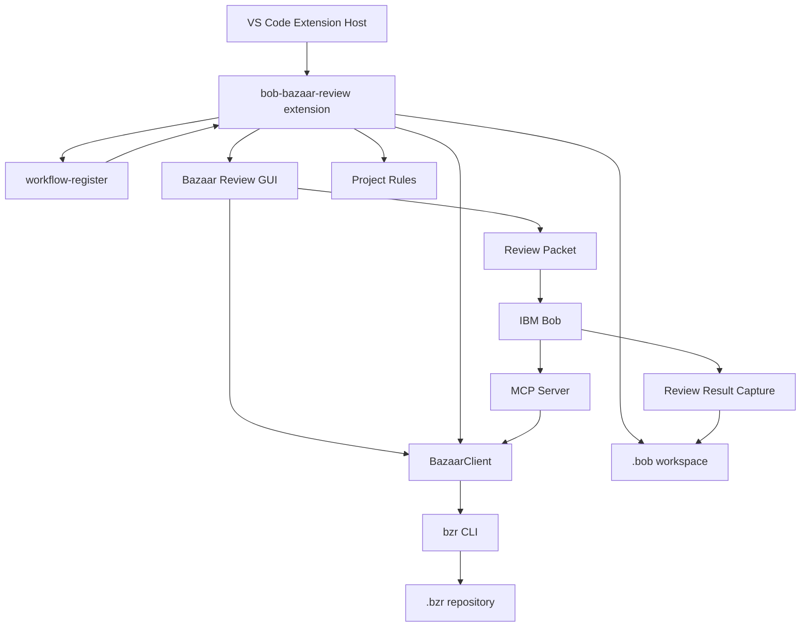

# bob-bazaar-review 基本設計書

## 1. 目的

`bob-bazaar-review` は、Bazaar リポジトリの変更レビューを IBM Bob / VS Code 上で実施しやすくするための拡張機能である。

主な目的は次のとおりである。

- Bazaar の revision / revision range / working tree 差分を安全に取得する。
- Bob に渡すレビュー用 Markdown packet を生成する。
- `.bob` 配下にプロジェクト固有レビュー規約、Skill、Workflow、MCP 設定を初期化する。
- `workflow-register` の action provider として、GUI、context 収集、rules 読み込み、review-result 保存を提供する。
- Bob が生成した review-result JSON を検証し、JSON と Markdown の成果物として保存する。
- 読み取り専用 MCP server として Bazaar / project rules 操作を Bob へ公開する。

## 2. 背景と課題

Bazaar を用いる既存プロジェクトでは、差分レビュー時に次の課題がある。

- `bzr diff` や `bzr log` の出力を Bob へ渡す作業が手動になりやすい。
- Bazaar alias により `diff` や `log` が GUI ツールへ置き換わると、stdout が取得できない。
- 日本語や Shift-JIS / CP932 系の Bazaar 出力が文字化けする可能性がある。
- `.bob` ワークスペースと Bazaar repository が multi-root workspace で別フォルダになる場合がある。
- プロジェクト固有規約に沿ったレビュー結果を JSON と Markdown で保存したい。
- Bob workflow が途中で中断した場合、生成済み JSON を再利用して保存・Markdown 生成だけ再開したい。

本拡張はこれらの課題に対して、GUI、workflow action provider、MCP server、review-result capture を組み合わせて対応する。

## 3. スコープ

### 3.1 対象範囲

- Bazaar CLI の読み取り系操作
- `bzr --no-aliases` の強制
- Bazaar 出力の UTF-8 / Shift-JIS 系 decode
- Bazaar review packet の生成
- Bob context への packet 追加
- `.bob` 初期化
- project review checklist / schema の読み込み
- review-result JSON の検証、正規化、保存、Markdown 生成
- `workflow-register` action provider 登録
- Bazaar / project rules MCP tools の提供
- multi-root workspace での `.bob` root と `.bzr` root の分離解決

### 3.2 対象外

- Bazaar の書き込み操作
- commit / push / pull / update / revert / merge / resolve などの破壊的操作
- IBM Bob 本体の UI 改修
- 任意 shell command の実行
- review-result JSON の内容を AI なしで自動判定すること
- 複数ユーザー間での review result 同期

## 4. 利用者と利用シーン

| 利用者 | 主な用途 |
| --- | --- |
| 開発者 | Bazaar revision を指定し、Bob へレビュー packet を渡す。 |
| レビュー担当者 | GUI で変更ファイルと revision 情報を確認し、プロジェクト規約レビューを開始する。 |
| ワークフロー設計者 | `bazaar-project-rule-review` を Bob workflow として利用・調整する。 |
| 拡張機能連携者 | MCP tools や workflow action provider を通じて Bazaar 情報を取得する。 |

## 5. 全体構成



## 6. 主要コンポーネント

| コンポーネント | 主な責務 | 主なファイル |
| --- | --- | --- |
| Extension Entry | VS Code command 登録、workflow-register action provider 登録 | `src/extension.ts` |
| Bazaar Client | Bazaar CLI 実行、引数検証、decode、alias 無効化 | `src/bazaar.ts` |
| Review GUI | Webview UI、target 選択、packet 生成、Bob context 追加 | `src/reviewGui.ts` |
| Workspace Resolver | `.bob` root と `.bzr` root の分離解決 | `src/workspaceResolver.ts`, `src/workspaceRoots.ts` |
| Bob Workspace Init | `.bob` 初期化、template refresh、MCP 設定 | `src/bobWorkspaceInit.ts` |
| MCP Config | `.bob/mcp.json` 生成・更新 | `src/mcpConfig.ts` |
| MCP Server | 読み取り専用 Bazaar tools と project rules tools 提供 | `src/mcp/server.ts` |
| Review Packet | Bob へ渡す Markdown packet の生成 | `src/reviewPacket.ts`, `src/revisionInfo.ts` |
| Workflow Bridge | review packet から workflow state 用 context を生成 | `src/workflowBridge.ts` |
| Project Rules | checklist / schema / prompt / packet section の読み込み | `src/projectRules/*` |
| Result Capture | review-result JSON 抽出、検証、保存、Markdown 生成 | `src/projectRules/resultCapture*.ts` |
| Workflow Template | Bob workflow 定義 | `templates/.bob/workflows/bazaar-project-rule-review/WORKFLOW.md` |
| Skill Template | Bob に渡すレビュー観点 Skill | `templates/.bob/skills/project-review-checklist/SKILL.md` |

## 7. 依存関係

| 依存 | 用途 |
| --- | --- |
| `IBM.bob-code` | Bob context 追加、workflow UI、MCP 利用。 |
| `local.workflow-register` | action provider 登録、Bob workflow step 実行。 |
| Bazaar CLI | `bzr root` / `diff` / `log` / `cat` / `status` など。 |
| Node.js | VS Code extension と MCP server の実行。 |

## 8. Workspace モデル

本拡張は、次の2種類の root を明確に分離する。

| Root | Marker | 用途 |
| --- | --- | --- |
| Bob workspace root | `.bob` | Skill、Workflow、MCP 設定、review rules、review results の保存先。 |
| Bazaar repository root | `.bzr` | Bazaar diff / log / status / cat の実行対象。 |

multi-root workspace では、たとえば次の構成を許容する。

```text
current_dir/
  workspace/
    .bob/
  bazaar_test/
    branch2/
      .bzr/
```

この場合、review packet の差分取得は `bazaar_test/branch2` で行い、review result は `workspace/.bob/review/results` に保存する。

## 9. Bazaar 実行方針

### 9.1 alias 無効化

本拡張が実行する Bazaar CLI は、必ず global option `--no-aliases` を付与する。

```text
bzr --no-aliases diff -c REV
bzr --no-aliases log -r REV
bzr --no-aliases status
```

理由は、ユーザー環境で `diff` や `log` が GUI tool 起動 alias に置き換わると stdout が取得できず、packet 生成や MCP tool response が破綻するためである。

### 9.2 安全な実行

- `execFile` を使用し、shell 文字列は使わない。
- `shell: false` とする。
- Bazaar arguments は array として渡す。
- revision は `validateRevision` で検証する。
- repository relative path は `validateRelativePath` で検証する。
- `BZR_PROGRESS_BAR=none` を設定し、progress 表示を抑制する。

### 9.3 文字コード

Bazaar 出力は `encoding: "buffer"` で取得し、`decodeTextBuffer` で decode する。設定 `bobBazaar.textEncoding` は次を許可する。

- `auto`
- `utf8`
- `shift_jis`
- `cp932`
- `windows-31j`

`auto` では UTF-8 を優先し、文字化けが疑われる場合に Shift-JIS 系として読み直す。

## 10. レビュー GUI 概要

`Bob Bazaar: Open Bazaar Review GUI` は Webview を開き、次を行う。

1. Bazaar workspace と Bob workspace を解決する。
2. `.bob` 初期化状態を確認する。
3. 必要に応じて `.bob` 初期化を実行する。
4. review target を入力する。
5. Bazaar log / diff / status を取得する。
6. target metadata と changed files を表示する。
7. review packet を生成する。
8. Bob context へ packet を追加する。
9. workflow 実行中の場合、GUI action 完了後に現在 step を完了できる。

## 11. Review target モデル

| Mode | 入力 | Bazaar 操作 |
| --- | --- | --- |
| `singleRevision` | `revision` | `bzr log -r REV`, `bzr diff -c REV` |
| `revisionRange` | `baseRevision`, `targetRevision` | `bzr diff -r BASE..TARGET`, 可能なら target log |
| `workingTreeSinceRevision` | 任意 `baseRevision` | `bzr revno`, `bzr diff -r BASE`, `bzr status` |

単一 revision と revision range では、新規追加ファイル本文を上限内で packet に含める。

## 12. `.bob` 初期化設計

`.bob` 初期化では次の template を配布する。

```text
.bob/mcp.json
.bob/custom_modes.yaml
.bob/review/checklist.json
.bob/review/review-result.schema.json
.bob/review/review-prompt-template.md
.bob/review/examples/review-result.example.json
.bob/skills/project-review-checklist/SKILL.md
.bob/workflows/bazaar-project-rule-review/WORKFLOW.md
```

初期化は基本的に missing only でコピーする。ただし workflow template は、`workspaceRequired` や日本語化済み UI などを反映する必要があるため refresh 対象として上書きする。

## 13. workflow-register 連携

本拡張は `workflow-register` API へ次の action provider を登録する。

| Provider | 用途 |
| --- | --- |
| `bobBazaar.openReviewGui` | GUI を開き、対象 revision / range を確定する。 |
| `bobBazaar.collectReviewContext` | 開いている review packet から workflow state 用 context を作る。 |
| `bobBazaar.loadReviewRules` | checklist と review-result schema を読み込む。 |
| `bobBazaar.captureReviewResult` | assistant 出力や clipboard から review-result JSON を検証・保存する。 |

`workflowRoot` は Bob workspace root として扱い、`.bob` 側の rules / results 保存先に使う。

## 14. MCP Server 概要

MCP server は stdio JSON-RPC で動作し、Bob から tools として呼び出される。

提供 tools は次の2系統である。

| 系統 | 例 |
| --- | --- |
| Bazaar 読み取り tools | `bazaar_root`, `bazaar_log`, `bazaar_diff_revision`, `bazaar_status` |
| Project rules tools | `project_rules_get_checklist`, `project_rules_validate_review_result`, `project_rules_render_markdown` |

Bazaar tools は読み取り専用に限定し、破壊的操作は提供しない。

## 15. Review result 保存

Bob が出力した review-result JSON は、次の入力元から抽出できる。

- command argument
- active editor selection
- active editor full text
- clipboard
- workflow-register result handoff の assistant 成果物

保存処理は次を行う。

1. raw JSON または fenced JSON block から JSON object を抽出する。
2. `severity` と `summary` を必要に応じて正規化する。
3. JSON schema と project rules 条件で検証する。
4. `.bob/review/results/<review_id>.json` を保存する。
5. `.bob/review/results/<review_id>.md` を保存する。

## 16. セキュリティ方針

- Bazaar 操作は読み取り系に限定する。
- shell を使わず `execFile` で実行する。
- `--no-aliases` を必ず付与する。
- revision / path を検証する。
- diff と added file content には byte 上限を設ける。
- MCP tools では commit / push / pull / revert などを公開しない。
- review-result 保存ファイル名は sanitize する。
- project rules の外部パスは明示許可がない限り拒否する。

## 17. エラー処理方針

| 場面 | 方針 |
| --- | --- |
| Bazaar command failure | `BazaarError` として cwd / args / stdout / stderr / code を保持する。 |
| `.bob` 未初期化 | GUI で未初期化状態を表示し、初期化導線を出す。 |
| workflow action failure | workflow-register へ error を返し step を pending / held にする。 |
| review-result JSON 不在 | warning message または validation issue として返す。 |
| schema validation 失敗 | Markdown validation report を表示する。 |
| Bob context 追加失敗 | packet を clipboard へ fallback copy する。 |

## 18. テスト方針

- BazaarClient の引数検証、`--no-aliases` 強制、allowed exit code を検証する。
- workspace resolver の `.bob` / `.bzr` 分離を検証する。
- review packet 生成と追加ファイル本文上限を検証する。
- workflow-register action provider 登録を検証する。
- review-result JSON 抽出、正規化、schema validation、Markdown 生成を検証する。
- workflow template の UI 表示値、resultKey、artifact、guardrail を検証する。
- MCP server の tool 定義と readonly 境界を検証する。

## 19. 今後の拡張方針

- Bob UI 経由の中断再開をさらに強化する。
- review packet の永続保存と再利用 UI を追加する。
- MCP tools に保存済み review-result の検索・比較支援を追加する。
- project rules の version migration を支援する。
- large diff の分割レビューを workflow と連動させる。
