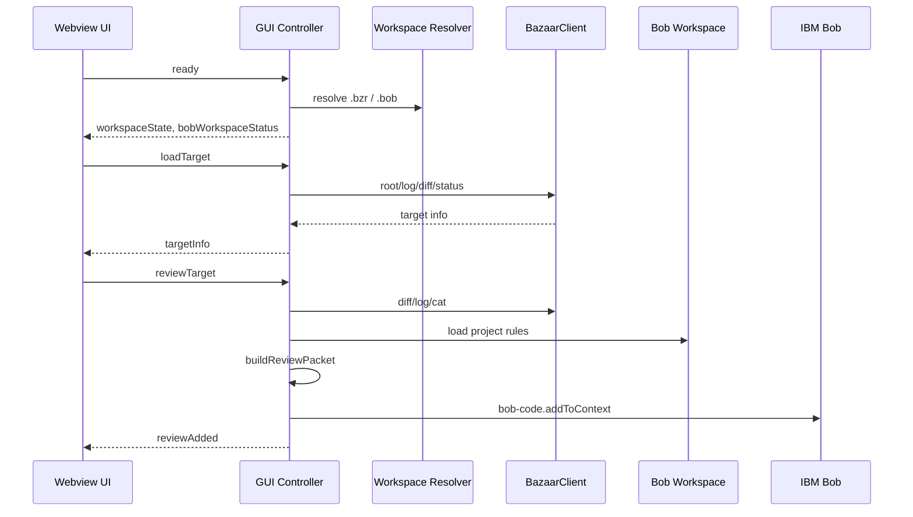

# bob-bazaar-review 詳細設計書

## 1. 文書の位置づけ

本書は `extensions/bob-bazaar-review` 拡張機能の詳細設計を定義する。基本設計書で示した責務を、実装モジュール、主要データ、処理シーケンス、エラー処理、安全制約、テスト観点へ展開する。

## 2. 実装構成

```text
extensions/bob-bazaar-review/
  package.json
  src/
    extension.ts
    bazaar.ts
    textEncoding.ts
    workspaceResolver.ts
    workspaceRoots.ts
    reviewGui.ts
    reviewPacket.ts
    revisionInfo.ts
    workflowBridge.ts
    workflowStepCompletion.ts
    bobWorkspaceInit.ts
    mcpConfig.ts
    mcp/
      server.ts
    projectRules/
      defaults.ts
      io.ts
      markdown.ts
      packet.ts
      resultCapture.ts
      resultCaptureCore.ts
      reviewResultsStore.ts
      schema.ts
      types.ts
      validator.ts
  templates/
    .bob/
      custom_modes.yaml
      mcp.json.template
      review/
      skills/
      workflows/
  test/
    *.test.js
```

## 3. 起動設計

### 3.1 Activation events

`package.json` は `onStartupFinished` と各 command の `onCommand` を activation event とする。

起動後、`extension.ts` の `activate(context)` が次を行う。

1. VS Code command を登録する。
2. `workflow-register` の action provider 登録を試行する。
3. 失敗時は warning log に留める。

拡張は background process を保持しない。MCP server は Bob が必要時に別 process として起動する。

### 3.2 VS Code commands

| Command ID | 実装入口 | 用途 |
| --- | --- | --- |
| `bobBazaar.openReviewGui` | `openBazaarReviewGui` | Webview GUI を開く。 |
| `bobBazaar.collectReviewContext` | `collectReviewContext` | review packet から workflow context を作る。 |
| `bobBazaar.loadReviewRules` | `loadReviewRules` | checklist / schema を読み込む。 |
| `bobBazaar.captureReviewResult` | `captureReviewResult` | review-result JSON を検証・保存する。 |
| `bobBazaar.saveReviewResultFromClipboard` | `saveReviewResultFromClipboard` | clipboard だけを入力として保存する。 |
| `bobBazaar.configureMcp` | `configureMcp` | `.bob/mcp.json` に MCP server を登録する。 |
| `bobBazaar.initProjectRules` | `initProjectRules` | `.bob/review` 規約ファイルを初期化する。 |
| `bobBazaar.reviewRevision` | `reviewRevision(false)` | 単一 revision packet を作る。 |
| `bobBazaar.reviewRange` | `reviewRange(false)` | revision range packet を作る。 |
| `bobBazaar.reviewRevisionWithProjectRules` | `reviewRevision(true)` | 単一 revision packet に規約 section を追加する。 |
| `bobBazaar.reviewRangeWithProjectRules` | `reviewRange(true)` | range packet に規約 section を追加する。 |
| `bobBazaar.validateReviewResultJson` | `validateActiveReviewResultJson` | active editor の JSON を検証する。 |

## 4. Workspace 解決詳細

### 4.1 Resolver interface

`workspaceResolver.ts` は marker ごとの workspace folder 解決を提供する。

```ts
resolveBazaarWorkspaceFolder(options): Promise<vscode.WorkspaceFolder | undefined>
resolveBobWorkspaceFolder(options): Promise<vscode.WorkspaceFolder | undefined>
```

### 4.2 解決順序

1. `explicitRoot` がある場合は最優先する。
2. `workflowRoot` があり、対象 marker を持つ場合は採用する。
3. workspace folders から marker root candidates を探索する。
4. active editor が candidate 内にある場合はそれを採用する。
5. candidate が1件なら自動採用する。
6. candidate が複数で `allowPick !== false` の場合のみ QuickPick を出す。
7. marker candidate が無く workspace folder が1件なら fallback 採用する。
8. それ以外は QuickPick または undefined を返す。

### 4.3 `.bob` と `.bzr` の分離

GUI controller は `bazaarWorkspaceFolder` と `bobWorkspaceFolder` を別々に保持する。これにより、`.bob` がある workspace と `.bzr` がある repository が異なる multi-root 構成でも、次のように責務を分離できる。

| 処理 | 使用 root |
| --- | --- |
| Bazaar root / diff / log / status | Bazaar workspace / `.bzr` root |
| `.bob` 初期化 | Bob workspace / `.bob` root |
| checklist / schema 読み込み | Bob workspace / `.bob` root |
| review result 保存 | Bob workspace / `.bob` root |
| workflowRoot | Bob workspace / `.bob` root |

## 5. BazaarClient 詳細設計

### 5.1 責務

`BazaarClient` は Bazaar CLI 実行を一元化する。

- CLI command construction
- `--no-aliases` 付与
- `execFile` 実行
- stdout / stderr decode
- revision / path validation
- allowed exit code 処理
- BazaarError 生成

### 5.2 公開操作

| Method | Bazaar 操作 |
| --- | --- |
| `root(cwd)` | `bzr --no-aliases root` |
| `revno(cwd)` | `bzr --no-aliases revno` |
| `log(cwd, revision?)` | `bzr --no-aliases log` / `log -r REV` |
| `diffRevision(cwd, revision)` | `bzr --no-aliases diff -c REV` |
| `diffRange(cwd, base, target)` | `bzr --no-aliases diff -r BASE..TARGET` |
| `diffWorkingTree(cwd, base?)` | `bzr --no-aliases diff` / `diff -r BASE` |
| `cat(cwd, revision, path)` | `bzr --no-aliases cat -r REV PATH` |
| `status(cwd)` | `bzr --no-aliases status` |

### 5.3 allowed exit code

Bazaar diff は差分ありで exit code 1 を返す場合があるため、diff 系 method は `[0, 1]` を許可する。

### 5.4 引数検証

#### revision

`validateRevision` は空文字列と unsafe 文字を拒否する。許可文字は英数字、`.`、`_`、`:`、`+`、`@`、`/`、`=`、`-` などである。

#### relative path

`validateRelativePath` は次を拒否する。

- 空 path
- absolute path
- NUL 文字
- `..` path segment

## 6. Text Encoding 詳細

`textEncoding.ts` は Bazaar 出力 Buffer を string 化する。

### 6.1 方針

- CLI 実行時は `encoding: "buffer"` にする。
- decode は `bobBazaar.textEncoding` または MCP env `BZR_TEXT_ENCODING` に従う。
- `auto` は UTF-8 を優先し、文字化けが疑われる場合に Shift-JIS 系へ fallback する。

### 6.2 対応値

```text
auto
utf8
shift_jis
cp932
windows-31j
```

## 7. Review GUI 詳細設計

### 7.1 Controller

`BazaarReviewGuiController` は Webview と extension host の bridge である。

主な状態:

```ts
private bazaarWorkspaceFolder?: vscode.WorkspaceFolder
private bobWorkspaceFolder?: vscode.WorkspaceFolder
```

### 7.2 Webview message

| Message | 処理 |
| --- | --- |
| `ready` | workspace state と `.bob` status を返す。 |
| `selectWorkspace` | Bazaar workspace を選択する。 |
| `initializeBobWorkspace` | `.bob` template 初期化を行う。 |
| `loadTarget` | Bazaar target metadata を取得する。 |
| `reviewTarget` | packet を生成して Bob context へ追加する。 |

### 7.3 GUI 処理シーケンス



### 7.4 Bob context fallback

`bob-code.addToContext` が失敗した場合、review packet を clipboard へコピーし、ユーザーに警告する。

## 8. Review target 詳細

### 8.1 TargetRequest

```ts
interface TargetRequest {
  mode: "singleRevision" | "revisionRange" | "workingTreeSinceRevision"
  revision?: string
  baseRevision?: string
  targetRevision?: string
  withProjectRules?: boolean
}
```

### 8.2 TargetInfo

`TargetInfo` は GUI 表示と packet metadata section に使う。

主な項目:

- mode
- targetLabel
- revision / baseRevision / targetRevision
- revno
- author / committer
- timestamp
- message
- changedFileCount
- changedFileEntries

### 8.3 新規追加ファイル本文

`buildAddedFilesContentSection` は diff / changed file entries をもとに新規追加ファイルを検出し、`bzr cat -r REV PATH` で本文を取得する。合計 byte 数は `bobBazaar.maxAddedFileContentBytes` で制限する。

## 9. Review Packet 詳細

### 9.1 目的

review packet は Bob chat / context に投入するための Markdown であり、レビュー対象、Bazaar log、diff、追加ファイル本文、project rules をまとめる。

### 9.2 主な section

- `# Bazaar Revision Review Request`
- repository root
- mode / revision / range
- Bazaar log
- Bazaar diff
- added file contents
- project rules checklist section
- review-result JSON output contract

### 9.3 diff 上限

diff は `bobBazaar.maxDiffBytes` で上限を設ける。上限超過時は切り詰めを明示する。

## 10. `.bob` 初期化詳細

### 10.1 Required files

`bobWorkspaceInit.ts` は次の file を required とする。

```text
.bob/mcp.json
.bob/custom_modes.yaml
.bob/review/checklist.json
.bob/review/review-result.schema.json
.bob/review/review-prompt-template.md
.bob/review/examples/review-result.example.json
.bob/skills/project-review-checklist/SKILL.md
.bob/workflows/bazaar-project-rule-review/WORKFLOW.md
```

### 10.2 初期化処理

1. template root を `context.asAbsolutePath("templates/.bob")` から求める。
2. `mcp.json.template` を除き、missing file のみコピーする。
3. refresh 対象 file を上書きする。
4. `configureWorkspaceMcpServer` で `.bob/mcp.json` を更新する。
5. status を再評価して返す。

### 10.3 stale workflow template 判定

workflow template は次の場合に stale とみなす。

- `workspaceRequired: true`
- `workspaceRequired` が無い
- 日本語 title が無い

stale の場合、GUI では未初期化扱いになり、初期化ボタンで更新できる。

## 11. MCP 設定詳細

### 11.1 `.bob/mcp.json`

`configureWorkspaceMcpServer` は `.bob/mcp.json` に MCP server entry を追加・更新する。

主な値:

- `command`: Node executable
- `args`: `out/mcp/server.js`
- `env.BZR_PATH`
- `env.BZR_TEXT_ENCODING`
- `disabled: false`

### 11.2 更新方針

既存 `.bob/mcp.json` がある場合は JSON として読み、対象 server name の entry を追加・更新する。JSON が壊れている場合はエラーとする。

## 12. MCP Server 詳細設計

### 12.1 Protocol

`src/mcp/server.ts` は stdio JSON-RPC で動作する。対応 method は次の通り。

| Method | 処理 |
| --- | --- |
| `initialize` | protocol version、capabilities、serverInfo を返す。 |
| `notifications/initialized` | no-op。 |
| `tools/list` | tool definitions を返す。 |
| `tools/call` | tool name と arguments に応じて処理する。 |

### 12.2 Bazaar tools

| Tool | 処理 |
| --- | --- |
| `bazaar_root` | Bazaar root を返す。 |
| `bazaar_revno` | current revno を返す。 |
| `bazaar_log` | log を返す。 |
| `bazaar_diff_revision` | single revision diff を返す。 |
| `bazaar_diff_range` | revision range diff を返す。 |
| `bazaar_diff_working_tree` | working tree diff を返す。 |
| `bazaar_cat_revision` | revision 時点の file content を返す。 |
| `bazaar_status` | status を返す。 |

### 12.3 Project rules tools

| Tool | 処理 |
| --- | --- |
| `project_rules_init` | default rules / schema を作成する。 |
| `project_rules_get_checklist` | checklist JSON を返す。 |
| `project_rules_get_schema` | schema JSON を返す。 |
| `project_rules_validate_review_result` | review-result JSON を検証する。 |
| `project_rules_render_markdown` | review-result JSON を Markdown に変換する。 |
| `project_rules_get_latest_review_result` | 最新保存済み review-result を返す。 |
| `project_rules_get_review_result` | 指定 review id の保存済み result を返す。 |

### 12.4 エラー応答

例外は MCP response として `isError: true` の text content に変換する。

## 13. workflow-register 連携詳細

### 13.1 Provider 登録

`registerWorkflowProviders` は `local.workflow-register` を取得し、次の provider を登録する。

```ts
bobBazaar.openReviewGui
bobBazaar.collectReviewContext
bobBazaar.loadReviewRules
bobBazaar.captureReviewResult
```

### 13.2 `openReviewGui`

workflow inputs と execution input から initial target を作る。

優先される root:

1. `input.bazaarRoot`
2. `input.repositoryRoot`
3. `inputs.bazaarRoot`
4. `inputs.repositoryRoot`

`workflowRoot` は Bob workspace root として GUI に渡す。

### 13.3 `loadReviewRules`

workflow action 実行時は `input.workflowRoot` を使い、QuickPick を出さない。通常 command 実行時は Bob workspace を選択可能とする。

戻り値は workflow state に保存しやすい JSON object で、rule 数、categories、schema top-level keys を含む。

### 13.4 `captureReviewResult`

workflow-register result handoff からは、`args[0]` に assistant 成果物 text が渡される。`input.workflowRoot` は保存先 Bob workspace として使う。

`state.reviewRules` から expected checklist item 数を取り出し、全 rule 分の `checklist_results` があるか検証する。

## 14. Workflow template 詳細

### 14.1 同梱 workflow

```text
templates/.bob/workflows/bazaar-project-rule-review/WORKFLOW.md
```

### 14.2 主な step

| Step | Type | Provider / 処理 |
| --- | --- | --- |
| `review-input` | command | `bobBazaar.openReviewGui` |
| `collect-context` | command | `bobBazaar.collectReviewContext` |
| `load-rules` | command | `bobBazaar.loadReviewRules` |
| `analyze-changes` | agent | Project rules に沿って分析 |
| `output-result` | agent | review-result JSON を生成し、capture command へ渡す |

### 14.3 再開性

`output-result` は `resultKey: reviewResultJson` を持つ。これにより、assistant が生成した JSON を workflow state / artifacts として保持し、Markdown 生成や保存処理で中断した場合に JSON 生成からやり直さず capture を再試行できる。

## 15. Project Rules 詳細

### 15.1 ファイル

```text
.bob/review/checklist.json
.bob/review/review-result.schema.json
.bob/review/review-prompt-template.md
.bob/review/examples/review-result.example.json
```

### 15.2 Checklist

`checklist.json` は `rules` array を持つ。各 rule は次を含む。

- id
- category
- title
- description
- severity_on_fail
- applies_when
- evidence_required
- review_hint

### 15.3 Schema

`review-result.schema.json` は Bob が出力する review-result JSON を検証する。主な top-level fields は次の通り。

- `review_id`
- `vcs`
- `checklist_results`
- `findings`
- `summary`

### 15.4 外部 path 制御

`projectRules/io.ts` は workspace root 外を指す path を原則拒否する。外部 path を明示許可する場合は環境変数で制御する。

## 16. Review Result Capture 詳細

### 16.1 入力候補

`resultCapture.ts` は次の順で入力候補を作る。

1. command argument があればそれを使う。
2. active editor selection
3. active editor full text
4. clipboard

### 16.2 JSON 抽出

`extractJsonFromText` は次を試す。

1. 全体が JSON object として parse できるか。
2. fenced code block `json` を抽出できるか。
3. text 中の balanced JSON object を抽出できるか。

### 16.3 正規化

`normalizeReviewResultJsonText` は次を行う。

- `severity` が `N/A`、`not_applicable`、`none` 相当なら `info` へ正規化する。
- `summary` を `checklist_results[].status` から再計算する。

### 16.4 検証

`validateReviewResultJson` で schema validation と project rules 由来の条件を検証する。workflow 実行時は `expectedChecklistItems` が渡され、rule 数と `checklist_results` 件数が一致するかも検証する。

### 16.5 保存

保存先:

```text
<Bob workspace>/.bob/review/results/<review_id>.json
<Bob workspace>/.bob/review/results/<review_id>.md
```

file basename は `review_id` を sanitize して作る。`review_id` が無い場合は revision 情報から fallback ID を作る。

## 17. Review Results Store 詳細

`reviewResultsStore.ts` は保存済み review-result を読み出す。

用途:

- MCP tool `project_rules_get_latest_review_result`
- MCP tool `project_rules_get_review_result`
- Bob / AI による過去結果参照

最新判定は `.bob/review/results` 配下の JSON file の更新時刻を使う。

## 18. Workflow Step Completion 詳細

GUI から Bob context へ packet を追加したあと、`workflowStepCompletion.ts` は `workflowRegister.completeCurrentStep` を呼び出す。

失敗時は warning を表示し、packet 生成自体は成功扱いとする。これにより、workflow-register 側と疎結合に保つ。

## 19. Error Handling 詳細

### 19.1 BazaarError

`BazaarError` は CLI failure、unsafe revision、unsafe path、MCP tool error で使う。

CLI failure details:

- cwd
- args
- stdout
- stderr
- code

### 19.2 GUI error

Webview message handler では例外を捕捉し、`type: "error"` message として UI に返す。

### 19.3 Capture error

validation failure は `CaptureReviewResultResult` の `status: "error"` と `issues` で返す。command 実行では warning / validation report として表示する。

### 19.4 MCP error

MCP tool 呼び出し中の例外は `isError: true` response に変換する。

## 20. セキュリティ詳細

### 20.1 CLI 実行

- `execFile` のみ使用する。
- `shell: false`。
- 引数は配列で渡す。
- `--no-aliases` を必ず挿入する。
- Bazaar command set は読み取り系に限定する。

### 20.2 入力 validation

- revision は許可文字 whitelist。
- file path は repository relative のみ。
- project rules path は workspace root 外を拒否。
- review result file name は sanitize。

### 20.3 出力制限

- diff は `maxDiffBytes` で制限。
- added file content は `maxAddedFileContentBytes` で制限。
- MCP server は破壊的 Bazaar command を公開しない。

## 21. 状態と保存先

| 種類 | 保存先 / 保持場所 |
| --- | --- |
| `.bob` 初期化 assets | `<Bob workspace>/.bob` |
| MCP config | `<Bob workspace>/.bob/mcp.json` |
| checklist | `<Bob workspace>/.bob/review/checklist.json` |
| schema | `<Bob workspace>/.bob/review/review-result.schema.json` |
| workflow template | `<Bob workspace>/.bob/workflows/bazaar-project-rule-review/WORKFLOW.md` |
| review results | `<Bob workspace>/.bob/review/results` |
| review packet | temporary Markdown document / clipboard fallback |
| GUI state | Webview controller memory |
| Bazaar output | memory only |

## 22. Multi-root 動作詳細

### 22.1 期待構成

```json
{
  "folders": [
    { "path": "./workspace" },
    { "path": "./bazaar_test/branch2" }
  ]
}
```

```text
current_dir/workspace/.bob
current_dir/bazaar_test/branch2/.bzr
```

### 22.2 動作

1. Bob workflow は `.bob` を持つ `workspace` から読み込まれる。
2. Bazaar GUI は `.bzr` を持つ `bazaar_test/branch2` を Bazaar workspace として解決する。
3. GUI 初期化と review rules は `workspace/.bob` を使う。
4. diff / log は `bazaar_test/branch2/.bzr` 側で取得する。
5. review-result は `workspace/.bob/review/results` に保存する。

## 23. テスト設計

### 23.1 単体テスト観点

| 対象 | 観点 |
| --- | --- |
| `bazaar.ts` | `--no-aliases` 強制、revision/path validation、allowed exit code。 |
| `textEncoding.ts` | UTF-8 / Shift-JIS / auto decode。 |
| `workspaceResolver.ts` | `.bob` / `.bzr` の分離、single candidate 自動選択。 |
| `reviewPacket.ts` | diff truncation、metadata、extra sections。 |
| `revisionInfo.ts` | log parse、changed file parse、added file content section。 |
| `projectRules/io.ts` | required file error、workspace escape rejection。 |
| `validator.ts` | schema validation、evidence / finding 条件。 |
| `resultCaptureCore.ts` | fenced JSON extraction、normalization、save artifacts。 |
| `workflowBridge.ts` | packet から workflow context 生成。 |
| `mcp/server.ts` | tool list、readonly tool definitions、argument validation。 |

### 23.2 結合テスト観点

- `.bob` と `.bzr` が別 folder の multi-root workspace で GUI が動く。
- GUI で single revision / range / working tree diff を取得できる。
- packet を Bob context へ追加できる。
- workflow-register から action provider が呼べる。
- Bob が出力した JSON を capture し、JSON / Markdown が保存される。
- MCP tools が `--no-aliases` 付きの Bazaar command を返す。

## 24. 変更時の注意点

- Bazaar command を追加する場合は、読み取り専用かを確認し、`--no-aliases` 強制経路を通す。
- MCP tool を追加する場合は、input schema と README / 設計書 / tests を更新する。
- workflow template を変更する場合は、template refresh 判定と workflow template tests を確認する。
- review-result schema を変更する場合は validator、example、prompt、workflow output contract を同期する。
- workspace resolver を変更する場合は multi-root の `.bob` / `.bzr` 分離動作を確認する。
- result capture を変更する場合は workflow-register result handoff 互換、`args[0]` 入力、`workflowRoot` 保存先を確認する。

## 25. 今後の改善候補

- review packet を `.bob/workflows/runs/<runId>` に永続保存する。
- GUI から保存済み review-result を開く導線を追加する。
- large diff を複数 packet に分割する。
- project rules の category filter を GUI から指定可能にする。
- MCP server の tool response に structured metadata を追加する。
- workflow-register の run state と連動して review packet / result を双方向に参照する。
