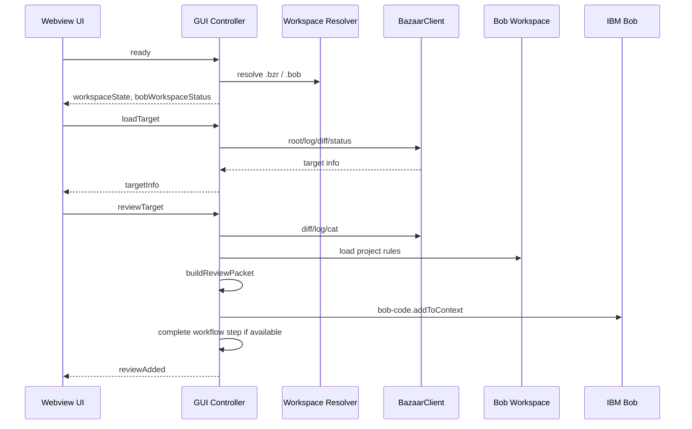

# bob-bazaar-review 詳細設計書

## 1. 文書の位置づけ

本書は `extensions/bob-bazaar-review` 拡張機能の詳細設計を定義する。基本設計で示した責務を、実装モジュール、主要データ、処理シーケンス、エラー処理、安全制約、MCP tools、テスト観点へ展開する。

## 2. 実装構成

```text
extensions/bob-bazaar-review/
  package.json
  src/
    extension.ts
    bazaar.ts
    textEncoding.ts
    workspaceResolver.ts
    workspaceRoots.ts
    reviewGui.ts
    reviewPacket.ts
    revisionInfo.ts
    workflowBridge.ts
    workflowStepCompletion.ts
    bobWorkspaceInit.ts
    mcpConfig.ts
    mcp/
      server.ts
    projectRules/
      defaults.ts
      io.ts
      markdown.ts
      packet.ts
      resultCapture.ts
      resultCaptureCore.ts
      reviewResultsStore.ts
      schema.ts
      types.ts
      validator.ts
  templates/
    .bob/
      custom_modes.yaml
      mcp.json.template
      review/
      skills/
      workflows/
  test/
    *.test.js
```

## 3. 起動設計

`extension.ts` の `activate(context)` は次を行う。

1. VS Code command を登録する。
2. `workflow-register` の action provider 登録を試行する。
3. 登録失敗時は warning log に留める。

拡張は background process を保持しない。MCP server は Bob が必要時に別 process として起動する。

## 4. VS Code commands

| Command ID | 実装入口 | 用途 |
| --- | --- | --- |
| `bobBazaar.openReviewGui` | `openBazaarReviewGui` | Webview GUI を開く。 |
| `bobBazaar.collectReviewContext` | `collectReviewContext` | review packet から workflow context を作る。 |
| `bobBazaar.loadReviewRules` | `loadReviewRules` | checklist / schema を読み込む。 |
| `bobBazaar.captureReviewResult` | `captureReviewResult` | review-result JSON を検証・保存する。 |
| `bobBazaar.saveReviewResultFromClipboard` | `saveReviewResultFromClipboard` | clipboard だけを入力として保存する。 |
| `bobBazaar.configureMcp` | `configureMcp` | `.bob/mcp.json` に MCP server を登録する。 |
| `bobBazaar.initProjectRules` | `initProjectRules` | `.bob/review` 規約ファイルを初期化する。 |
| `bobBazaar.reviewRevision` | `reviewRevision(false)` | 単一 revision packet を作る。 |
| `bobBazaar.reviewRange` | `reviewRange(false)` | revision range packet を作る。 |
| `bobBazaar.reviewRevisionWithProjectRules` | `reviewRevision(true)` | 単一 revision packet に規約 section を追加する。 |
| `bobBazaar.reviewRangeWithProjectRules` | `reviewRange(true)` | range packet に規約 section を追加する。 |
| `bobBazaar.validateReviewResultJson` | `validateActiveReviewResultJson` | active editor の JSON を検証する。 |

## 5. Workspace 解決詳細

`workspaceResolver.ts` は marker ごとの workspace folder 解決を提供する。

```ts
resolveBazaarWorkspaceFolder(options): Promise<vscode.WorkspaceFolder | undefined>
resolveBobWorkspaceFolder(options): Promise<vscode.WorkspaceFolder | undefined>
```

解決順序:

1. `explicitRoot` がある場合は最優先する。
2. `workflowRoot` があり、対象 marker を持つ場合は採用する。
3. workspace folders から marker root candidates を探索する。
4. active editor が candidate 内にある場合はそれを採用する。
5. candidate が1件なら自動採用する。
6. candidate が複数で `allowPick !== false` の場合のみ QuickPick を出す。
7. marker candidate が無く workspace folder が1件なら fallback 採用する。
8. それ以外は QuickPick または undefined を返す。

GUI controller は `bazaarWorkspaceFolder` と `bobWorkspaceFolder` を別々に保持する。

## 6. BazaarClient 詳細設計

`BazaarClient` は Bazaar CLI 実行を一元化する。

- CLI command construction。
- `--no-aliases` 付与。
- `execFile` 実行。
- stdout / stderr decode。
- revision / path validation。
- allowed exit code 処理。
- BazaarError 生成。

| Method | Bazaar 操作 |
| --- | --- |
| `root(cwd)` | `bzr --no-aliases root` |
| `revno(cwd)` | `bzr --no-aliases revno` |
| `log(cwd, revision?)` | `bzr --no-aliases log` / `log -r REV` |
| `diffRevision(cwd, revision)` | `bzr --no-aliases diff -c REV` |
| `diffRange(cwd, base, target)` | `bzr --no-aliases diff -r BASE..TARGET` |
| `diffWorkingTree(cwd, base?)` | `bzr --no-aliases diff` / `diff -r BASE` |
| `cat(cwd, revision, path)` | `bzr --no-aliases cat -r REV PATH` |
| `status(cwd)` | `bzr --no-aliases status` |

Bazaar diff は差分ありで exit code 1 を返す場合があるため、diff 系 method は `[0, 1]` を許可する。

## 7. Text Encoding 詳細

`textEncoding.ts` は Bazaar 出力 Buffer を string 化する。

- CLI 実行時は `encoding: "buffer"` にする。
- decode は `bobBazaar.textEncoding` または MCP env `BZR_TEXT_ENCODING` に従う。
- `auto` は UTF-8 を優先し、文字化けが疑われる場合に Shift-JIS 系へ fallback する。

対応値:

```text
auto
utf8
shift_jis
cp932
windows-31j
```

## 8. Review GUI 詳細設計

`BazaarReviewGuiController` は Webview と extension host の bridge である。

主な Webview message:

| Message | 処理 |
| --- | --- |
| `ready` | workspace state と `.bob` status を返す。 |
| `selectWorkspace` | Bazaar workspace を選択する。 |
| `initializeBobWorkspace` | `.bob` template 初期化を行う。 |
| `loadTarget` | Bazaar target metadata を取得する。 |
| `reviewTarget` | packet を生成する。`IBM.bob-code` 導入時のみ Bob context へ追加する。 |

GUI sequence:



`bob-code.addToContext` が失敗した場合、review packet を clipboard へコピーし、ユーザーに警告する。

## 9. Review target 詳細

| Mode | 入力 | Bazaar 操作 |
| --- | --- | --- |
| `singleRevision` | `revision` | `bzr log -r REV`, `bzr diff -c REV` |
| `revisionRange` | `baseRevision`, `targetRevision` | `bzr diff -r BASE..TARGET`, 可能なら target log |
| `workingTreeSinceRevision` | 任意 `baseRevision` | `bzr revno`, `bzr diff -r BASE`, `bzr status` |

`TargetInfo` は GUI 表示と packet metadata section に使う。主な項目は mode、targetLabel、revision、baseRevision、targetRevision、revno、author、timestamp、message、changedFileCount、changedFileEntries である。

単一 revision と revision range では、新規追加ファイル本文を上限内で packet に含める。

## 10. Review Packet 詳細

review packet はレビュー対象、Bazaar log、diff、追加ファイル本文、project rules をまとめる Markdown である。`IBM.bob-code` 導入時は Bob chat / context に投入し、未導入時は Markdown document 作成で停止する。

主な section:

- `# Bazaar Revision Review Request`
- repository root
- mode / revision / range
- Bazaar log
- Bazaar diff
- added file contents
- project rules checklist section
- review-result JSON output contract

`bobBazaar.maxDiffBytes` で diff 上限を設け、上限超過時は切り詰めを明示する。

## 11. `.bob` 初期化詳細

`bobWorkspaceInit.ts` は次の file を required とする。

```text
.bob/mcp.json
.bob/custom_modes.yaml
.bob/review/checklist.json
.bob/review/review-result.schema.json
.bob/review/review-prompt-template.md
.bob/review/examples/review-result.example.json
.bob/skills/project-review-checklist/SKILL.md
.bob/workflows/bazaar-project-rule-review/WORKFLOW.md
```

初期化処理:

1. template root を `context.asAbsolutePath("templates/.bob")` から求める。
2. `mcp.json.template` を除き、missing file のみコピーする。
3. refresh 対象 file を上書きする。
4. `configureWorkspaceMcpServer` で `.bob/mcp.json` を更新する。
5. status を再評価して返す。

workflow template は `workspaceRequired`、日本語 title、`schemaVersion: workflow-register/v1`、`requires`、`preflight`、`guardrails.requireApproval` などが古い場合に stale とみなす。

## 12. MCP 設定詳細

`configureWorkspaceMcpServer` は `.bob/mcp.json` に MCP server entry を追加・更新する。

主な値:

- `command`: Node executable
- `args`: `out/mcp/server.js`
- `env.BZR_PATH`
- `env.BZR_TEXT_ENCODING`
- `disabled: false`

既存 `.bob/mcp.json` がある場合は JSON として読み、対象 server name の entry を追加・更新する。JSON が壊れている場合はエラーとする。

## 13. MCP Server 詳細設計

`src/mcp/server.ts` は stdio JSON-RPC で動作する。

| Method | 処理 |
| --- | --- |
| `initialize` | protocol version、capabilities、serverInfo を返す。 |
| `notifications/initialized` | no-op。 |
| `tools/list` | tool definitions を返す。 |
| `tools/call` | tool name と arguments に応じて処理する。 |

### 13.1 Bazaar tools

| Tool | 処理 |
| --- | --- |
| `bazaar_root` | Bazaar root を返す。 |
| `bazaar_revno` | current revno を返す。 |
| `bazaar_log` | log を返す。 |
| `bazaar_diff_revision` | single revision diff を返す。 |
| `bazaar_diff_range` | revision range diff を返す。 |
| `bazaar_diff_working_tree` | working tree diff を返す。 |
| `bazaar_cat_revision` | revision 時点の file content を返す。 |
| `bazaar_status` | status を返す。 |

### 13.2 Project rules / result tools

| Tool | 処理 |
| --- | --- |
| `project_rules_init` | default rules / schema を作成する。 |
| `project_rules_get_checklist` | checklist JSON を返す。 |
| `project_rules_get_schema` | schema JSON を返す。 |
| `project_rules_validate_review_result` | review-result JSON を検証する。 |
| `project_rules_render_markdown` | review-result JSON を Markdown に変換する。 |
| `project_rules_get_latest_review_result` | 最新保存済み review-result を返す。 |
| `project_rules_get_review_result` | 指定 review id の保存済み result を返す。 |

例外は MCP response として `isError: true` の text content に変換する。

## 14. workflow-register 連携詳細

`registerWorkflowProviders` は `local.workflow-register` を取得できた場合だけ、次の provider を登録する。取得できない場合は provider 登録をスキップし、拡張機能の起動と通常コマンド利用は継続する。

```ts
bobBazaar.openReviewGui
bobBazaar.collectReviewContext
bobBazaar.loadReviewRules
bobBazaar.captureReviewResult
```

`openReviewGui` は workflow inputs と execution input から initial target を作る。`workflowRoot` は Bob workspace root として GUI に渡す。

`loadReviewRules` は workflow action 実行時に `input.workflowRoot` を使い、QuickPick を出さない。通常 command 実行時は Bob workspace を選択可能とする。

`captureReviewResult` は workflow-register result handoff から `args[0]` または `latestAssistantText` 相当の assistant 成果物 text を受け取る。`input.workflowRoot` は保存先 Bob workspace として使う。

`workflow-register` 未導入時にレビューコマンドから packet を作成した場合は、`IBM.bob-code` が導入されていれば確認ダイアログを挟まず `bob-code.addToContext` で Bob chat / context へ追加する。`IBM.bob-code` が見つからない場合は、`# Bazaar Revision Review Request` Markdown を開いたところで停止し、Bob context 追加を試行しない。GUI 経路も同じく `IBM.bob-code` 導入時だけ Bob context 追加まで実行し、workflow step 完了は best effort とする。

## 15. Workflow template 詳細

同梱 workflow:

```text
templates/.bob/workflows/bazaar-project-rule-review/WORKFLOW.md
```

主な step:

| Step | Type | Provider / 処理 |
| --- | --- | --- |
| `review-input` | command | `bobBazaar.openReviewGui` |
| `collect-context` | command | `bobBazaar.collectReviewContext` |
| `load-rules` | command | `bobBazaar.loadReviewRules` |
| `analyze-changes` | agent | Project rules に沿って分析 |
| `output-result` | agent | review-result JSON を生成し、command sink で capture に渡す |

現行 template は `schemaVersion: workflow-register/v1`、`requires`、`preflight`、`tools`、`guardrails.requireApproval`、`artifacts`、`completion`、typed `steps` を持つ。

`output-result` は `resultKey: reviewResultJson` と `result.source: agent` / `sinks.type: command` を持つ。これにより、assistant が生成した JSON を workflow state / artifacts として保持し、Markdown 生成や保存処理で中断した場合に capture を再試行できる。

## 16. Project Rules 詳細

`.bob/review` の主なファイル:

```text
.bob/review/checklist.json
.bob/review/review-result.schema.json
.bob/review/review-prompt-template.md
.bob/review/examples/review-result.example.json
```

`checklist.json` は `rules` array を持つ。各 rule は id、category、title、description、severity_on_fail、applies_when、evidence_required、review_hint を含む。

`review-result.schema.json` は Bob が出力する review-result JSON を検証する。

## 17. Review Result Capture 詳細

入力候補:

1. command argument。
2. active editor selection。
3. active editor full text。
4. clipboard。
5. workflow-register result handoff の assistant 成果物。

`extractJsonFromText` は raw JSON object、fenced code block `json`、text 中の balanced JSON object を試す。

`normalizeReviewResultJsonText` は severity と summary を正規化する。`validateReviewResultJson` は schema validation と project rules 由来の条件を検証する。

保存先:

```text
<Bob workspace>/.bob/review/results/<review_id>.json
<Bob workspace>/.bob/review/results/<review_id>.md
```

file basename は `review_id` を sanitize して作る。`review_id` が無い場合は revision 情報から fallback ID を作る。

## 18. Review Results Store 詳細

`reviewResultsStore.ts` は保存済み review-result を読み出す。

用途:

- MCP tool `project_rules_get_latest_review_result`
- MCP tool `project_rules_get_review_result`
- Bob / AI による過去結果参照

最新判定は `.bob/review/results` 配下の JSON file の更新時刻を使う。

## 19. Workflow Step Completion 詳細

GUI から Bob context へ packet を追加できたあと、`workflowStepCompletion.ts` は `workflowRegister.completeCurrentStep` を呼び出す。`IBM.bob-code` 未導入時は Markdown 作成で停止するため、workflow step 完了も試行しない。

失敗時は warning を表示し、packet 生成自体は成功扱いとする。これにより、workflow-register 側と疎結合に保つ。

## 20. Error Handling 詳細

| 発生箇所 | 処理 |
| --- | --- |
| BazaarError | CLI failure、unsafe revision、unsafe path、MCP tool error で使う。 |
| GUI error | Webview message handler で例外を捕捉し、`type: "error"` message として UI に返す。 |
| Capture error | `CaptureReviewResultResult.status: "error"` と `issues` で返す。 |
| MCP error | `isError: true` response に変換する。 |
| workflow step completion failure | warning に留める。 |

## 21. セキュリティ詳細

- `execFile` のみ使用する。
- `shell: false`。
- 引数は配列で渡す。
- `--no-aliases` を必ず挿入する。
- Bazaar command set は読み取り系に限定する。
- revision は許可文字 whitelist。
- file path は repository relative のみ。
- project rules path は workspace root 外を拒否。
- review result file name は sanitize。
- diff は `maxDiffBytes`、added file content は `maxAddedFileContentBytes` で制限する。

## 22. 状態と保存先

| 種類 | 保存先 / 保持場所 |
| --- | --- |
| `.bob` 初期化 assets | `<Bob workspace>/.bob` |
| MCP config | `<Bob workspace>/.bob/mcp.json` |
| checklist | `<Bob workspace>/.bob/review/checklist.json` |
| schema | `<Bob workspace>/.bob/review/review-result.schema.json` |
| workflow template | `<Bob workspace>/.bob/workflows/bazaar-project-rule-review/WORKFLOW.md` |
| review results | `<Bob workspace>/.bob/review/results` |
| review packet | temporary Markdown document / clipboard fallback |
| GUI state | Webview controller memory |
| Bazaar output | memory only |

## 23. Multi-root 動作詳細

期待構成:

```json
{
  "folders": [
    { "path": "./workspace" },
    { "path": "./bazaar_test/branch2" }
  ]
}
```

動作:

1. Bob workflow は `.bob` を持つ `workspace` から読み込まれる。
2. Bazaar GUI は `.bzr` を持つ `bazaar_test/branch2` を Bazaar workspace として解決する。
3. GUI 初期化と review rules は `workspace/.bob` を使う。
4. diff / log は `bazaar_test/branch2/.bzr` 側で取得する。
5. review-result は `workspace/.bob/review/results` に保存する。

## 24. テスト設計

| 対象 | 観点 |
| --- | --- |
| `bazaar.ts` | `--no-aliases` 強制、revision/path validation、allowed exit code。 |
| `textEncoding.ts` | UTF-8 / Shift-JIS / auto decode。 |
| `workspaceResolver.ts` | `.bob` / `.bzr` の分離、single candidate 自動選択。 |
| `reviewPacket.ts` | diff truncation、metadata、extra sections。 |
| `revisionInfo.ts` | log parse、changed file parse、added file content section。 |
| `projectRules/io.ts` | required file error、workspace escape rejection。 |
| `validator.ts` | schema validation、evidence / finding 条件。 |
| `resultCaptureCore.ts` | fenced JSON extraction、normalization、save artifacts。 |
| `reviewResultsStore.ts` | latest / id 指定の保存済み result 取得。 |
| `workflowBridge.ts` | packet から workflow context 生成。 |
| `workflowStepCompletion.ts` | workflow-register step completion 呼び出しの疎結合。 |
| `mcp/server.ts` | tool list、readonly tool definitions、argument validation、result tools。 |

## 25. 変更時の注意点

- Bazaar command を追加する場合は、読み取り専用かを確認し、`--no-aliases` 強制経路を通す。
- MCP tool を追加する場合は、input schema と README / 設計書 / tests を更新する。
- workflow template を変更する場合は、template refresh 判定と workflow template tests を確認する。
- review-result schema を変更する場合は validator、example、prompt、workflow output contract を同期する。
- workspace resolver を変更する場合は multi-root の `.bob` / `.bzr` 分離動作を確認する。
- result capture を変更する場合は workflow-register result handoff 互換、`args[0]` 入力、`workflowRoot` 保存先を確認する。
