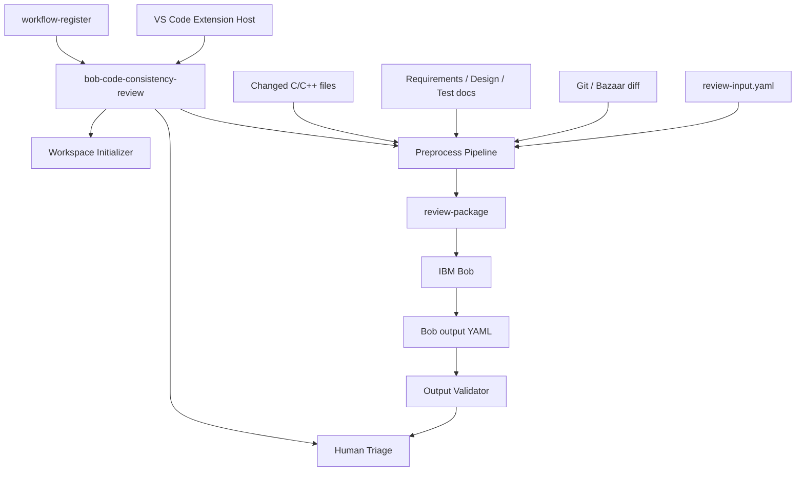
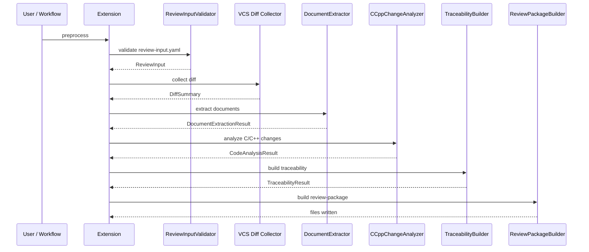
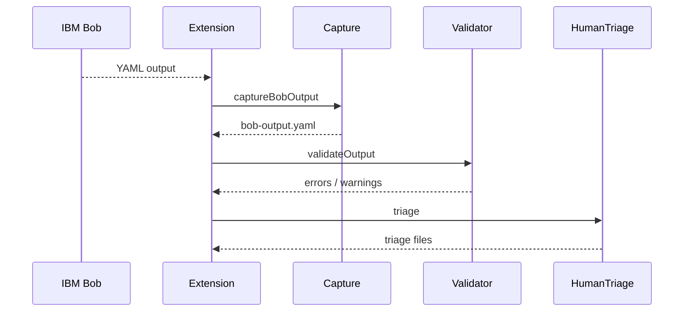

# bob-code-consistency-review 基本設計書

## 1. 目的

`bob-code-consistency-review` は、コード変更と要求書・基本設計書・詳細設計書・テスト仕様書の整合性を、正式レビュー前に IBM Bob でプレレビューするための VS Code 拡張機能である。

本拡張は、Bob にコードや文書をそのまま大量投入するのではなく、事前処理で差分、文書抜粋、コード解析結果、対応候補、根拠 ID をまとめた `review-package` を生成する。Bob はこの固定済みパッケージだけを根拠として、不整合候補、確認事項、推奨対応を抽出する。最終判断は人間が行う。

## 2. 背景と課題

コード変更と仕様書類の整合レビューでは、次の課題がある。

- コード差分、要求、設計、テスト仕様が別ファイルに分散している。
- Word、Excel、Markdown など文書形式が混在する。
- Git / Bazaar など VCS 差分の取得方法が環境により異なる。
- Bob に全量投入すると、対象外情報の混入、根拠不明な断定、トークン過多が起きやすい。
- C / C++ の変更箇所、変更関数、関連 caller / callee、グローバル変数候補などを事前に整理したい。
- Bob の指摘が、どの文書・コード根拠に基づくかを `evidence_id` で追跡したい。
- Bob 出力を schema と evidence index で検証し、人間 triage へつなげたい。
- workflow として配布できる初期 `WORKFLOW.md` が必要である。

本拡張はこれらに対し、決定論的な前処理、根拠 ID 付き review-package、Bob 出力 YAML の検証、人間 triage 生成、workflow 初期化を提供する。

## 3. スコープ

### 3.1 対象範囲

- `review-input.yaml` の読み込みと schema 検証。
- Git 差分の収集。
- review input で `review.vcs` が Bazaar / bzr の場合の Bazaar 差分取得。
- 変更ファイル一覧、変更行、変更関数候補の抽出。
- Markdown / Word `.docx` / Excel `.xlsx` からの根拠抜粋。
- C / C++ の軽量変更解析。
- traceability map の生成。
- `review-package` の生成。
- Bob 投入用 `bob-input.md` と prompt template の生成。
- Bob 出力 YAML の抽出、正規化、保存。
- Bob 出力 YAML の schema 検証と evidence 参照検証。
- 人間 triage ファイルの生成。
- `.bob/workflows/code-consistency-review/WORKFLOW.md` の初期化。
- `workflow-register` action provider としての連携。

### 3.2 対象外

- 正式レビューの承認。
- Bob 出力の自動採用。
- 任意ファイル全探索による根拠の推測。
- コミット、push、PR コメント投稿などの副作用。
- clang AST 等による完全な C / C++ 意味解析。
- 関数ポインタ、マクロ展開、include graph を含む完全な静的解析。
- 文書全量の Bob 投入。

## 4. 利用者と利用シーン

| 利用者 | 主な用途 |
| --- | --- |
| 開発者 | 変更内容と関連文書を指定し、Bob 用 review-package を生成する。 |
| レビュー担当者 | Bob の不整合候補を確認し、正式レビュー前の観点漏れを減らす。 |
| 設計担当者 | 要求・設計・テスト仕様とコード差分の対応関係を確認する。 |
| 人間 triage 担当者 | Bob 出力を採用・棄却・追加調査に振り分ける。 |
| ワークフロー設計者 | `workflow-register` の step から本拡張の前処理・検証・triage を呼び出す。 |
| 導入担当者 | 初期化コマンドで `.bob` 配下に workflow template を配置する。 |

## 5. 全体構成



## 6. 主要コンポーネント

| コンポーネント | 主な責務 | 主なファイル |
| --- | --- | --- |
| Extension Entry | VS Code command 登録、workflow-register action provider 登録 | `src/extension.ts` |
| Workspace Initializer | `.bob/workflows/code-consistency-review/WORKFLOW.md` の作成・更新・backup | `src/workspaceInitializer.ts` |
| Workspace Resolver | Bob workspace root の解決 | `src/workspaceResolver.ts` |
| Workflow Options | workflow action input / args / state から option を構築 | `src/workflowOptions.ts` |
| Review Input Validator | `review-input.yaml` の schema 検証と関連文書存在確認 | `src/core/reviewInputValidator.ts` |
| Git Diff Collector | Git 差分、変更ファイル、numstat、unified diff の収集 | `src/core/gitDiffCollector.ts` |
| Text Encoding | UTF-8 / Shift-JIS / CP932 系 decode | `src/core/textEncoding.ts` |
| Document Extractor | Markdown / docx / xlsx から根拠抜粋を生成 | `src/analyzers/documentExtractor.ts` |
| C/C++ Change Analyzer | 変更関数、call graph 候補、define / global / RT 禁止候補の抽出 | `src/analyzers/cCppChangeAnalyzer.ts` |
| Traceability Builder | 文書根拠とコード根拠の対応候補を作る | `src/analyzers/traceabilityBuilder.ts` |
| Review Package Builder | review-package のファイル群と `bob-input.md` を生成 | `src/core/reviewPackageBuilder.ts` |
| Bob Output Capture | Bob 出力 YAML を抽出して保存 | `src/core/bobOutputCapture.ts` |
| Bob Output Validator | YAML schema と evidence 参照を検証 | `src/core/bobOutputValidator.ts` |
| Human Triage Helper | 人間確認用 triage ファイルを生成 | `src/triage/humanTriageHelper.ts` |
| Prompt Templates | Bob 投入用 system / task / output-format / bob-input template | `src/templates/*` |

## 7. 入力モデル

### 7.1 `review-input.yaml`

`review-input.yaml` は整合プレレビューの起点である。主な情報は次の通り。

| 項目 | 説明 |
| --- | --- |
| `review.id` | レビュー ID。成果物や Bob 出力の紐付けに使う。 |
| `review.title` | レビュー表示名。 |
| `review.change_type` | bugfix / feature / refactor などの変更種別。 |
| `review.purpose` | 変更目的。 |
| `review.base` / `review.head` | Git diff の比較範囲。 |
| `review.vcs` | Git / Bazaar など差分取得方式の指定。 |
| `artifacts` | 要求、基本設計、詳細設計、テスト仕様、台帳、チケットの関連文書。 |
| `review_focus` | Bob に重点確認させる整合観点。 |
| `analysis_options` | 解析深度、言語、台帳利用などのオプション。 |

### 7.2 対応文書形式

| 形式 | 抽出単位 |
| --- | --- |
| Markdown | 見出しブロック、section / case / row selector。 |
| Word `.docx` | 見出し、段落、表。 |
| Excel `.xlsx` | sheet と行。 |

## 8. 出力モデル

### 8.1 `review-package`

既定の出力先は `.bob-review/review-package` である。

| ファイル | 用途 |
| --- | --- |
| `manifest.yaml` | package 作成情報、対象範囲、template ID、evidence 件数。 |
| `input-normalized.json` | 検証済み `review-input.yaml` の正規化結果。 |
| `changed-files.json` | VCS 差分から得た変更ファイル一覧。 |
| `changed-symbols.json` | 変更関数、define、global、call graph、RT 禁止候補。 |
| `document-index.json` | 文書と evidence の対応。 |
| `evidence-index.json` | Bob 出力検証に使う evidence metadata。本文は含めない。 |
| `traceability-map.json` | 要求・設計・コード・テスト仕様の対応候補。 |
| `change-summary.md` | 変更目的、変更ファイル、根拠件数の要約。 |
| `diff-context.md` | コードスライスと raw unified diff。 |
| `document-excerpts.md` | 文書から抽出した根拠抜粋。 |
| `traceability-map.md` | 対応候補の人間向け表示。 |
| `deterministic-checks.md` | warning と決定論的チェック結果。 |
| `bob-input.md` | Bob に投入する最終 Markdown。 |
| `prompts/*.md` | Bob 用 prompt template。 |
| `code-slices/*.md` | コード根拠ごとの Markdown。 |
| `tables/*.md` | 表形式 evidence の個別 Markdown。 |

### 8.2 Bob output / triage

Bob 出力は YAML として扱い、既定では `.bob-review/bob-output/bob-output.yaml` に保存する。

人間 triage の既定出力先は `.bob-review/human-triage` である。

| ファイル | 用途 |
| --- | --- |
| `triage-result.yaml` | 各 finding / question への人間判断を記録する。 |
| `accepted-findings.md` | 採用候補の指摘。 |
| `questions-to-author.md` | 作成者への確認事項。 |
| `rejected-findings.md` | 棄却指摘と理由の記録。 |
| `follow-up-actions.md` | 後続対応一覧。 |

## 9. 処理フロー

### 9.1 workspace 初期化

`bobCodeConsistency.initializeWorkspace` は同梱 template を `.bob/workflows/code-consistency-review/WORKFLOW.md` へ配置する。既存ファイルがある場合は backup を作成して更新する。

### 9.2 前処理



### 9.3 Bob 出力取り込み・検証・triage



## 10. `workflow-register` 連携

本拡張は、次の action provider を `workflow-register` に登録する。

| Provider | 処理 |
| --- | --- |
| `bobCodeConsistency.initializeWorkspace` | workflow template を `.bob/workflows/code-consistency-review/WORKFLOW.md` に作成・更新する。 |
| `bobCodeConsistency.preprocess` | review-package を生成する。 |
| `bobCodeConsistency.captureBobOutput` | Bob 出力 YAML を取り込む。 |
| `bobCodeConsistency.validateOutput` | Bob 出力を schema と evidence index で検証する。 |
| `bobCodeConsistency.triage` | 人間 triage 成果物を生成する。 |

workflow 実行時は `workflowRoot` / `bobRoot` / `workspaceRoot` を優先して workspace root を解決する。command palette から実行する場合は、VS Code workspace folder を選択する。

## 11. 同梱 workflow

同梱 template:

```text
templates/.bob/workflows/code-consistency-review/WORKFLOW.md
```

現行 template は `schemaVersion: workflow-register/v1`、`requires`、`guardrails.requireApproval`、`inputs`、`tools`、`artifacts`、`completion`、typed `steps` を持つ。

主な step:

| Step | Type | Provider / 処理 |
| --- | --- | --- |
| `preprocess-review-package` | command | `bobCodeConsistency.preprocess` |
| `run-bob-pre-review` | agent | `bob-input.md` に基づく整合プレレビュー |
| `capture-bob-output` | command | `bobCodeConsistency.captureBobOutput` |
| `validate-bob-output` | command | `bobCodeConsistency.validateOutput` |
| `human-triage` | command | `bobCodeConsistency.triage` |
| `handoff-formal-review` | agent | 正式レビューへの引き継ぎ Markdown を作る |

## 12. Bob にさせること / させないこと

| 区分 | 方針 |
| --- | --- |
| 拡張機能が行うこと | 入力検証、差分収集、文書抜粋、コード根拠抽出、対応候補作成、Bob 入力生成、Bob 出力検証、triage 生成。 |
| Bob にさせること | `review-package` に含まれる根拠だけを使い、意味的な不整合候補、確認事項、推奨対応を抽出する。 |
| 人間が行うこと | 指摘の採用判断、棄却理由、追加調査、正式レビュー、最終承認。 |
| Bob にさせないこと | 正式承認、根拠なし断定、対象外ファイル推測、大量ファイル探索、破壊的操作、コミットや PR 更新。 |

## 13. セキュリティと安全設計

- Bob に投入する前に、根拠を `review-package` として固定する。
- Bob 入力は根拠 ID 付き抜粋に限定する。
- 文書やコードの全量投入は避ける。
- Bob 出力は YAML schema と `evidence-index.json` で検証する。
- 存在しない `evidence_id` を参照する finding / question はエラーにする。
- 解析不能な情報は warning として保存する。
- 承認判断は必ず人間が行う。
- 通常フローに commit、push、PR コメント投稿などの副作用を含めない。

## 14. エラー処理方針

| 場面 | 方針 |
| --- | --- |
| `review-input.yaml` 不正 | schema error として処理を中止する。 |
| 関連文書欠落 | missing artifact として処理を中止する。 |
| Git / Bazaar diff 収集失敗 | preprocess を失敗させる。 |
| 文書抽出失敗 | warning に記録し、可能な範囲で続行する。 |
| 変更関数を特定できない | warning に記録する。 |
| Bob 出力 YAML 不在 | capture 結果を error とする。 |
| Bob 出力 schema 不一致 | validation error とする。 |
| evidence 参照不一致 | validation error とする。 |
| triage 入力不備 | triage 生成を失敗させる。 |
| workflow template 初期化 | 既存ファイルを backup して更新する。 |

## 15. テスト方針

- workspace initializer の作成・更新・backup を検証する。
- `review-input.yaml` schema validation を検証する。
- Git / Bazaar diff collector の changed files / language 判定を検証する。
- Markdown / docx / xlsx の文書抽出を検証する。
- C / C++ 変更解析の changed function / code evidence 生成を検証する。
- `review-package` の生成ファイル一覧と内容を検証する。
- Bob output capture の fenced YAML 抽出を検証する。
- Bob output validator の schema / evidence 参照検証を検証する。
- triage 生成ファイルを検証する。
- workflow-register provider 登録を検証する。
- 同梱 workflow template の requires / guardrails / steps を検証する。

## 16. 今後の拡張方針

- clang AST 連携による C / C++ 解析強化。
- 関数ポインタ、構造体メンバ、グローバル変数影響の解析強化。
- 文書 ID / section ID のより厳密な対応付け。
- Redmine / ticket system 連携。
- review-package の差分比較と再利用。
- workflow-register の result handoff を使った Bob 出力自動取り込み強化。
- 人間 triage 結果から正式レビュー用コメントを生成する補助機能。
