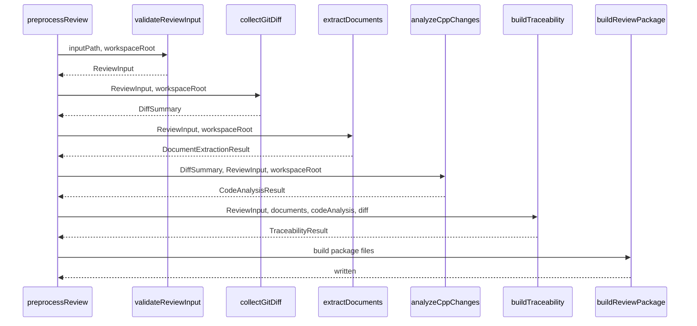

# bob-code-consistency-review 詳細設計書

## 1. 文書の位置づけ

本書は `extensions/bob-code-consistency-review` 拡張機能の詳細設計を定義する。基本設計書で示した目的とスコープを、実装モジュール、主要データ、処理シーケンス、エラー処理、テスト観点へ展開する。

## 2. 実装構成

```text
extensions/bob-code-consistency-review/
  package.json
  src/
    extension.ts
    workflowOptions.ts
    workspaceResolver.ts
    analyzers/
      cCppChangeAnalyzer.ts
      documentExtractor.ts
      traceabilityBuilder.ts
    core/
      bobOutputCapture.ts
      bobOutputValidator.ts
      fileSystem.ts
      gitDiffCollector.ts
      pipeline.ts
      reviewInputValidator.ts
      reviewPackageBuilder.ts
      schemaLoader.ts
      textEncoding.ts
      types.ts
    schemas/
      bob-output.schema.json
      review-input.schema.json
    templates/
      bob-input.md
      output-format.md
      system.md
      task.md
      templateLoader.ts
    triage/
      humanTriageHelper.ts
  test/
    *.test.js
```

## 3. 起動設計

### 3.1 Activation

`package.json` の `main` は `./out/extension.js` である。activation event は次の通りである。

- `onStartupFinished`
- `onCommand:bobCodeConsistency.preprocess`
- `onCommand:bobCodeConsistency.captureBobOutput`
- `onCommand:bobCodeConsistency.validateOutput`
- `onCommand:bobCodeConsistency.triage`

`activate(context)` は VS Code command を登録し、続けて `workflow-register` の `registerActionProvider` API を使って action provider を登録する。

### 3.2 Command entry

| Command ID | 実装関数 | 概要 |
| --- | --- | --- |
| `bobCodeConsistency.preprocess` | `runPreprocess` | `review-input.yaml` から review-package を生成する。 |
| `bobCodeConsistency.captureBobOutput` | `runCaptureBobOutput` | Bob 出力 YAML を抽出・正規化して保存する。 |
| `bobCodeConsistency.validateOutput` | `runValidateOutput` | Bob 出力 YAML を schema と evidence index で検証する。 |
| `bobCodeConsistency.triage` | `runTriage` | 人間確認用 triage 成果物を生成する。 |

## 4. 設定設計

| 設定キー | 既定値 | 用途 |
| --- | --- | --- |
| `bobCodeConsistency.reviewInputPath` | `review-input.yaml` | 入力 YAML の workspace 相対パス。 |
| `bobCodeConsistency.reviewPackagePath` | `.bob-review/review-package` | review-package 出力先。 |
| `bobCodeConsistency.bobOutputPath` | `.bob-review/bob-output/bob-output.yaml` | Bob 出力 YAML 保存先。 |
| `bobCodeConsistency.triagePath` | `.bob-review/human-triage` | 人間 triage 出力先。 |

workflow や他拡張から呼ぶ場合は、同名 option を `args` / `inputs` / workflow context で渡せる。明示 option は設定値より優先する。

## 5. Workspace 解決設計

### 5.1 Root 解決

`requireBobWorkspaceRoot()` は `resolveBobWorkspaceRoot()` を使って root を解決する。

優先順位は次の通り。

1. `bobRoot`
2. `workspaceRoot`
3. `workflowRoot`
4. VS Code workspace folder
5. QuickPick

### 5.2 Path 解決

`absolute(root, value)` は absolute path ならそのまま、relative path なら workspace root に結合する。

`fileSystem.resolveWorkspacePath()` も同様に workspace root から相対 path を解決する。現時点では workspace 外 path の拒否は行っていないため、今後の安全強化候補である。

## 6. Workflow-register 連携設計

### 6.1 Provider 登録

`registerWorkflowProviders()` は `local.workflow-register` を取得し、次の action provider を登録する。

| Provider ID | 実行内容 |
| --- | --- |
| `bobCodeConsistency.preprocess` | `runPreprocess(mergeWorkflowOptions(input))` |
| `bobCodeConsistency.captureBobOutput` | `runCaptureBobOutput(...)` |
| `bobCodeConsistency.validateOutput` | `runValidateOutput(mergeWorkflowOptions(input))` |
| `bobCodeConsistency.triage` | `runTriage(mergeWorkflowOptions(input))` |

### 6.2 Option merge

workflow 実行時は、次の情報を統合する。

- `input.inputs`
- `input.args`
- `workflowRoot`
- `workflowFile`
- `workflowFolderName`
- `bobRoot`
- `workspaceRoot`

`captureBobOutput` は `buildCaptureWorkflowOptions()` を使い、workflow state / inputs / args から取り込み option を組み立てる。

## 7. Preprocess pipeline 詳細

### 7.1 Pipeline sequence

`preprocessReview()` は次の順で処理する。



### 7.2 戻り値

`PreprocessResult` は次を返す。

- `status`
- `reviewId`
- `packageDir`
- `changedFiles`
- `documentEvidence`
- `codeEvidence`
- `warnings`
- `summary`

## 8. Review Input Validation 詳細

### 8.1 処理

`validateReviewInput(inputPath, workspaceRoot)` は次を行う。

1. `readTextFile()` で YAML text を読む。
2. `YAML.parse()` で object 化する。
3. `review-input` schema を `loadSchemaValidator()` で読み込む。
4. schema validation を行う。
5. `artifacts` に指定された文書 path の存在確認を行う。
6. `ReviewInput` を返す。

### 8.2 Artifact existence

`artifacts` の値が array の場合、各 item の `path` を workspace root から解決し、存在しない場合は error にする。

## 9. Git Diff Collector 詳細

### 9.1 Git commands

`collectGitDiff()` は通常時に次を実行する。

```text
git diff --name-status <base> <head>
git diff --numstat <base> <head>
git diff --unified=80 <base> <head>
```

`diffFixturePath` が指定された場合は、Git を実行せず fixture JSON を読み込む。

### 9.2 DiffSummary

`DiffSummary` は次を持つ。

- base
- head
- files
- unifiedDiff
- warnings

`files` は path、status、additions、deletions、language、test file flag、interface candidate flag を持つ。

### 9.3 言語判定

拡張子から次を判定する。

| 拡張子 | language |
| --- | --- |
| `.c` | `c` |
| `.cc` / `.cpp` / `.cxx` | `cpp` |
| `.h` | `h` |
| `.hh` / `.hpp` / `.hxx` | `hpp` |
| その他 | 拡張子名または `unknown` |

## 10. Document Extractor 詳細

### 10.1 入力

`extractDocuments(reviewInput, { workspaceRoot })` は `reviewInput.artifacts` を走査する。

対応 artifact key と evidence prefix は次の通り。

| artifact key | evidence type | prefix |
| --- | --- | --- |
| `requirements` | `requirement` | `REQ` |
| `basic_design` | `basic_design` | `BD` |
| `detailed_design` | `detailed_design` | `DD` |
| `test_spec` | `test_spec` | `TC` |
| `ledgers` | `ledger` | `LEDGER` |
| `tickets` | `ticket` | `TICKET` |

### 10.2 Markdown 抽出

Markdown は見出しごとに block 化する。`sections` / `cases` / `rows` selector が指定されている場合、ref、title、location、text のいずれかに selector を含む chunk を採用する。

### 10.3 docx 抽出

`.docx` は `mammoth.convertToHtml()` で HTML 化し、`cheerio` で heading、paragraph、table を抽出する。table は Markdown table へ変換する。

### 10.4 xlsx 抽出

`.xlsx` は `xlsx` で workbook を読み、指定 sheets または全 sheets を走査する。先頭行を header とし、各行を Markdown table chunk にする。

### 10.5 Evidence

抽出した chunk ごとに `evidence_id` を付与する。例:

```text
REQ-0001
BD-0001
DD-0001
TC-0001
LEDGER-0001
```

## 11. C / C++ Change Analyzer 詳細

### 11.1 対象

`c` / `cpp` / `h` / `hpp` の変更ファイルを対象とする。

### 11.2 処理概要

`analyzeCppChanges()` は次を行う。

1. unified diff から追加・削除行を抽出する。
2. 変更識別子 token を抽出する。
3. 変更ファイルを workspace 内で解決する。
4. source file を読み込む。
5. 正規表現ベースで関数範囲を検出する。
6. 変更行を含む関数を changed function とする。
7. changed function の callees / direct callers を抽出する。
8. `#define` 候補、global 候補を抽出する。
9. RT 禁止処理候補を検出する。
10. code slice と code evidence を生成する。

### 11.3 変更関数検出

関数検出は軽量な正規表現ベースである。次は除外する。

- `if`
- `for`
- `while`
- `switch`
- `return`

brace depth を使い、関数開始から終了までの行範囲を推定する。

### 11.4 Call graph 候補

changed function 内の `name(` 形式を callee 候補とする。制御構文などは除外する。direct caller は同一変更ファイル内で対象関数を呼ぶ関数から推定する。

### 11.5 RT 禁止処理候補

追加行に次の関数呼び出しがある場合、RT 禁止処理候補として記録する。

```text
fopen, fread, fwrite, fprintf, printf, scanf, sleep, Sleep, malloc, free, system
```

## 12. Traceability Builder 詳細

`buildTraceability()` は、review input、document evidence、code evidence、diff summary をもとに、要求・設計・コード・テスト仕様の対応候補を作る。

主な出力:

- traceability rows
- Markdown 表示
- warnings

現状は evidence ID、文書種別、変更シンボル、review focus を用いた候補生成であり、AI 判断の代替ではない。Bob が意味的な不整合候補を抽出するための足場である。

## 13. Review Package Builder 詳細

### 13.1 生成順序

`buildReviewPackage()` は次を行う。

1. output directory を作成する。
2. prompt template を書き出す。
3. code slices を `code-slices/` に書き出す。
4. table evidence を `tables/` に書き出す。
5. JSON index 群を書き出す。
6. Markdown summary 群を書き出す。
7. prompt template を適用し、`bob-input.md` を生成する。

### 13.2 JSON files

| ファイル | 内容 |
| --- | --- |
| `input-normalized.json` | `ReviewInput`。 |
| `changed-files.json` | `DiffSummary.files` と warning。 |
| `changed-symbols.json` | symbols、functions、defines、globals、call graph、RT 候補。 |
| `document-index.json` | documents と warning。 |
| `evidence-index.json` | evidence metadata。本文は除外。 |
| `traceability-map.json` | traceability rows と warning。 |

### 13.3 Markdown files

| ファイル | 内容 |
| --- | --- |
| `change-summary.md` | review summary と変更ファイル一覧。 |
| `diff-context.md` | code slices と raw unified diff。 |
| `document-excerpts.md` | 文書根拠抜粋。 |
| `traceability-map.md` | 対応候補。 |
| `deterministic-checks.md` | warning と evidence duplicate check。 |
| `bob-input.md` | Bob 投入用の最終 Markdown。 |

### 13.4 Evidence index 方針

`evidence-index.json` には本文を含めず、metadata だけを保存する。Bob 出力検証ではこの file を参照し、存在しない `evidence_id` を検出する。

## 14. Prompt Template 詳細

`src/templates` は次の prompt を持つ。

| Template | 用途 |
| --- | --- |
| `system.md` | Bob の役割と制約。 |
| `task.md` | 整合プレレビューの作業指示。 |
| `output-format.md` | Bob 出力 YAML schema の説明。 |
| `bob-input.md` | review-package 内容を合成する最終テンプレート。 |

`templateLoader.ts` は template を読み込み、`applyTemplate()` で placeholder を置換する。

## 15. Bob Output Capture 詳細

### 15.1 入力候補

`runCaptureBobOutput()` は次の順で text を決める。

1. command argument が string の場合
2. options の `text`
3. clipboard text

workflow 実行では `buildCaptureWorkflowOptions()` により、workflow state / inputs / args から option を組み立てる。

### 15.2 YAML 抽出

`extractYamlFromText()` は次を試す。

1. fenced YAML code block
2. text 全体が `schema_version:` を含む YAML
3. text 中の `schema_version:` 以降

### 15.3 保存

YAML parse に成功した場合、`YAML.stringify(parsed)` で正規化し、`bobOutputPath` に保存する。

## 16. Bob Output Validator 詳細

### 16.1 処理

`validateBobOutput()` は次を行う。

1. `bobOutputPath` を読み込む。
2. YAML parse する。
3. `bob-output` schema を検証する。
4. `packageDir/evidence-index.json` を読み込む。
5. `findings[].evidence[]` と `questions[].evidence[]` の `evidence_id` が存在するか確認する。
6. findings / questions が 30 件超の場合 warning を出す。

### 16.2 ValidationReport

戻り値は次の構造を持つ。

```ts
interface ValidationReport {
  errors: string[]
  warnings: string[]
}
```

VS Code command としては、error が 0 件なら `status: ok`、1 件以上なら `status: error` を付けて返す。

## 17. Human Triage 詳細

### 17.1 入力

- `packageDir`
- `bobOutputPath`
- `outDir`

### 17.2 生成ファイル

| ファイル | 詳細 |
| --- | --- |
| `triage-result.yaml` | finding / question ごとに decision、owner、reason、follow_up を記入する雛形。 |
| `accepted-findings.md` | finding の要約と evidence を列挙する。 |
| `questions-to-author.md` | question の要約、理由、owner、action を列挙する。 |
| `rejected-findings.md` | 棄却指摘を人間が追記する雛形。 |
| `follow-up-actions.md` | recommended action / suggested action を一覧化する。 |

### 17.3 人間判断の位置づけ

triage は最終判断を自動化しない。`triage-result.yaml` の `decision`、`reason`、`owner`、`due` は人間が記入する。

## 18. Schema 詳細

### 18.1 `review-input.schema.json`

`review-input.yaml` の required field、artifact array、review focus、analysis options を検証する。

### 18.2 `bob-output.schema.json`

Bob 出力 YAML の構造を検証する。

主な想定 field:

- `schema_version`
- `review_summary`
- `findings`
- `questions`
- `overall_assessment`

schema validation だけでは evidence の存在までは確認できないため、`bobOutputValidator` が `evidence-index.json` と照合する。

## 19. File I/O と文字コード

### 19.1 読み込み

`readTextFile()` は `decodeTextBuffer()` を使って file を読み込む。既定は `auto` である。

想定:

- UTF-8
- Shift-JIS / CP932 系日本語テキスト

### 19.2 書き込み

生成ファイルは UTF-8 で書き込む。

### 19.3 Directory creation

`writeTextFile()` は親 directory を recursive に作成してから書き込む。

## 20. Error Handling 詳細

| 発生箇所 | エラー処理 |
| --- | --- |
| review input parse | YAML parse error または schema error を throw。 |
| missing artifact | missing file 一覧を含む error を throw。 |
| Git command failure | `execFile` の例外で preprocess 失敗。 |
| document extraction failure | warning に追加して続行。 |
| changed function 未検出 | warning に追加して続行。 |
| Bob output YAML 不在 | capture result `status: error`。 |
| Bob output parse error | capture result `status: error` または validation errors。 |
| evidence-index 不在 | validation error。 |
| unknown evidence_id | validation error。 |
| triage output write error | command failure。 |

## 21. セキュリティ詳細

### 21.1 Bob 投入前固定

Bob に渡す情報は、前処理で生成した `review-package` に固定する。Bob が外部ファイルを追加探索する前提にはしない。

### 21.2 Evidence ID 制約

Bob 出力は `evidence-index.json` に存在する evidence のみを根拠として認める。存在しない evidence を参照した場合は validation error とする。

### 21.3 副作用制限

通常フローでは次を行わない。

- Git commit
- Git push
- PR コメント投稿
- ソースコード変更
- 文書更新
- 正式承認

### 21.4 既知の安全強化余地

現状の `resolveWorkspacePath()` は absolute path を許可する。将来的には、明示許可がない限り workspace root 外への参照を拒否する設計が望ましい。

## 22. 状態と保存先

| 種類 | 既定保存先 |
| --- | --- |
| 入力 | `review-input.yaml` |
| review-package | `.bob-review/review-package` |
| Bob output | `.bob-review/bob-output/bob-output.yaml` |
| human triage | `.bob-review/human-triage` |
| prompt template copy | `.bob-review/review-package/prompts` |
| code slices | `.bob-review/review-package/code-slices` |
| table excerpts | `.bob-review/review-package/tables` |

## 23. テスト設計

### 23.1 Unit test 観点

| 対象 | 観点 |
| --- | --- |
| `reviewInputValidator` | schema error、missing artifact。 |
| `gitDiffCollector` | name-status / numstat parse、language 判定、fixture 利用。 |
| `documentExtractor` | Markdown / docx / xlsx 抽出、selector、evidence ID。 |
| `cCppChangeAnalyzer` | function range、changed function、callee / caller、RT 禁止候補。 |
| `traceabilityBuilder` | evidence と code symbol の対応候補。 |
| `reviewPackageBuilder` | 生成ファイル、evidence-index、bob-input。 |
| `bobOutputCapture` | fenced YAML、schema_version 開始、parse error。 |
| `bobOutputValidator` | schema error、unknown evidence_id、warning 上限。 |
| `humanTriageHelper` | triage-result と Markdown 出力。 |
| `extension` | workflow-register provider 登録、option merge。 |

### 23.2 Smoke test 観点

- 最小 `review-input.yaml` で preprocess が完了する。
- review-package が必要ファイルをすべて生成する。
- Bob output fixture を capture / validate できる。
- triage file を生成できる。
- workflow-register step 経由で preprocess -> capture -> validate -> triage が実行できる。

## 24. 変更時の注意点

- `review-input.schema.json` を変えた場合は README、設計書、テスト fixture を同期する。
- `bob-output.schema.json` を変えた場合は prompt `output-format.md` と validator test を同期する。
- evidence ID 形式を変えた場合は document extractor、code analyzer、validator、triage を確認する。
- C / C++ 解析を強化する場合は、正規表現ベースの限界と false positive / false negative を docs に明記する。
- workspace path 制約を強化する場合は、絶対 path を使う既存利用との互換性を確認する。
- workflow-register の `ActionExecutionInput` 変更時は `workflowOptions.ts` と provider registration test を確認する。

## 25. 今後の改善候補

- workspace root 外 path の明示許可制。
- Git 以外の VCS 対応、または差分 fixture 入力の正式化。
- C / C++ AST 連携。
- 関数ポインタ、構造体メンバ、外部 IF 影響の解析。
- Excel 台帳の列マッピング定義。
- triage 結果から正式レビューコメント案を生成する補助。
- Bob output capture を workflow-register result handoff の `latestAssistantText` に直接対応させる。
