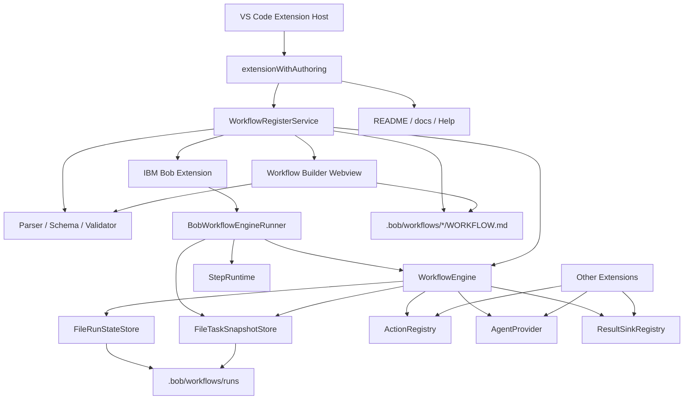

# workflow-register 基本設計書

## 1. 目的

`workflow-register` は、VS Code / IBM Bob 環境で `.bob/workflows/*/WORKFLOW.md` に定義されたワークフローを検出し、IBM Bob の Workflow UI へ登録し、UI 実行または単独実行できるようにする VS Code 拡張機能である。

本拡張は、個別拡張が持つ前処理、レビュー、結果保存、成果物生成などを、共通の workflow 定義と実行状態管理に接続する基盤を提供する。

## 2. 背景と課題

Bob 上でレビューや設計作業を定型化する場合、次の課題がある。

- `.bob/workflows` 配下の定義を動的に Bob Workflow UI へ登録したい。
- command、agent、manual、result を一連の step として扱いたい。
- UI から Todo / Step 単位で進めつつ、実行状態は壊れにくく保存したい。
- VS Code 再起動や Bob task 中断後も、同じ入力・同じ workflow 定義であれば途中状態を再利用したい。
- AI 出力後に result handoff だけ失敗した場合、Bob chat 側に残った出力を救済したい。
- GUI Builder、AI 補助、Diagnostics、Help を main の一体機能として運用したい。
- 他拡張が action provider / agent provider / result sink を後付けできるようにしたい。

`workflow-register` はこれらを解決するため、workflow 定義、Bob 登録、UI 実行 adapter、単独実行 engine、run state、task snapshot、検証、診断、GUI Builder、AI 補助をまとめて提供する。

## 3. スコープ

### 3.1 対象範囲

- `.bob/workflows/*/WORKFLOW.md` の探索と読み込み。
- `schemaVersion: workflow-register/v1` の解析、検証、正規化。
- legacy 形式の互換読み込み。
- IBM Bob Workflow UI への source / workflow 登録。
- Bob UI からの full 実行および Todo step 単位の `singleStep` 実行。
- Command Palette / API からの standalone 実行。
- `command` / `agent` / `manual` / `result` step の実行。
- `run.json` による run state 永続化と recoverable run 再利用。
- Bob task snapshot による chat 文脈、last assistant text、metadata の補助保存。
- `resumeRun` / `retryCurrentStep` による再開と再試行。
- result handoff / result sink / artifact 出力。
- Workflow Diagnostics、Run Diagnostics、Active Step 表示。
- テンプレート作成、AI 設計、AI 改善、診断説明。
- Webview GUI Builder による新規作成と既存 v1 workflow 編集。
- Help / README / authoring guide など、main に統合された支援ドキュメント群との整合。

### 3.2 対象外

- IBM Bob 本体の UI 実装。
- 個別業務処理そのものの実装。
- 任意 shell command の直接実行。
- workspace root 外への成果物保存。
- 長期ジョブスケジューリング。
- 複数ユーザー間の run state 同期。
- Bob task object、Promise、callback、`resolve` の永続化。
- legacy workflow の GUI 編集。
- YAML コメントや field 順序の完全保持。

## 4. 利用者と利用シーン

| 利用者 | 主な用途 |
| --- | --- |
| 開発者 | `.bob/workflows` に workflow を定義し、Bob UI または Command Palette から実行する。 |
| レビュー担当者 | Bob Workflow UI の Todo / Step を進め、途中成果物を確認する。 |
| 拡張機能開発者 | action provider、agent provider、result sink を登録し、個別処理を workflow step へ接続する。 |
| ワークフロー設計者 | テンプレート、GUI Builder、AI 補助、Help を使って `WORKFLOW.md` を作成・改善する。 |
| 保守担当者 | run state、task snapshot、diagnostics を確認し、中断・復帰時の状態を調査する。 |

## 5. 全体構成

## 6. 主要コンポーネント

| コンポーネント | 主な責務 | 主なファイル |
| --- | --- | --- |
| Extension Entry | VS Code command 登録、Bob 連携、公開 API | `src/extension.ts` |
| Authoring Entry | core activation に検証、AI 補助、GUI Builder を追加 | `src/extensionWithAuthoring.ts` |
| WorkflowRegisterService | workflow 探索、Bob source 登録、run 操作、provider 管理 | `src/extension.ts` |
| BobWorkflowEngineRunner | Bob task を `WorkflowEngine` へ接続する UI 実行 adapter | `src/extension.ts` |
| StepRuntime | Bob UI の手動完了待ち active step だけをメモリ保持 | `src/extension.ts` |
| WorkflowEngine | step 実行、singleStep/full、hook、manual completion、復帰候補利用 | `src/core/engine.ts` |
| Run State Store | `run.json` の作成、atomic 保存、recoverable run 探索 | `src/core/runStateStore.ts` |
| Task Snapshot Store | Bob task snapshot の保存、latest、pruning、検索 | `src/core/taskSnapshots.ts` |
| Parser / Schema / Validator | `WORKFLOW.md` の解析、AJV schema、参照検証 | `src/core/parser.ts`, `src/core/workflowSchema.ts`, `src/core/workflowValidator.ts` |
| Action Registry | command step の provider 登録と実行 | `src/core/actionRegistry.ts` |
| Agent Provider | standalone agent 実行、Bob subagent 接続 | `src/core/agentProvider.ts`, `src/agentStep.ts` |
| Result Sink Registry | file / command sink、artifact 出力 | `src/core/resultSinkRegistry.ts` |
| Result Handoff | Bob assistant 出力を result command へ渡す | `src/resultHandoff.ts` |
| Input Collector | workflow input の prompt / metadata 補完 | `src/core/inputCollector.ts`, `src/core/inputResolver.ts` |
| Workspace Roots | `.bob` root と workspace root の解決 | `src/core/workspaceRoots.ts` |
| AI Authoring | AI による設計、改善、診断説明 | `src/commands/*Ai.ts`, `src/core/workflowAiProviderFactory.ts` |
| GUI Builder | Webview 作成、preview、diff、save、backup、reload | `src/webview/*`, `src/core/workflowAuthoring*.ts` |
| Diagnostics | workflow / run diagnostics の Markdown 表示と VS Code Diagnostics | `src/commands/*Diagnostics.ts`, `src/commands/validateWorkflow.ts` |
| Help / Docs | 操作手順、authoring guide、設計書、復旧計画 | `README.md`, `docs/*.md` |

## 7. ワークフロー定義モデル

workflow は `WORKFLOW.md` の YAML front matter と Markdown body で定義する。新規定義では `schemaVersion: workflow-register/v1` を推奨する。

主な要素は次のとおり。

| 要素 | 説明 |
| --- | --- |
| `name` | 安定識別子。フォルダ名との一致を推奨する。 |
| `description` | Bob UI と診断で使う説明。 |
| `title` / `label` / `menuLabel` | UI 表示名。 |
| `mode` | Bob 実行モード。 |
| `workspaceRequired` | Bob UI 上で workspace env を要求するか。 |
| `inputs` | 実行前入力定義。 |
| `requires` | workspace、Bob、必須ファイルなどの実行条件。 |
| `preflight` | 実行前チェック。 |
| `guardrails` | command 実行の許可・禁止・承認ルール。 |
| `artifacts` | step 結果から保存する成果物。 |
| `completion` | 完了時の summary / artifacts / visualization。 |
| `steps` | 実行 step の列。 |
| Markdown body | Bob へ渡す説明、手順、運用補足。GUI の `Markdown Body` タブで編集できる。 |

## 8. ステップ種別

| 種別 | 説明 |
| --- | --- |
| `command` | action provider を呼び出す。戻り値は `resultKey` に保存できる。 |
| `agent` | agent provider または Bob task の `startSubagent` に prompt を渡す。 |
| `manual` | 人間の確認完了を待つ。 |
| `result` | state / literal / agent 結果を result sink に渡す。 |

`includeState` は前段 step の `resultKey` を参照する。GUI Builder では参照切れ、前方参照、`artifact.producedBy` の不整合を即時警告する。

## 9. 実行方式の棲み分け

### 9.1 Bob UI 実行系

Bob UI 実行系は、Bob task を持つ実行経路である。Bob step の表示は `createBobWorkflow()` / `buildWorkflowSteps()` が作り、実行本体は `BobWorkflowEngineRunner` が `WorkflowEngine` に委譲する。

| Bob UI 上の形 | Engine 実行 | 用途 |
| --- | --- | --- |
| Todo ごとの Bob step | `executionMode: "singleStep"` + `stepId` | UI 上で step を1つずつ進める。 |
| 単一 `runWorkflow` step | `executionMode: "full"` | Bob UI から workflow 全体を一括実行する。 |

Bob UI 実行系では、次を Bob adapter が担う。

- Bob task metadata / messages から input 候補を抽出する。
- `task.startSubagent()` を `AgentProvider` として接続する。
- `task.sendMessage()` で step 開始、command result、agent output を Bob chat に同期する。
- `task.setStepComplete()` で Bob UI の step 完了を同期する。
- `StepRuntime` に manual completion 待ちを登録する。
- `WorkflowExecutionHooks` から task snapshot を保存する。
- 現在 task または snapshot から `lastAssistantText` を復帰候補として返す。

### 9.2 Standalone 実行系

Standalone 実行系は、Command Palette または公開 API から `WorkflowEngine` を直接呼ぶ経路である。Bob task は存在しない。

Standalone 実行系では、次を行う。

- VS Code UI で不足 input を prompt する。
- `FileRunStateStore` に `run.json` を保存する。
- `agentCommand` または登録済み `AgentProvider` で agent step を実行する。
- `resumeRun` / `retryCurrentStep` で保存済み run を再開する。
- 既存 snapshot がある場合は `recoverResultText` の候補として参照できるが、新規 Bob task snapshot は作らない。

## 10. 実行状態と再開

実行状態の正本は `.bob/workflows/runs/<runId>/run.json` である。保存対象は次の情報である。

- run ID
- workflow ID / name / schema version / definition hash / workflow file
- engine version
- 入力値
- state
- 各 step の状態
- current step
- error
- created / updated timestamp

`FileRunStateStore` は `run.json` を atomic write で保存する。`findRecoverableRun()` は `running` / `held` の run から、workflow ID、workflow definition hash、workflow file、安定化した inputs が一致する run を探す。

再開方式は次の通り。

| 操作 | 説明 |
| --- | --- |
| recoverable run 再利用 | 同じ workflow 定義・同じ inputs で開始された場合、既存の `running` / `held` run を再利用する。 |
| Resume | held step を完了扱いにし、次 step から再開する。 |
| Retry | current step を pending に戻し、同じ step から再実行する。 |
| singleStep 継続 | Todo step 実行後も run を `running` のまま残し、次の Bob step が同じ run を取得する。 |

`StepRuntime.activeSteps` は、Bob UI の手動完了待ち Promise と Bob task 参照だけを保持する。これは extension host のメモリ上の補助状態であり、step state、inputs、outputs、run status の正本ではない。

## 11. Bob task snapshot

Bob task 側の chat 文脈は `.bob/workflows/runs/<runId>/task-snapshots/*.json` に補助証跡として保存する。

| reason | 保存タイミング |
| --- | --- |
| `workflow-start` | 新規 run 開始時。 |
| `step-start` | step 開始時。 |
| `agent-output` | agent output 取得直後。 |
| `handoff-failed` | result sink / handoff 失敗時。 |
| `held` | held 移行時。 |
| `failed` | failed 移行時。 |
| `completed` | step または workflow 完了時。 |

snapshot は `latest.json` にも保存される。保存時には `workflowRegister.taskSnapshots.*` の設定に従い、最大サイズ、messages の保存有無、run あたり件数、pruning を制御する。

snapshot は `run.json` の代替ではない。用途は、Bob chat 側にしか残っていない `lastAssistantText` の救済、handoff 失敗調査、run と Bob UI の不整合診断である。

## 12. GUI Builder / Help / AI 補助

GUI Builder は main の標準機能として統合され、次を扱う。

- template からの新規作成。
- 既存 `workflow-register/v1` の編集。
- `Steps` / `Inputs` / `Requires` / `Preflight` / `Artifacts` / `Guardrails` / `Completion` / `Markdown Body` の編集。
- 参照関係の即時警告。
- Preview / Diagnostics。
- Diff 表示。
- backup 作成後の保存。

AI 補助は、次の command で提供する。

| Command | 用途 |
| --- | --- |
| `workflowRegister.designWorkflowWithAi` | 新規 workflow draft を作る。 |
| `workflowRegister.improveWorkflowWithAi` | 現在の workflow と diagnostics から改善案を作る。 |
| `workflowRegister.explainWorkflowDiagnostics` | diagnostics を自然言語で説明する。 |

Help / README / authoring guide / 設計書は、GUI Builder とワークフロー設計の運用補助として main に統合される。

## 13. 他拡張との連携

`workflow-register` は activation return value として次の API を公開する。

| API | 用途 |
| --- | --- |
| `registerActionProvider(provider)` | `command` step の provider を追加する。 |
| `registerAgentProvider(provider)` | standalone engine または Bob adapter の fallback agent 実行を差し替える。 |
| `registerResultSink(type, handler)` | `result.sinks[].type` で参照できる sink を追加する。 |
| `listWorkflows()` | 読み込み済み workflow 定義を取得する。 |
| `runWorkflow(workflowId, inputs)` | workflow をプログラムから standalone 実行する。 |

## 14. セキュリティと安全設計

- 任意 shell 実行は標準機能として提供しない。
- command step は action provider 経由で実行する。
- guardrails により許可・禁止 command を検査する。
- `guardrails.requireApproval` は人間承認が必要な条件を workflow 定義に残す。
- `file` result sink は workspace root 外への書き込みを拒否する。
- task snapshot は workspace root 配下の run ディレクトリにのみ保存する。
- task snapshot は最大サイズ、messages 保存有無、pruning を設定で制御する。
- Bob task object や callback は保存しない。
- `.bob/workflows` 配下の workflow のみを登録対象にする。

## 15. エラー処理方針

| 場面 | 方針 |
| --- | --- |
| workflow parse 失敗 | 登録対象から除外し、diagnostics に出す。 |
| Bob API 不在 | 登録を中止し、inspect report に記録する。 |
| input 不足 | prompt で入力を求め、required ならキャンセル時に中止する。 |
| preflight error | run を failed にする。 |
| command provider 未登録 | step を failed にする。 |
| command provider が structured error を返す | `reportedActionError` で failed 扱いにする。 |
| manual step | held として保存し、Bob UI 実行では `StepRuntime` に active step を保持する。 |
| result handoff 失敗 | `onHandoffFailed` hook で snapshot を保存し、step を failed として retry 可能にする。 |
| snapshot 保存失敗 | hook 内の警告扱いとし、正本である `run.json` を優先する。 |

## 16. 運用と診断

主な運用 command は次のとおり。

- `workflowRegister.reload`
- `workflowRegister.inspect`
- `workflowRegister.runWorkflow`
- `workflowRegister.inspectRuns`
- `workflowRegister.resumeRun`
- `workflowRegister.retryCurrentStep`
- `workflowRegister.inspectRunDiagnostics`
- `workflowRegister.inspectActiveSteps`
- `workflowRegister.completeCurrentStep`
- `workflowRegister.completeStep`
- `workflowRegister.validateCurrentWorkflow`
- `workflowRegister.validateWorkspaceWorkflows`
- `workflowRegister.createWorkflowFromTemplate`
- `workflowRegister.openWorkflowBuilder`
- `workflowRegister.editWorkflowInBuilder`
- `workflowRegister.designWorkflowWithAi`
- `workflowRegister.improveWorkflowWithAi`
- `workflowRegister.explainWorkflowDiagnostics`

`WORKFLOW.md` は保存時と active editor 変更時に検証され、VS Code Diagnostics に反映される。

`workflowRegister.inspectRunDiagnostics` は `run.json` に加えて task snapshot summary を表示し、workflow hash mismatch、step mismatch、`lastAssistantText` 有無、handoff error、truncated 状態を確認できる。

## 17. テスト方針

- parser の v1 / legacy 解析を検証する。
- schema validation を検証する。
- workflow engine の full / singleStep / resume / retry を検証する。
- recoverable run の一致条件を検証する。
- result handoff の assistant 成果物渡しを検証する。
- task snapshot の保存、latest、pruning、診断表示、復帰候補利用を検証する。
- workflow template と provider registration の契約を検証する。
- workspace root 探索と multi-root 動作を検証する。
- GUI authoring serializer / loader / reference analysis を検証する。
- Webview 分割 module と Markdown Body editor の出力を検証する。

## 18. 今後の拡張方針

- Bob UI 実行と standalone 実行の UX 改善。
- active step の再接続 UI。
- result handoff の再試行 UI 強化。
- task snapshot から artifact 候補を選ぶ UI。
- action provider / result sink の権限モデル拡張。
- workflow definition migration の支援。
- workflow 実行ログの可視化。
- GUI Builder と AI 改善結果の部分適用連携。
