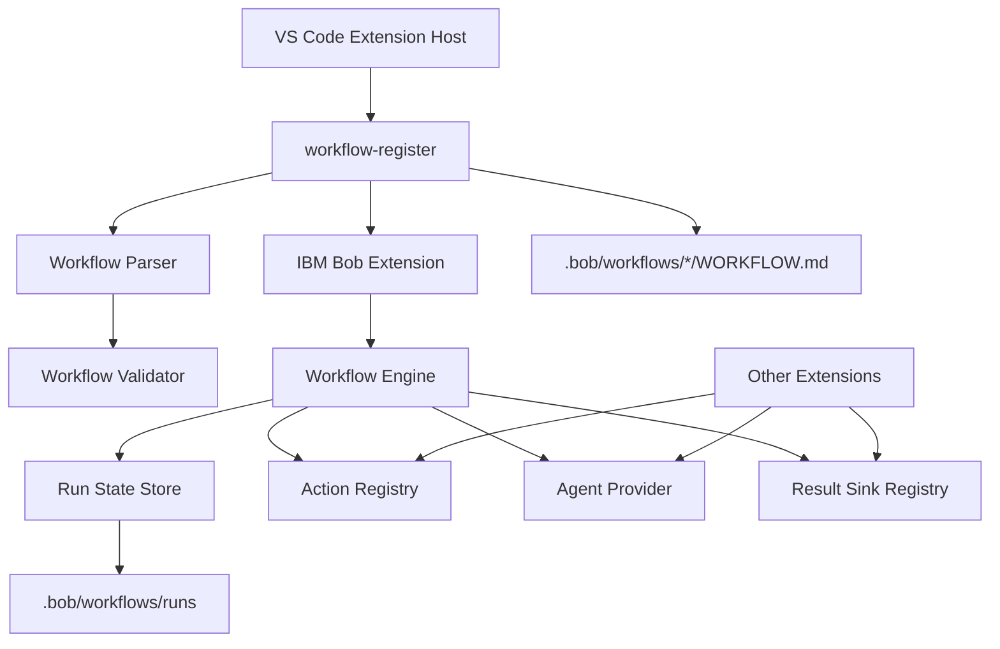

# workflow-register 基本設計書

## 1. 目的

`workflow-register` は、VS Code / IBM Bob 環境で `.bob/workflows/*/WORKFLOW.md` に定義されたワークフローを検出し、IBM Bob の Workflow UI へ登録・実行・再開できるようにする拡張機能である。

本拡張は、個別拡張機能が持つ処理、たとえば `bob-bazaar-review` の Bazaar レビュー GUI、差分収集、レビュー結果保存などを、Bob のワークフローとして組み合わせるための共通基盤を提供する。

## 2. 背景と課題

IBM Bob 上でレビューや設計作業を定型化する場合、次の課題がある。

- ワークフロー定義をプロジェクトごとに配置したい。
- Bob の UI へ動的にワークフローを登録したい。
- コマンド実行、AI 実行、人間の確認、成果物保存を一連のステップとして扱いたい。
- 実行途中で中断した場合に、前段の成果物を再利用して途中から再開したい。
- ワークフロー定義の誤りを実行前に検出したい。
- 他拡張が action provider / agent provider / result sink を後付けできるようにしたい。

`workflow-register` はこれらを解決するため、ワークフロー定義形式、登録処理、実行エンジン、検証、診断、AI 補助、実行状態管理をまとめて提供する。

## 3. スコープ

### 3.1 対象範囲

- `.bob/workflows/*/WORKFLOW.md` の探索と読み込み
- `schemaVersion: workflow-register/v1` 形式の解析
- legacy 形式の互換読み込み
- IBM Bob Workflow UI への登録
- Bob task API を利用した step 実行
- standalone 実行用の workflow engine
- command / agent / manual / result step の実行
- workflow state と run state の管理
- result handoff によるチャット成果物の外部処理
- ワークフロー定義の検証と VS Code Diagnostics 表示
- AI による新規設計、改善、診断説明の補助

### 3.2 対象外

- IBM Bob 本体の UI 実装
- 個別業務処理の実装
- 任意 shell command の直接実行
- ワークスペース外への成果物保存
- 長期ジョブスケジューリング
- 複数ユーザー間の実行状態同期

## 4. 利用者と利用シーン

| 利用者 | 主な用途 |
| --- | --- |
| 開発者 | `.bob/workflows` にワークフローを定義し、Bob 上から実行する。 |
| レビュー担当者 | Bob Workflow UI からレビュー手順を開始し、途中成果物を確認しながら進める。 |
| 拡張機能開発者 | `registerActionProvider` などを使い、独自処理を workflow step へ接続する。 |
| ワークフロー設計者 | テンプレートと AI 補助を使って新しい `WORKFLOW.md` を作成・改善する。 |

## 5. 全体構成

## 6. 主要コンポーネント

| コンポーネント | 主な責務 | 主なファイル |
| --- | --- | --- |
| Extension Entry | VS Code command 登録、Bob 連携、workflow provider API 公開 | `src/extension.ts` |
| Authoring Entry | core activation に設計支援・検証コマンドを追加 | `src/extensionWithAuthoring.ts` |
| Parser | Markdown front matter と body を workflow model へ変換 | `src/core/parser.ts` |
| Schema | `workflow-register/v1` の構造定義 | `src/core/workflowSchema.ts` |
| Validator | workflow 定義の構造・参照整合性を検証 | `src/core/workflowValidator.ts` |
| Engine | workflow step 実行、再開、再試行、preflight、artifact 出力 | `src/core/engine.ts` |
| Run State Store | run state を `.bob/workflows/runs` に保存 | `src/core/runStateStore.ts` |
| Action Registry | command step 用 provider の登録と実行 | `src/core/actionRegistry.ts` |
| Result Sink Registry | result / artifact の保存先を抽象化 | `src/core/resultSinkRegistry.ts` |
| Result Handoff | assistant 成果物を action provider へ渡す | `src/resultHandoff.ts` |
| Input Resolver | workflow inputs の不足値を解決 | `src/core/inputResolver.ts` |
| Workspace Roots | `.bob` を持つ workflow root 候補を解決 | `src/core/workspaceRoots.ts` |
| Diagnostics | VS Code Diagnostics と Markdown レポート表示 | `src/commands/*`, `src/commands/workflowDiagnostics.ts` |
| AI Authoring | ワークフロー設計・改善・診断説明の補助 | `src/commands/*Ai.ts`, `src/core/workflowAiProviderFactory.ts` |

## 7. ワークフロー定義モデル

ワークフローは `WORKFLOW.md` の YAML front matter と Markdown body で定義する。新規定義では `schemaVersion: workflow-register/v1` を推奨する。

主な要素は次のとおり。

| 要素 | 説明 |
| --- | --- |
| `name` | 安定識別子。フォルダ名と一致させることを推奨する。 |
| `description` | Bob UI と診断で使う説明。 |
| `title` / `label` / `menuLabel` | UI 表示名。 |
| `workspaceRequired` | Bob UI 上で workspace env を要求するか。 |
| `inputs` | 実行前入力定義。 |
| `requires` | workspace、Bob、必須ファイルなどの実行条件。 |
| `preflight` | 実行前に行う確認。 |
| `guardrails` | command 実行の許可・禁止ルール。 |
| `artifacts` | step 結果から保存する成果物。 |
| `steps` | 実行ステップの列。 |

## 8. ステップ種別

| 種別 | 説明 |
| --- | --- |
| `command` | action provider を呼び出す。戻り値は `resultKey` に保存できる。 |
| `agent` | agent provider または Bob task の subagent にプロンプトを渡す。 |
| `manual` | 人間の確認完了を待つ。 |
| `result` | state / literal / agent 結果を result sink に渡す。 |

## 9. 実行方式

### 9.1 Bob UI 経由の実行

1. 拡張機能が `onStartupFinished` などで起動する。
2. `.bob/workflows/*/WORKFLOW.md` を探索する。
3. workflow 定義を解析し、Bob の source API へ登録する。
4. Bob の Workflow UI から workflow が開始される。
5. `getSteps()` で返した step 定義に沿って実行する。
6. command step は action provider を呼び出す。
7. agent step は Bob task の `startSubagent` を使う。
8. manual step は `completeCurrentStep` まで hold する。
9. result handoff が必要な場合、最新 assistant 成果物を action provider へ渡す。

### 9.2 Command Palette 経由の standalone 実行

`workflowRegister.runWorkflow` は `WorkflowEngine` を使い、workflow 定義を直接実行する。この経路では `FileRunStateStore` に run state を保存し、`resumeRun` / `retryCurrentStep` を利用できる。

## 10. 実行状態と再開

実行状態は `.bob/workflows/runs/<runId>/run.json` に保存する。保存対象は次の情報である。

- run ID
- workflow ID / name / schema version / definition hash
- 入力値
- state
- 各 step の状態
- current step
- error
- created / updated timestamp

再開方式は次の2種類である。

| 操作 | 説明 |
| --- | --- |
| Resume | hold された step を完了扱いにし、次 step から再開する。 |
| Retry | current step を pending に戻し、同じ step から再実行する。 |

Bob UI 経由の手動 step はメモリ上の active step と Bob task のメッセージを使う。result handoff では、チャットに残る最新 assistant 成果物を `latestAssistantText` / `resultText` / `artifactText` として action provider へ渡す。

## 11. 他拡張との連携

`workflow-register` は activation return value として次の API を公開する。

| API | 用途 |
| --- | --- |
| `registerActionProvider(provider)` | `command` step の provider を追加する。 |
| `registerAgentProvider(provider)` | standalone engine の agent 実行を差し替える。 |
| `registerResultSink(type, handler)` | `result` step の出力先を追加する。 |
| `listWorkflows()` | 読み込み済み workflow 定義を取得する。 |
| `runWorkflow(workflowId, inputs)` | workflow をプログラムから実行する。 |

`bob-bazaar-review` はこの仕組みにより、`bobBazaar.openReviewGui`、`bobBazaar.collectReviewContext`、`bobBazaar.loadReviewRules`、`bobBazaar.captureReviewResult` などを action provider として登録する。

## 12. セキュリティと安全設計

- 任意 shell 実行は標準機能として提供しない。
- command step は action provider 経由で実行する。
- guardrails により許可・禁止 command を検査する。
- `file` result sink は workspace root 外への書き込みを拒否する。
- result command sink は既定で許可リスト制にする。
- `.bob/workflows` 配下のワークフローのみを登録対象にする。

## 13. エラー処理方針

| 場面 | 方針 |
| --- | --- |
| workflow parse 失敗 | 登録対象から除外し、diagnostics に出す。 |
| Bob API 不在 | 登録を中止し、inspect report に記録する。 |
| input 不足 | prompt で入力を求め、required ならキャンセル時に中止する。 |
| preflight error | run を failed にする。 |
| command provider 未登録 | step を failed / held にする。 |
| manual step | held として待機する。 |
| result handoff 失敗 | step を保持し、再実行または再完了できるようにする。 |

## 14. 運用と診断

主な運用コマンドは次のとおり。

- `workflowRegister.reload`
- `workflowRegister.inspect`
- `workflowRegister.runWorkflow`
- `workflowRegister.inspectRuns`
- `workflowRegister.resumeRun`
- `workflowRegister.retryCurrentStep`
- `workflowRegister.inspectRunDiagnostics`
- `workflowRegister.validateCurrentWorkflow`
- `workflowRegister.validateWorkspaceWorkflows`
- `workflowRegister.completeCurrentStep`

`WORKFLOW.md` は保存時と active editor 変更時に検証され、VS Code Diagnostics に反映される。

## 15. テスト方針

- parser の v1 / legacy 解析を検証する。
- schema validation を検証する。
- workflow engine の run / resume / retry を検証する。
- result handoff の assistant 成果物渡しを検証する。
- workflow template と provider registration の契約を検証する。
- workspace root 探索と multi-root 動作を検証する。

## 16. 今後の拡張方針

- Bob UI 経由実行の永続 resume 強化。
- active step の永続化。
- result handoff の再試行 UI 強化。
- action provider / result sink の権限モデル拡張。
- workflow definition migration の支援。
- workflow 実行ログの可視化。
