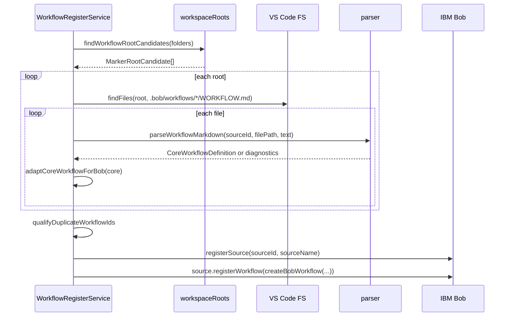
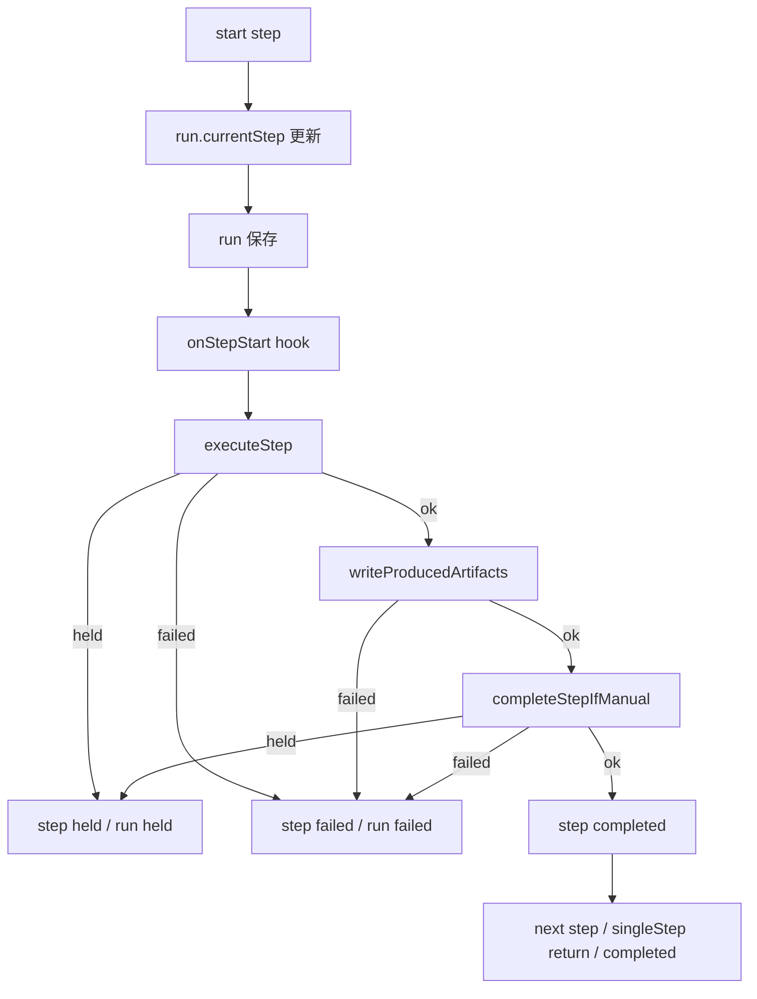

# workflow-register 詳細設計書

## 1. 文書の位置づけ

本書は `extensions/workflow-register` 拡張機能の詳細設計を定義する。現在の main 実装に合わせ、UI 実行系、standalone 実行系、中断・復帰、task snapshot、GUI Builder、AI 補助、Help / docs 統合の責務を整理する。

## 2. 実装構成

```text
extensions/workflow-register/
  package.json
  README.md
  docs/
    basic-design-ja.md
    detailed-design-ja.md
    workflow-authoring-guide-ja.md
    bob-task-export-recovery-plan-ja.md
  src/
    extensionWithAuthoring.ts
    extension.ts
    agentStep.ts
    resultHandoff.ts
    commands/
      createWorkflow.ts
      designWorkflowWithAi.ts
      editWorkflowInBuilder.ts
      explainWorkflowDiagnostics.ts
      improveWorkflowWithAi.ts
      inspectRunDiagnostics.ts
      openWorkflowBuilder.ts
      validateWorkflow.ts
      workflowDiagnostics.ts
    core/
      actionRegistry.ts
      agentProvider.ts
      engine.ts
      guardrails.ts
      inputCollector.ts
      inputResolver.ts
      model.ts
      parser.ts
      reportedActionError.ts
      resultSinkRegistry.ts
      runStateStore.ts
      taskSnapshots.ts
      workflowAiProvider.ts
      workflowAiProviderFactory.ts
      workflowAuthoringDefaults.ts
      workflowAuthoringLoader.ts
      workflowAuthoringModel.ts
      workflowAuthoringReferenceAnalysis.ts
      workflowAuthoringSerializer.ts
      workflowScaffold.ts
      workflowSchema.ts
      workflowTemplates.ts
      workflowValidator.ts
      workspaceRoots.ts
    webview/
      README.md
      workflowBuilderBodyScript.ts
      workflowBuilderClientScript.ts
      workflowBuilderHtml.ts
      workflowBuilderPanel.ts
      workflowBuilderStyles.ts
  test/
    *.test.js
```

## 3. 起動設計

### 3.1 VS Code activation

`package.json` の `main` は `./out/extensionWithAuthoring.js` である。activation event は `onStartupFinished` と各 command の `onCommand` を指定する。

起動時の処理は次の通り。

1. `extensionWithAuthoring.activate(context)` を呼ぶ。
2. `activateCore(context)` を呼び、`WorkflowRegisterService` と core API を作る。
3. core command を登録する。
4. authoring / validation / diagnostics / GUI Builder / AI 補助 command を追加登録する。
5. 既に開いている `WORKFLOW.md` を diagnostics 対象にする。
6. `WorkflowRegisterService.reload()` を非同期で実行する。
7. Bob 拡張の遅延起動に備えて retry timer を設定する。

### 3.2 command entry

| Command ID | 主な用途 |
| --- | --- |
| `workflowRegister.reload` | `.bob/workflows/*/WORKFLOW.md` を再読み込みする。 |
| `workflowRegister.inspect` | 登録状態と diagnostics を Markdown で表示する。 |
| `workflowRegister.runWorkflow` | standalone engine で workflow を実行する。 |
| `workflowRegister.inspectRuns` | 保存済み run state を一覧表示する。 |
| `workflowRegister.resumeRun` | held / running run を再開する。 |
| `workflowRegister.retryCurrentStep` | current step を再試行する。 |
| `workflowRegister.inspectRunDiagnostics` | run state と task snapshot の診断を表示する。 |
| `workflowRegister.inspectActiveSteps` | Bob UI の手動完了待ち active step を表示する。 |
| `workflowRegister.completeCurrentStep` | Bob UI 経由の current manual step を完了する。 |
| `workflowRegister.completeStep` | `completeCurrentStep` の別名。 |
| `workflowRegister.validateCurrentWorkflow` | active editor の workflow を検証する。 |
| `workflowRegister.validateWorkspaceWorkflows` | workspace 内 workflow を一括検証する。 |
| `workflowRegister.createWorkflowFromTemplate` | template から `WORKFLOW.md` を作成する。 |
| `workflowRegister.openWorkflowBuilder` | Webview GUI で新規 workflow を作成する。 |
| `workflowRegister.editWorkflowInBuilder` | 既存 `workflow-register/v1` workflow を Webview GUI で編集する。 |
| `workflowRegister.designWorkflowWithAi` | AI provider で新規 workflow draft を作る。 |
| `workflowRegister.improveWorkflowWithAi` | AI provider で改善案を作り、preview / diff / backup 後に適用する。 |
| `workflowRegister.explainWorkflowDiagnostics` | diagnostics を自然言語で説明する。 |

### 3.3 設定

| 設定 | 既定値 | 用途 |
| --- | --- | --- |
| `workflowRegister.sourceId` | `workflow-register` | Bob に登録する source ID。 |
| `workflowRegister.sourceName` | `ワークフロー登録` | Bob に表示する source 名。 |
| `workflowRegister.agentCommand` | 空 | standalone agent step を VS Code command に委譲する。 |
| `workflowRegister.aiProviderCommand` | 空 | AI 設計、改善、診断説明に使う。 |
| `workflowRegister.taskSnapshots.enabled` | `true` | Bob UI 実行時に task snapshot を保存する。 |
| `workflowRegister.taskSnapshots.maxBytes` | `262144` | 1 snapshot JSON の最大サイズ。 |
| `workflowRegister.taskSnapshots.maxPerRun` | `50` | 1 run に保持する snapshot 数。 |
| `workflowRegister.taskSnapshots.includeMessages` | `true` | snapshot に Bob chat messages を含める。 |
| `workflowRegister.taskSnapshots.pruneOnSave` | `true` | 保存時に古い snapshot を削除する。 |

## 4. 公開 API 設計

`activate` の戻り値として `WorkflowRegisterApi` を公開する。

```ts
export interface WorkflowRegisterApi {
  registerActionProvider: (provider: ActionProvider) => void
  registerAgentProvider: (provider: AgentProvider) => void
  registerResultSink: (type: string, handler: Parameters<ResultSinkRegistry["register"]>[1]) => void
  listWorkflows: () => CoreWorkflowDefinition[]
  runWorkflow: (workflowId?: string, inputs?: Record<string, unknown>) => Promise<unknown>
}
```

公開 API の `runWorkflow` は standalone 実行である。Bob task は作成されない。

## 5. Workflow 定義探索設計

探索対象は次の glob に限定する。

```text
**/.bob/workflows/*/WORKFLOW.md
```

`workspaceRoots.ts` は `.bob` を持つ root 候補を解決する。direct candidate、child candidate、fallback candidate の順で解決し、multi-root workspace で `.bob` と作業 root が異なる構成を扱う。

読み込み時は、workflow root ごとに `.bob/workflows/*/WORKFLOW.md` を探し、`parseWorkflowMarkdown()` で `CoreWorkflowDefinition` へ変換する。同じ logical workflow ID が複数 root から見つかった場合は、workflow root の basename と SHA-1 hash を使って workflow ID を一意化する。

## 6. Workflow 読み込み設計



読み込み結果は2種類の model に保持する。

| Model | 用途 |
| --- | --- |
| `CoreWorkflowDefinition` | `WorkflowEngine` 用の正規化済み実行 model。 |
| `WorkflowDefinition` | Bob 登録と Bob task adapter 用の内部 model。 |

## 7. Parser / Schema / Validator 詳細

### 7.1 Parser

`parseWorkflowMarkdown()` は Markdown 先頭の YAML front matter を抽出し、`schemaVersion: workflow-register/v1` なら v1 parser、そうでなければ legacy parser を使う。

v1 では `workflowV1Schema` を AJV で検証し、`CoreWorkflowDefinition` へ normalize する。Markdown body は `prompt` 未指定時の workflow prompt として扱う。

### 7.2 Schema

主な制約は次の通り。

- `name` と `description` は必須。
- `name` は英数字で始まり、英数字、`.`、`_`、`-` のみを許可する。
- `stepCompletion` は `auto` または `manual`。
- `stepMessage` は `full` / `current` / `silent` / `step`。
- input `type` は `string` / `number` / `boolean` / `select`。
- step `type` は `command` / `agent` / `manual` / `result`。
- `command` step では `action` を必須とする。
- `result` step では `result` を必須とする。
- `guardrails.requireApproval[]` は `id` / `when` / `message` を持てる。

### 7.3 Validator

`workflowValidator.ts` は parser の構造検証に加え、次を検査する。

| 項目 | エラー条件 |
| --- | --- |
| Todo | `todoRequired` が true なのに Todo が無い。 |
| Step ID | 同一 workflow 内で重複する。 |
| Todo と Step | `todoAsSteps` なのに対応する step が無い。 |
| State 参照 | `includeState` が存在しない `resultKey` を参照する、または前方参照する。 |
| Result source | `source: state` の `stateKey` が存在しない。 |
| Result sink | command / file sink の必須値が無い。 |
| Artifact | `producedBy` が存在しない step を参照する。 |
| Inputs | `select` に `options` が無い。 |
| requiredWhen | 存在しない input を参照する。 |
| Guardrails | allowed と denied に同一 command がある。 |

## 8. Bob 登録設計

`adaptCoreWorkflowForBob()` は `CoreWorkflowDefinition` を Bob adapter 用の `WorkflowDefinition` へ変換する。

`buildWorkflowSteps()` は次の方針で Bob step を生成する。

| 条件 | Bob step |
| --- | --- |
| `todoEnabled && todoAsSteps && todos.length > 0` | Todo ごとの Bob step。各 step は `runner.runTodoStep(todo, index, task)` を呼ぶ。 |
| 上記以外 | 単一 `runWorkflow` step。`runner.runSingleWorkflowStep(task)` を呼ぶ。 |

Bob に登録する object は、`getId()`、`getLabel()`、`getMenuLabel()`、`getDescription()`、`getMode()`、`isEnabled()`、`getSteps()`、`getApprovalConfig()` を提供する。

## 9. UI 実行系詳細設計

### 9.1 役割

Bob UI 実行系は `BobWorkflowEngineRunner` が担当する。Bob task を `WorkflowEngine` の依存に変換し、実行状態の正本は `run.json` に保存する。

Bob UI 実行系だけが扱うものは次の通り。

- Bob task object
- `task.getMessages()`
- `task.getAllMetadata()`
- `task.toSerializable()`
- `task.sendMessage()`
- `task.startSubagent()`
- `task.setStepComplete()`
- `StepRuntime.activeSteps`
- task snapshot

### 9.2 full 実行と singleStep 実行

| Bob entry | Engine request | 戻り値の扱い |
| --- | --- | --- |
| `runSingleWorkflowStep` | `{ executionMode: "full" }` | run が `completed` または `running` なら Bob step 成功。 |
| `runTodoStep` | `{ executionMode: "singleStep", stepId: todo.id }` | 1 step 実行後に run が `running` なら Bob step 成功。 |

`singleStep` では指定 step だけを実行する。後続 step が残る場合、run は `running` のまま保存され、次の Bob step が同じ inputs と workflow hash で recoverable run を取得して継続する。

### 9.3 input 収集

Bob UI 実行では、まず Bob task から既知 input を抽出する。

抽出元は次の通り。

- `task.getAllMetadata()`
- `metadata.inputs`
- `metadata.workflowInputs`
- `metadata.meta`
- `metadata.workflow.meta`
- message `_meta.workflow.meta`
- message `_meta.workflow.inputs`

不足分だけ `collectWorkflowInputsWithResolver()` により VS Code prompt で入力を求める。解決済み inputs は task object が object の場合、`WeakMap` に task 単位で cache する。

### 9.4 Bob task adapter

`BobWorkflowEngineRunner` は `WorkflowEngine` に次を渡す。

| Engine option | Bob UI 実行での接続 |
| --- | --- |
| `actions` | 共有 `ActionRegistry`。 |
| `resultSinks` | workflow root ごとの `ResultSinkRegistry`。 |
| `runStore` | workflow root ごとの `FileRunStateStore`。 |
| `agentProvider` | `task.startSubagent()` を呼ぶ `AgentProvider`。未使用時は fallback provider。 |
| `preflightChecks` | workflow root ごとの preflight checks。 |
| `hooks` | Bob chat 同期、snapshot 保存、step complete 同期。 |
| `manualCompletion` | `StepRuntime.hold()` による手動完了待ち。 |
| `recoverResultText` | 現在 task の latest assistant text、snapshot の順で復帰候補を返す。 |

### 9.5 Hook 処理

`WorkflowExecutionHooks` は Engine event から Bob UI 側の副作用を実行する。

| Hook | Bob UI 側の処理 |
| --- | --- |
| `onWorkflowStart` | `workflow-start` snapshot を保存する。 |
| `onStepStart` | message start index を記録し、step prompt を Bob chat に送信し、`step-start` snapshot を保存する。 |
| `onCommandResult` | command result と includeState を Bob chat に送信する。 |
| `onAgentOutput` | assistant message を Bob chat に送信し、`agent-output` snapshot を保存する。 |
| `onHandoffFailed` | `handoff-failed` snapshot を保存する。 |
| `onStepHeld` | `held` snapshot を保存する。 |
| `onStepFailed` | `failed` snapshot を保存する。 |
| `onStepCompleted` | manual completion 済みでなければ `task.setStepComplete()` を呼び、`completed` snapshot を保存する。 |
| `onWorkflowCompleted` | workflow-level の `completed` snapshot を保存する。 |

## 10. Standalone 実行系詳細設計

Standalone 実行系は `WorkflowRegisterService.runWorkflow()`、公開 API の `runWorkflow()`、`resumeRun()`、`retryCurrentStep()` から `WorkflowEngine` を直接呼び出す経路である。

Standalone 実行系では Bob task がないため、次を行わない。

- Bob chat への message 同期。
- `task.startSubagent()` 呼び出し。
- `task.setStepComplete()` 呼び出し。
- task snapshot の新規保存。
- `StepRuntime.activeSteps` への登録。

一方で、次は UI 実行系と共通である。

- `FileRunStateStore` による `run.json` 保存。
- `ActionRegistry` による command step 実行。
- `ResultSinkRegistry` による result / artifact 出力。
- preflight。
- recoverable run 再利用。
- `resumeRun` / `retryCurrentStep`。

Standalone 実行系では、agent step は登録済み `AgentProvider` または `workflowRegister.agentCommand` に委譲する。既存 task snapshot がある run を retry する場合は、snapshot の `lastAssistantText` を復帰候補として参照できる。

## 11. WorkflowEngine 詳細設計

### 11.1 Engine options

`WorkflowEngineOptions` は次を持つ。

| Option | 用途 |
| --- | --- |
| `actions` | command step 実行。 |
| `resultSinks` | result / artifact 出力。 |
| `runStore` | run state 永続化。 |
| `agentProvider` | agent step 実行。 |
| `workspaceAvailable` | workspace requirement の確認。 |
| `fileExists` | required files / preflight files の確認。 |
| `preflightChecks` | named preflight check の実行。 |
| `strictPreflightChecks` | 未対応 preflight を error にするか。 |
| `hooks` | Engine event の副作用。 |
| `manualCompletion` | manual step / manual completion workflow の待機。 |
| `recoverResultText` | retry / missing result text の復帰候補取得。 |

### 11.2 実行開始

`runWorkflow(workflow, inputs, options)` は次の処理を行う。

1. `findRecoverableRun()` で同じ workflow / inputs の `running` / `held` run を探す。
2. 見つからなければ `createRun()` で run を作る。
3. `run.json` を保存する。
4. 新規 run の場合は `onWorkflowStart` hook を呼ぶ。
5. inputs を検証する。
6. preflight を実行する。
7. `startIndexForRun()` で開始 step を決める。
8. `continueRun()` で full または singleStep 実行へ進む。

### 11.3 Step 実行



`executionMode=singleStep` の場合は、指定 step だけを処理する。後続 step が残る場合、workflow は `completed` ではなく `running` のまま戻る。

### 11.4 Step 種別ごとの実行

| Step type | 実行内容 |
| --- | --- |
| `manual` | `manualCompletion` があれば待機し、なければ held を返す。 |
| `agent` | state / snapshot / agent provider の順で agent text を確保し、`resultKey` へ保存する。 |
| `command` | guardrails 検査後、`ActionRegistry.execute()` を呼び、structured error を failed 扱いにする。 |
| `result` | `ResultSinkRegistry.write()` を呼ぶ。 |

agent step は、すでに `resultKey` に値がある場合、または `recoverResultText` が値を返した場合、agent provider の再実行を避ける。

### 11.5 Result text と handoff

`result.source` は次の通り扱う。

| source | text の取得元 |
| --- | --- |
| `literal` | `result.text`。 |
| `state` | `run.state[result.stateKey]`。 |
| `agent` | agent step 出力、または `recoverResultText` の復帰候補。 |

result sink が失敗した場合は `onHandoffFailed` hook を呼び、step を failed にする。sink が replacement text を返す場合、step に `resultKey` があれば state を置き換える。

## 12. Run State 詳細設計

保存場所:

```text
<workflowRoot>/.bob/workflows/runs/<runId>/run.json
```

`WorkflowRunState` は次を保持する。

- `runId`
- `workflowId`
- `workflowName`
- `workflowSchemaVersion`
- `workflowDefinitionHash`
- `workflowFile`
- `engineVersion`
- `status`
- `currentStep`
- `inputs`
- `state`
- `steps[]`
- `error`
- `createdAt`
- `updatedAt`

`FileRunStateStore.saveRun()` は一時ファイルに JSON を書き込み、rename する atomic write で保存する。

`findRecoverableRun()` は次の条件を満たす run を返す。

- `status` が `running` または `held`。
- `workflowId` が一致する。
- `workflowDefinitionHash` が両方にある場合は一致する。
- `workflowFile` が両方にある場合は一致する。
- canonical JSON 化した `inputs` が一致する。

## 13. Task Snapshot 詳細設計

### 13.1 保存場所

```text
<workflowRoot>/.bob/workflows/runs/<runId>/task-snapshots/
```

各 snapshot は時刻、stepId、reason を含むファイル名で保存される。最新 snapshot は `latest.json` にも保存する。

### 13.2 Snapshot payload

`TaskSnapshotPayload` は次を持つ。

| Field | 用途 |
| --- | --- |
| `schemaVersion` | `workflow-register/task-snapshot/v1`。 |
| `createdAt` | 作成時刻。 |
| `reason` | 保存理由。 |
| `runId` | 対象 run。 |
| `workflowId` | workflow ID。 |
| `logicalWorkflowId` | logical workflow ID。 |
| `workflowDefinitionHash` | workflow 定義 hash。 |
| `stepId` | 対象 step。 |
| `runStatus` | run status。 |
| `runCurrentStep` | current step。 |
| `taskMetadata` | Bob task metadata。 |
| `messages` | Bob chat messages。設定により省略可。 |
| `messageCount` / `omittedMessageCount` | message 数と省略数。 |
| `truncated` | 最大サイズ超過などによる切り詰め有無。 |
| `taskExport` | `task.toSerializable()` の結果。 |
| `lastAssistantText` | 直近 assistant 出力。 |
| `handoff` | result command と error。 |

### 13.3 サイズ制御と pruning

`FileTaskSnapshotStore` は保存前に `prepareSnapshot()` を通し、設定に従って次を行う。

- `includeMessages=false` の場合は `messages` を省略する。
- `maxBytes` を超える場合、古い messages から削る。
- それでも超える場合、`lastAssistantText` を切り詰める。
- さらに超える場合、`taskExport`、`taskMetadata` を省略する。
- `maxPerRun` を超える古い snapshot を削除する。

### 13.4 復帰候補としての利用

`recoverResultTextFromSnapshots()` は次の順で `lastAssistantText` を探す。

1. `latest.json`
2. 最新の `reason === "agent-output"` snapshot

snapshot は `runId`、`workflowId`、`stepId`、`workflowDefinitionHash` が一致する場合だけ使う。

Bob UI 実行では、これより前に現在 task の latest assistant message を確認する。

## 14. StepRuntime 詳細設計

`StepRuntime` は、Bob UI 実行で manual step または workflow-level manual completion が必要なときだけ使う。

保持する情報は次の通り。

- active key
- workflow ID / label
- run ID
- step ID / title
- Bob task object
- step definition
- guardrails
- action registry
- inputs / state の snapshot
- message start index
- Promise の `resolve`

`StepRuntime` は永続状態ではない。VS Code 再起動で失われる。復帰時の正本は `run.json` であり、Bob chat 側の補助情報は task snapshot である。

`completeCurrentStep()` は active step を選択し、必要なら `captureHeldStepResult()` で Bob chat の latest assistant text を result command へ handoff した後、`task.setStepComplete()` と Promise resolve を行う。

## 15. Result Handoff / Sink 詳細

agent step が JSON や Markdown などの成果物を chat に出力したあと、その成果物を action provider または VS Code command に渡して保存・検証・変換できる。

`executeResultHandoff()` は成果物 text を trim したうえで、互換用 `args[0]` と、明示フィールド `latestAssistantText` / `resultText` / `artifactText` の両方に渡す。

`file` sink は workspace root 配下のみ許可し、path escape を拒否する。

`command` sink は result handoff と同じく action provider / VS Code command を呼び出す。

## 16. Guardrails 詳細設計

`guardrails.ts` は command provider の実行前にルールを検査する。

- `deniedCommands` に含まれる command は拒否する。
- `allowedCommands` が指定されている場合、含まれない command は拒否する。
- `allowedCommands` と `deniedCommands` の衝突は validator で検出する。
- `requireApproval` は人間承認が必要な条件・メッセージを workflow 定義に残すための構造である。

## 17. GUI Builder 詳細設計

### 17.1 Authoring model

`WorkflowAuthoringModel` は GUI 編集用の中間 model である。実行用の `CoreWorkflowDefinition` とは異なり、GUI で編集しやすい配列形式の `inputs`、`steps`、`artifacts` と、Markdown body、`unknownFrontMatter` を保持する。

```text
WORKFLOW.md
  -> parseWorkflowMarkdown
  -> workflowToAuthoringModel
  -> Webview form state
  -> serializeAuthoringModelToMarkdown
  -> validateWorkflowText
  -> Preview / Diff / Save
```

### 17.2 新規作成

`openWorkflowBuilder.ts` は Webview を開き、template から初期 model を生成する。対応 template は `simple-agent`、`command-then-agent`、`manual-checklist`、`input-driven-agent`、`preflight-files`、`artifact-output`、`guarded-command`、`review-workflow` である。

### 17.3 既存編集

`editWorkflowInBuilder.ts` は active editor または file picker で `WORKFLOW.md` を選び、`loadAuthoringModelFromMarkdown()` で GUI model を作る。

- 対象は `schemaVersion: workflow-register/v1` のみ。
- legacy workflow は GUI 編集対象外。
- GUI 管理外 front matter は `unknownFrontMatter` として保持する。
- Markdown body は `model.body` として保持する。

### 17.4 Webview modules

| file | role |
| --- | --- |
| `workflowBuilderPanel.ts` | WebviewPanel 作成、preview / diff / save、backup、reload。 |
| `workflowBuilderHtml.ts` | HTML shell、CSP、nonce、initial state 埋め込み。 |
| `workflowBuilderStyles.ts` | Webview CSS。 |
| `workflowBuilderClientScript.ts` | form state、tab、step 操作、reference warning、details section 編集。 |
| `workflowBuilderBodyScript.ts` | `Markdown Body` タブを追加し、`model.body` を編集する補助 script。 |

### 17.5 Preview / Diff / Save

Webview client は `preview` / `diff` / `save` / `resetTemplate` message を extension host へ送る。

保存時は次の順で処理する。

1. `serializeAuthoringModelToMarkdown()` で Markdown を生成する。
2. `validateWorkflowText()` を実行する。
3. error があれば保存しない。
4. 既存ファイルがある場合は `WORKFLOW.backup-<timestamp>.md` を作る。
5. `WORKFLOW.md` を書き込む。
6. `workflowRegister.reload` を実行する。

### 17.6 YAML 表記安定化

`workflowAuthoringSerializer.ts` は `js-yaml.dump()` 後に `requires.bob.minVersion` と `guardrails.requireApproval[].when` をダブルクォート付きに正規化する。これは YAML の意味を変えるためではなく、既存運用ファイルとの差分ノイズを減らすためである。

## 18. AI Authoring / Help 詳細設計

AI provider は `workflowRegister.aiProviderCommand` で指定する。未設定時は mock provider を使う。

| command | 処理 |
| --- | --- |
| `designWorkflowWithAi` | 目的とテンプレート候補から新規 workflow draft を作る。 |
| `improveWorkflowWithAi` | 現在の workflow と診断結果から改善案を作る。 |
| `explainWorkflowDiagnostics` | 診断内容を自然言語で説明する。 |

`improveWorkflowWithAi` は候補 Markdown を `.bob/workflows/.previews/...` に保存し、diff を表示し、明示確認後に backup を作成して適用する。

Help / docs は、README、authoring guide、basic design、detailed design、task export recovery plan として main に統合する。GUI Builder や command palette の説明と矛盾しないよう、schema / command / 実行方式の変更時に更新する。

## 19. Diagnostics 詳細設計

検証タイミング:

- `validateCurrentWorkflow` command 実行時。
- `validateWorkspaceWorkflows` command 実行時。
- `WORKFLOW.md` 保存時。
- active editor が `WORKFLOW.md` に切り替わった時。
- GUI Builder preview / save 時。

VS Code Diagnostics には error / warning を表示し、Markdown report には info も含める。

`inspectRunDiagnostics` は、run state と task snapshot summary を読み、次を表示する。

- run ID、status、current step。
- workflow ID、definition hash。
- step 状態一覧。
- snapshot 件数。
- latest snapshot。
- snapshot ごとの reason、stepId、lastAssistantText 有無、handoff error、truncated。
- run / snapshot / workflow 定義の不一致警告。

## 20. エラー処理詳細

| 発生箇所 | 処理 |
| --- | --- |
| YAML parse | `ok: false` と diagnostics を返す。 |
| schema error | `formatValidationErrors` で diagnostics 化する。 |
| Bob extension 不在 | 登録を中断し inspect report に記録する。 |
| source.registerWorkflow 失敗 | attempt result として report に記録する。 |
| action provider 不在 | command step を失敗扱いにする。 |
| action provider structured error | `reportedActionError()` により step failed にする。 |
| result sink 不在 | result / artifact 書き込みを失敗扱いにする。 |
| agent provider 不在 | standalone agent step を失敗扱いにする。 |
| manual step | `held` として保存する。 |
| file sink path escape | 例外を捕捉し sink error に変換する。 |
| hook 失敗 | `console.warn` に留め、run state の正本更新を優先する。 |
| snapshot 保存失敗 | hook 失敗扱い。workflow 実行は継続可能とする。 |

## 21. Multi-root workspace 詳細

workflow-register は `.bob` を持つ root を workflow root として扱う。action provider、agent provider、result sink、run store、task snapshot store には `workflowRoot` / `workflowFile` / `workflowFolderName` を渡す。

個別拡張は、必要に応じて action provider の中で Bazaar repository root やコードレビュー対象 root を解決する。

同じ workflow ID が複数 workflow root から見つかった場合、`<logicalId>.<rootSlug>-<sha1-prefix>` の形式に修飾して Bob 登録 ID を一意化する。

## 22. テスト設計

| 対象 | 観点 |
| --- | --- |
| parser | v1 / legacy parse、diagnostics、unknown field。 |
| schema | 必須項目、step type、input type、guardrails。 |
| engine | full / singleStep、preflight、command、agent、manual、result。 |
| runStateStore | runId 採番、atomic save、load、list、recoverable run。 |
| taskSnapshots | save、latest、size truncation、includeMessages、prune、findLatest。 |
| resultHandoff | latest assistant text、args 互換、validation failure。 |
| workflowValidator | state 参照、artifact 参照、guardrail 衝突。 |
| workspaceRoots | direct / child / fallback candidate。 |
| extension registration | Bob API 登録、workflow id 修飾、provider 呼び出し。 |
| BobWorkflowEngineRunner | full / singleStep、task input 抽出、hooks、manual completion。 |
| authoring serializer | YAML / Markdown 出力、quote 安定化、body 保持。 |
| authoring loader | 既存 v1 workflow の GUI model 変換、unknownFrontMatter 保持。 |
| reference analysis | includeState / producedBy / move / delete impact。 |
| webview modules | split HTML / CSS / client script / body script の出力。 |
| diagnostics | run diagnostics と snapshot summary の表示。 |

## 23. 変更時の注意点

- `workflowV1Schema` を変更した場合は parser、validator、README、テンプレート、GUI Builder、テストを同期する。
- `ActionExecutionInput` を変更した場合は、連携拡張の action provider と result handoff テストを確認する。
- `WorkflowEngineOptions` を変更した場合は、Bob UI 実行系と standalone 実行系の両方を更新する。
- `WorkflowExecutionHooks` を変更した場合は、task snapshot と Bob chat 同期を確認する。
- `RunStateStore` の recoverable 判定を変更した場合は、singleStep 継続と resume / retry の回帰を確認する。
- `TaskSnapshotPayload` を変更した場合は、run diagnostics、snapshot pruning、復帰候補利用を更新する。
- `workspaceRequired` の扱いは Bob UI のフォルダ選択挙動へ影響するため、multi-root で確認する。
- `ResultSinkRegistry` の command 許可リストを拡張する場合は、guardrails とセキュリティ観点を確認する。
- active step の永続化を検討する場合も、Bob task object や Promise を直接保存しない。
- GUI Builder の client script を変更する場合は、preview / save / diff / reference warning の回帰を確認する。
- serializer の YAML 表記安定化を変更する場合は、既存運用 workflow との差分を確認する。
