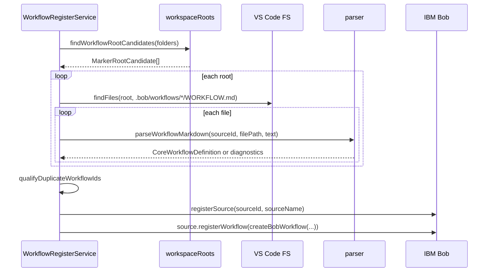
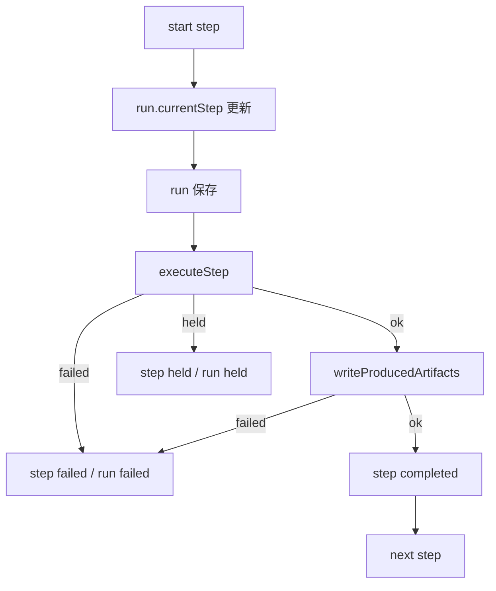

# workflow-register 詳細設計書

## 1. 文書の位置づけ

本書は `extensions/workflow-register` 拡張機能の詳細設計を定義する。基本設計書で示した責務を、実装モジュール、主要データ構造、処理シーケンス、エラー処理、再開仕様、テスト観点に分解する。

## 2. 実装構成

```text
extensions/workflow-register/
  package.json
  src/
    extensionWithAuthoring.ts
    extension.ts
    agentStep.ts
    resultHandoff.ts
    commands/
      createWorkflow.ts
      designWorkflowWithAi.ts
      explainWorkflowDiagnostics.ts
      improveWorkflowWithAi.ts
      inspectRunDiagnostics.ts
      validateWorkflow.ts
      workflowDiagnostics.ts
    core/
      actionRegistry.ts
      agentProvider.ts
      engine.ts
      guardrails.ts
      inputCollector.ts
      inputResolver.ts
      model.ts
      parser.ts
      resultSinkRegistry.ts
      runStateStore.ts
      workflowAiProvider.ts
      workflowAiProviderFactory.ts
      workflowSchema.ts
      workflowTemplates.ts
      workflowValidator.ts
      workspaceRoots.ts
  test/
    *.test.js
```

## 3. 起動設計

### 3.1 VS Code activation

`package.json` の `main` は `./out/extensionWithAuthoring.js` である。activation event は `onStartupFinished` と各 command の `onCommand` を指定する。

起動時の処理は次の通り。

1. `extensionWithAuthoring.activate(context)` を呼ぶ。
2. `activateCore(context)` を呼び、core API を作る。
3. authoring / validation / diagnostics 系 command を追加登録する。
4. 既に開いている `WORKFLOW.md` を diagnostics 対象にする。
5. core 側では `WorkflowRegisterService` を生成し、`reload` を非同期で実行する。
6. Bob 拡張の遅延起動に備えて retry timer を設定する。

### 3.2 入口モジュール

| ファイル | 役割 |
| --- | --- |
| `extensionWithAuthoring.ts` | core activation に authoring 機能を重ねる薄い façade。 |
| `extension.ts` | Bob 登録、command 登録、workflow 実行、run 管理の中核。 |

`extensionWithAuthoring.ts` は `WorkflowRegisterApi` をそのまま返すため、他拡張から見た API は core と同一である。

## 4. 公開 API 設計

`activate` の戻り値として `WorkflowRegisterApi` を公開する。

```ts
export interface WorkflowRegisterApi {
  registerActionProvider: (provider: ActionProvider) => void
  registerAgentProvider: (provider: AgentProvider) => void
  registerResultSink: (type: string, handler: Parameters<ResultSinkRegistry["register"]>[1]) => void
  listWorkflows: () => CoreWorkflowDefinition[]
  runWorkflow: (workflowId?: string, inputs?: Record<string, unknown>) => Promise<unknown>
}
```

### 4.1 API の意図

| API | 詳細 |
| --- | --- |
| `registerActionProvider` | command step の `action.provider` で参照できる provider を追加する。 |
| `registerAgentProvider` | standalone engine の agent step を実行する provider を差し替える。 |
| `registerResultSink` | `result.sinks[].type` で参照できる sink を追加する。 |
| `listWorkflows` | parse 済みの `CoreWorkflowDefinition` 一覧を返す。 |
| `runWorkflow` | workflow ID と inputs を指定して workflow を直接実行する。 |

## 5. Workflow 定義探索設計

### 5.1 探索対象

探索対象は次の glob に限定する。

```text
**/.bob/workflows/*/WORKFLOW.md
```

### 5.2 workflow root 解決

`workspaceRoots.ts` が `.bob` を持つ root 候補を解決する。

優先順位は次の通り。

1. VS Code workspace folder 直下に `.bob` がある場合、その folder を direct candidate とする。
2. direct candidate がない場合、workspace folder の直下子ディレクトリに `.bob` があるか調べ child candidate とする。
3. `.bob` が見つからない場合、workspace folder 自体を fallback candidate とする。

この設計により、multi-root workspace で `.bob` と実作業ディレクトリが異なる構成でも workflow root を決定できる。

## 6. Workflow 読み込み設計

### 6.1 読み込みシーケンス



### 6.2 重複 ID 処理

同じ logical workflow ID が複数 root から見つかった場合は、`workflowRoot` の basename と SHA-1 hash を使って一意化する。

```text
<logicalId>.<root-basename>-<hash8>
```

これにより、同名 workflow が複数 workspace に存在しても Bob に登録できる。

## 7. Parser 詳細設計

### 7.1 入力

```ts
interface ParseWorkflowRequest {
  sourceId: string
  filePath: string
  text: string
}
```

### 7.2 出力

```ts
type ParseWorkflowResult =
  | { ok: true; workflow: CoreWorkflowDefinition; diagnostics: string[] }
  | { ok: false; diagnostics: string[] }
```

### 7.3 解析手順

1. Markdown 先頭の YAML front matter を抽出する。
2. `js-yaml` で YAML を object 化する。
3. `schemaVersion: workflow-register/v1` の場合は v1 parser を使う。
4. それ以外は legacy parser を使う。
5. v1 では AJV で `workflowV1Schema` を検証する。
6. `CoreWorkflowDefinition` へ normalize する。
7. unknown top-level field は warning とする。

### 7.4 v1 normalize 方針

| 入力 | normalize 後 |
| --- | --- |
| `title` / `label` | `label` として扱う。優先順は `label` > `title` > `name`。 |
| `menuLabel` | 未指定時は `label` 相当。 |
| `permissions` | Todo 有効時は `todo` を自動追加する。 |
| `steps` | `EngineStep[]` に変換する。 |
| `artifacts` | `WorkflowArtifactDefinition[]` に変換する。 |
| Markdown body | `prompt` 未指定時の workflow prompt として使う。 |

### 7.5 legacy 互換

legacy 形式では Markdown body の `## Todo` と `## Step: <id>` を使い、step を復元する。新規作成では v1 形式を推奨し、legacy は既存互換に限定する。

## 8. Schema 詳細設計

`workflowSchema.ts` は `workflow-register/v1` の構造を JSON Schema として定義する。

主な制約は次の通り。

- `name` と `description` は必須。
- `name` は英数字で始まり、英数字、`.`、`_`、`-` のみを許可する。
- `stepCompletion` は `auto` または `manual`。
- `stepMessage` は `full` / `current` / `silent` / `step`。
- input `type` は `string` / `number` / `boolean` / `select`。
- step `type` は `command` / `agent` / `manual` / `result`。
- `command` step では `action` を必須とする。
- `result` step では `result` を必須とする。

## 9. Validator 詳細設計

`workflowValidator.ts` は parser の構造検証に加え、参照整合性を検査する。

### 9.1 検証項目

| 項目 | エラー条件 |
| --- | --- |
| Todo | `todoRequired` が true なのに Todo が無い。 |
| Step ID | 同一 workflow 内で重複する。 |
| Todo と Step | `todoAsSteps` なのに対応する step が無い。 |
| State 参照 | `includeState` が存在しない `resultKey` を参照する。 |
| Result source | `source: state` の `stateKey` が存在しない。 |
| Result sink | command / file sink の必須値が無い。 |
| Artifact | `producedBy` が存在しない step を参照する。 |
| Inputs | `select` に `options` が無い。 |
| requiredWhen | 存在しない input を参照する。 |
| Guardrails | allowed と denied に同一 command がある。 |

### 9.2 Diagnostics 表示

`WorkflowDiagnosticsReporter` は `ValidateWorkflowResult` から VS Code `DiagnosticCollection` を更新する。`info` は VS Code diagnostics には出さず、warning / error を表示する。

## 10. Bob 登録設計

### 10.1 Bob API 解決

`loadBobApi()` が `IBM.bob-code` 拡張を取得し、必要に応じて activate する。`registerSource` がない場合は登録を中止し、inspect report に記録する。

### 10.2 Bob workflow 変換

`CoreWorkflowDefinition` は `adaptCoreWorkflowForBob()` で内部 `WorkflowDefinition` へ変換する。その後、`createBobWorkflow()` で Bob に渡す object を作る。

```ts
interface BobWorkflow {
  hidden?: boolean
  getId: () => string
  getLabel: () => string
  getMenuLabel: () => string
  getDescription: () => string
  getMode?: () => string
  isEnabled: (env?: { workspace?: string }) => Promise<boolean>
  getSteps: () => BobWorkflowStep[]
  getApprovalConfig: () => { allowed_permissions: string[]; autoApprovalEnabled: boolean }
}
```

### 10.3 Step 生成

`buildWorkflowSteps()` は次の方針で Bob step を生成する。

- `todo && todoAsSteps && todos.length > 0` の場合、Todo ごとに step を生成する。
- それ以外は `runWorkflow` という単一 step を生成する。

## 11. Bob UI 経由実行設計

### 11.1 Todo step 実行

`runTodoStep()` の処理は次の通り。

1. 最初の step なら workflow state / input cache を reset する。
2. `ensureWorkflowInputs()` で不足入力を収集する。
3. command step なら action provider を実行する。
4. command result が `resultKey` を持つ場合は state に保存する。
5. `includeState` が不足していれば hold する。
6. step message を Bob chat に送る。
7. agent step なら `startSubagent()` を呼ぶ。
8. agent result を `resultKey` に保存する。
9. `result` sink がある場合は handoff / sink 書き込みを行う。
10. `completeOnSuccess` または auto completion の場合は Bob task を complete する。
11. manual の場合は active step として保持する。

### 11.2 Workflow input 収集

`ensureWorkflowInputs()` は `StepRuntime` の input cache を優先する。存在しない場合は、Bob task metadata から既知 input を抽出し、不足分だけ prompt する。

抽出元は次の通り。

- `task.getAllMetadata()`
- `metadata.inputs`
- `metadata.workflowInputs`
- `metadata.meta`
- `metadata.workflow.meta`
- message `_meta.workflow.meta`
- message `_meta.workflow.inputs`

## 12. Standalone Engine 詳細設計

### 12.1 実行開始

`WorkflowEngine.runWorkflow()` は次の処理を行う。

1. `RunStateStore.createRun()` で run を作成する。
2. `validateWorkflowInputs()` で inputs を検証する。
3. `evaluatePreflight()` を実行する。
4. run state を保存する。
5. `continueRun()` で step 実行へ進む。

### 12.2 Step 実行

`continueRun()` は step を順番に処理する。



### 12.3 Step 種別ごとの実行

| Step type | 実行内容 |
| --- | --- |
| `manual` | `held` を返し、外部完了待ちにする。 |
| `agent` | `AgentProvider.run()` を呼び、必要なら result sink へ渡す。 |
| `command` | `ActionRegistry.execute()` を呼び、必要なら state へ保存する。 |
| `result` | `ResultSinkRegistry.write()` を呼ぶ。 |

### 12.4 再開

`resumeRun()` は run state を読み込み、`currentStep` から再開する。`completeHeldStep` が true の場合は、held step を completed にして次 step へ進む。

### 12.5 再試行

`retryCurrentStep()` は `currentStep` の step 状態を pending に戻し、同じ step から再実行する。

## 13. Run State 詳細設計

### 13.1 保存場所

```text
<workflowRoot>/.bob/workflows/runs/<runId>/run.json
```

### 13.2 runId

`FileRunStateStore.nextRunId()` は作成時刻と workflow name から runId を作る。

```text
<timestamp>-<workflowName>
```

同名が存在する場合は `-2`, `-3` のように連番を付与する。

### 13.3 run.json の主な項目

| 項目 | 説明 |
| --- | --- |
| `runId` | 実行 ID。 |
| `workflowId` | 登録 workflow ID。 |
| `workflowName` | workflow name。 |
| `workflowSchemaVersion` | schema version。 |
| `workflowDefinitionHash` | 定義全文の SHA-256。 |
| `workflowFile` | workflow file path。 |
| `engineVersion` | 拡張機能 version。 |
| `status` | running / held / completed / failed。 |
| `currentStep` | 現在 step ID。 |
| `inputs` | 実行時入力。 |
| `state` | step 間共有状態。 |
| `steps` | 各 step の状態。 |
| `error` | エラーメッセージ。 |

## 14. Action Provider 詳細設計

### 14.1 ActionRegistry

`ActionRegistry` は provider ID と handler の Map を持つ。

- `register(provider)` で登録する。
- `execute(providerId, input)` で実行する。
- provider 不在時は `Unsupported action provider` を返す。
- 例外は捕捉し `ok: false` へ変換する。

### 14.2 既定 provider

`createDefaultActionRegistry()` は `vscode.executeCommand` provider を登録できる。この provider は `args[0]` を VS Code command ID として扱い、残りを command arguments として渡す。

### 14.3 ActionExecutionInput

Action provider へ渡す入力は次の通り。

| 項目 | 説明 |
| --- | --- |
| `args` | step / sink で指定された引数。 |
| `inputs` | workflow inputs。 |
| `state` | workflow state。 |
| `workflowId` | workflow ID。 |
| `logicalWorkflowId` | 重複修飾前の logical ID。 |
| `workflowRoot` | `.bob` を持つ root。 |
| `workflowFile` | workflow file path。 |
| `workflowFolderName` | workflow root candidate 名。 |
| `runId` | run ID。 |
| `stepId` | step ID。 |
| `latestAssistantText` | chat から取得した最新 assistant 成果物。 |
| `resultText` | `latestAssistantText` の result 用 alias。 |
| `artifactText` | `latestAssistantText` の artifact 用 alias。 |

## 15. Result Handoff 詳細設計

### 15.1 目的

agent step が JSON や Markdown などの成果物を chat に出力したあと、その成果物を action provider に渡して保存・検証・変換できるようにする。

### 15.2 result source

| source | 説明 |
| --- | --- |
| `agent` | agent step の戻り値を使う。 |
| `lastAssistant` | Bob task の message 履歴から、step 開始後の最新 assistant message を使う。 |

### 15.3 handoff 入力

`executeResultHandoff()` は成果物 text を trim したうえで、次の両方に渡す。

- 互換用: `args[0]`
- 明示フィールド: `latestAssistantText`, `resultText`, `artifactText`

これにより、既存 provider は `args[0]` のまま動作し、新しい provider は意味付きフィールドを優先できる。

### 15.4 エラー判定

action provider の戻り値が次の場合は handoff 失敗として扱う。

- `status: "error"`
- `valid: false`

`issues` がある場合は、path と message を連結してエラーに含める。

## 16. Result Sink 詳細設計

### 16.1 Sink 種別

| type | 処理 |
| --- | --- |
| `command` | VS Code command / action を呼び出す。 |
| `file` | workspace root 配下へファイル保存する。 |

### 16.2 file sink 安全制約

`file` sink は `workspaceRoot` と `sink.path` を解決し、relative path が `..` で始まる、または絶対パスになる場合は拒否する。

### 16.3 path template

対応する placeholder は次の通り。

- `{{run.id}}`
- `{{runId}}`
- `{{step.id}}`
- `{{stepId}}`
- `{{workflow.id}}`

## 17. Guardrails 詳細設計

`guardrails.ts` は command provider の実行前にルールを検査する。

想定する方針は次の通り。

- `deniedCommands` に含まれる command は拒否する。
- `allowedCommands` が指定されている場合、含まれない command は拒否する。
- `allowedCommands` と `deniedCommands` の衝突は validator で検出する。

## 18. Input Resolver 詳細設計

`inputResolver.ts` は workflow inputs の不足を解決する。

### 18.1 isMissing

次を missing とする。

- `undefined`
- `null`
- 空文字列

### 18.2 prompt 判定

1. 既に値がある input は prompt しない。
2. `prompt: false` の input は prompt しない。
3. `required: true` または `requiredWhen` に一致する input は prompt 対象とする。
4. required ではない input も、`prompt` が有効で未入力なら prompt 対象とする。

### 18.3 requiredWhen

サポート式は簡易形式のみである。

```text
inputs.<name> == "value"
inputs.<name> != "value"
```

## 19. AI Authoring 詳細設計

### 19.1 機能

| command | 処理 |
| --- | --- |
| `designWorkflowWithAi` | 目的とテンプレート候補から新規 workflow draft を作る。 |
| `improveWorkflowWithAi` | 現在の workflow と診断結果から改善案を作る。 |
| `explainWorkflowDiagnostics` | 診断内容を自然言語で説明する。 |

### 19.2 Provider

AI provider は `workflowRegister.aiProviderCommand` で指定する。未設定時は mock provider を使う。

provider は `{ kind, payload }` を受け取り、draft / repair proposal / explanation を返す。

### 19.3 改善適用

`improveWorkflowWithAi` は次の流れで適用する。

1. 現在の workflow を検証する。
2. AI provider へ改善要求を渡す。
3. candidate Markdown を preview として `.bob/workflows/.previews/...` に保存する。
4. diff を表示する。
5. 明示確認後に backup を作成して適用する。

## 20. Diagnostics 詳細設計

### 20.1 検証タイミング

- `validateCurrentWorkflow` command 実行時
- `validateWorkspaceWorkflows` command 実行時
- `WORKFLOW.md` 保存時
- active editor が `WORKFLOW.md` に切り替わった時

### 20.2 表示方法

- VS Code Diagnostics には error / warning を表示する。
- Markdown report には info も含めて表示する。
- diagnostics hint により典型的な修正方針を提示する。

## 21. エラー処理詳細

| 発生箇所 | 処理 |
| --- | --- |
| YAML parse | `ok: false` と diagnostics を返す。 |
| schema error | `formatValidationErrors` で diagnostics 化する。 |
| Bob extension 不在 | 登録を中断し inspect report に記録する。 |
| source.registerWorkflow 失敗 | attempt result として report に記録する。 |
| action provider 不在 | command step を失敗扱いにする。 |
| result sink 不在 | result / artifact 書き込みを失敗扱いにする。 |
| agent provider 不在 | standalone agent step を失敗扱いにする。 |
| manual step | `held` として保存する。 |
| file sink path escape | 例外を捕捉し sink error に変換する。 |

## 22. 再開・中断対応詳細

### 22.1 Standalone run

`run.json` が永続化されるため、VS Code 再起動後も `resumeRun` / `retryCurrentStep` が可能である。

### 22.2 Bob UI active step

Bob UI 経由の手動 step は `StepRuntime.activeSteps` に保持される。これは extension host のメモリ上にあるため、VS Code 再起動後は失われる。

### 22.3 チャット成果物の再利用

`captureHeldStepResult()` は step 開始時点以降の message から最新 assistant message を取得し、result handoff に渡す。これにより、たとえば JSON 生成後に保存処理で失敗した場合、JSON を再生成せず保存処理だけ再試行できる。

### 22.4 今後の強化案

- active step context を run state に永続化する。
- Bob task message から artifact 候補を選択できる UI を追加する。
- result handoff 失敗時に自動で retry prompt を出す。
- action provider に `resumeContext` を渡す。

## 23. Multi-root workspace 詳細

### 23.1 `.bob` root と作業 root の分離

workflow-register は `.bob` を持つ root を workflow root として扱う。個別拡張は action provider の中で、必要に応じて別 root、たとえば Bazaar repository root を解決する。

### 23.2 workflowRoot の利用

action provider には `workflowRoot` を渡す。これにより、個別拡張は `.bob` 側の設定・チェックリスト・成果物保存先を安定して解決できる。

## 24. テスト設計

### 24.1 単体テスト観点

| テスト対象 | 観点 |
| --- | --- |
| parser | v1 / legacy parse、diagnostics、unknown field。 |
| schema | 必須項目、step type、input type。 |
| engine | run、preflight、command、agent、manual、result。 |
| runStateStore | runId 採番、保存、読み込み、一覧。 |
| resultHandoff | latest assistant text、args 互換、validation failure。 |
| workflowValidator | state 参照、artifact 参照、guardrail 衝突。 |
| workspaceRoots | direct / child / fallback candidate。 |
| extension registration | Bob API 登録、workflow id 修飾、provider 呼び出し。 |

### 24.2 結合テスト観点

- `.bob/workflows/*/WORKFLOW.md` を配置して reload できる。
- Bob Workflow UI に workflow が表示される。
- command step が他拡張 action provider を呼べる。
- agent step の出力を後続 step が `includeState` で参照できる。
- result sink により workspace 内ファイルが保存される。
- held step を complete して後続 step に進める。
- run state から resume / retry できる。

## 25. 非機能設計

| 項目 | 方針 |
| --- | --- |
| 保守性 | core と commands を分離し、workflow engine は VS Code 依存を最小にする。 |
| 拡張性 | provider registry により個別拡張の処理を後付けする。 |
| 安全性 | shell を直接実行せず、file sink は workspace 外書き込みを拒否する。 |
| 可観測性 | inspect report、run diagnostics、VS Code diagnostics を提供する。 |
| 互換性 | legacy workflow 形式を読み込み可能にする。 |
| 再開性 | run state と result handoff により途中成果物を再利用する。 |

## 26. 変更時の注意点

- `workflowV1Schema` を変更した場合は parser、validator、README、テンプレート、テストを同期する。
- `ActionExecutionInput` を変更した場合は、連携拡張の action provider と result handoff テストを確認する。
- `workspaceRequired` の扱いは Bob UI のフォルダ選択挙動へ影響するため、multi-root で確認する。
- `ResultSinkRegistry` の command 許可リストを拡張する場合は、guardrails とセキュリティ観点を確認する。
- active step の永続化を追加する場合は、Bob task object を直接保存しない設計にする。
